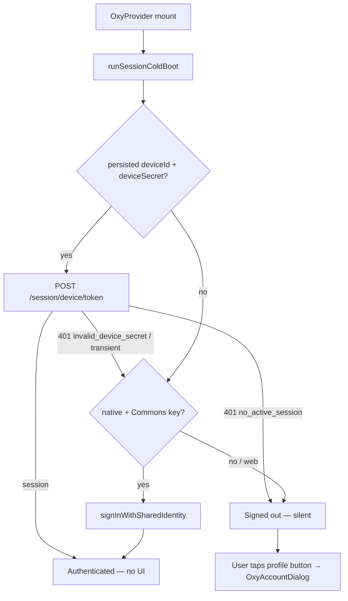
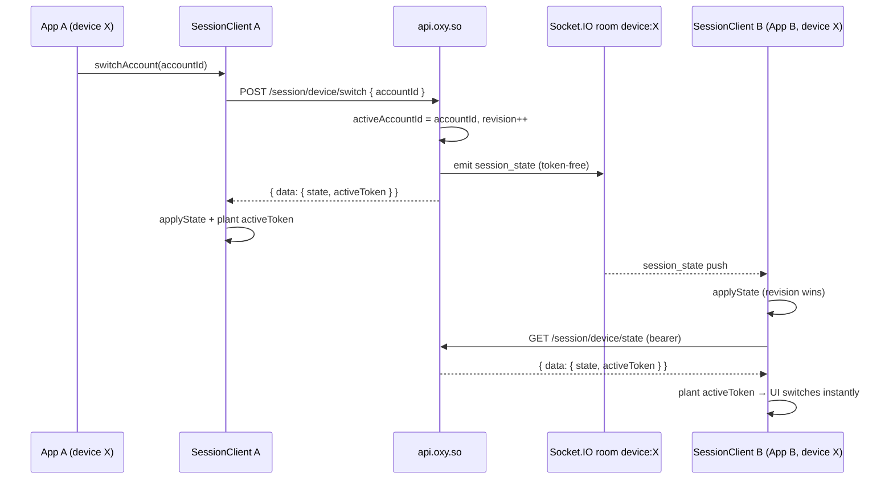

# Session Architecture

> Device-first session model for the Oxy ecosystem. The server is the single session
> authority (`DeviceSession`); clients mirror it through `SessionClient` in `@oxyhq/core`
> and receive real-time pushes over Socket.IO. There is **one** UI SDK: `@oxyhq/services`
> (`OxyProvider`) — the former web-only SDK package was deleted from the monorepo.
>
> Related docs: [device-session API reference](./auth/device-session.md) ·
> [third-party integration guide](./auth/integration-guide.md) ·
> [platform master plan](./architecture/oxy-auth-platform.md)

## Principles

- **Server authority.** Which accounts are signed in on a device — and which one is
  active — lives in one MongoDB document per device. Clients never own that state; they
  project it.
- **Silent cold boot.** `OxyProvider` restores the session on mount with zero UI. It never
  redirects to a login page and never opens a dialog on its own. Signed-out is a silent,
  valid outcome; interactive sign-in is always user-initiated (profile button →
  `OxyAccountDialog`).
- **Tokens never ride the socket.** Socket pushes carry token-free state only. Access
  tokens are minted and delivered exclusively over authenticated REST.
- **One write path.** Every mutation (add / switch / sign-out) goes through
  `/session/device/*`, bumps `revision`, and broadcasts — so every app on the device
  converges instantly.

## Server authority: `DeviceSession`

Model: `packages/api/src/models/DeviceSession.ts` (collection `devicesessions`).

```
deviceId          string   unique — stable identifier for one device/origin
accounts[]        { accountId, sessionId, authuser, addedAt, operatedByUserId? }
activeAccountId   ObjectId | null
secretHash        sha256 of the current deviceSecret (sparse-unique; see Transport)
prevSecretHash    sha256 of the just-superseded secret (short grace; transient)
revision          number   monotonic — $inc on every mutation
```

`accounts[]` is the **device set**: the accounts currently signed in on this device.
`operatedByUserId` records the human operator when the entry is a managed account
(org/project/bot) — audit trail for `act_as` switches. `revision` gives clients a total
order: state application is last-writer-wins by revision across the device set.

### REST surface (`/session/device/*`)

Routes: `packages/api/src/routes/sessionDevice.ts`. All routes except the mint require a
bearer token; the `deviceId` is always derived from the **validated JWT claim**, never
from the request body.

| Method | Route | Body | Behavior |
|--------|-------|------|----------|
| POST | `/session/device/token` | `{ deviceId, deviceSecret }` | **The zero-cookie mint** — PUBLIC (no bearer, no cookies): possession of the secret is the device-ownership proof. Verifies `sha256(deviceSecret)` (constant-time) against the device's `secretHash`, mints a short access token for the active account, and rotates the secret in-use (`nextDeviceSecret`; the presented secret stays valid for a short grace). Per-device lockout + rate limit blunt online guessing. |
| GET | `/session/device/state` | — | Returns current state for the caller's JWT device. |
| POST | `/session/device/add` | — | Registers the caller's account into the device set. Account + session ids come from the bearer (IDOR-safe); `operatedByUserId` is resolved from the session document. Idempotent — an unchanged re-register does not broadcast. |
| POST | `/session/device/switch` | `{ accountId }` | Sets `activeAccountId`, bumps `revision`, broadcasts. If the target session was revoked, heals the device set (drops the dead account), broadcasts the healed state, and returns 403. |
| POST | `/session/device/signout` | `{ accountId }` or `{ all: true }` | Removes one account or clears the device set; picks the next active account; broadcasts. `{ all: true }` also clears the device's `secretHash`. |

Every response is validated against `deviceSessionSyncSchema` from `@oxyhq/contracts`:

```
{ data: { state: DeviceSessionState, activeToken: { accessToken, expiresAt } | null } }
```

Contracts (`packages/contracts/src/deviceSession.ts`): `sessionAccountSchema`,
`deviceSessionStateSchema`, `activeTokenSchema`, `deviceSessionSyncSchema` — shared by
the server (output validation) and `SessionClient` (input validation).

## Session transport (zero-cookie)

The transport that carries "which device is this?" across reloads is **`deviceId` +
`deviceSecret`** — no cookies, no refresh-token family, no boot-fragment hop.

1. **`deviceId` + `deviceSecret`** — every successful sign-in (password, 2FA, QR claim,
   challenge verify) returns the session's `deviceId` and a 256-bit `deviceSecret`. The
   client persists both first-party (localStorage on web per origin; SecureStore on
   native). The server stores only `sha256(deviceSecret)` (`DeviceSession.secretHash`,
   sparse-unique), so a database dump cannot forge the secret and the secret reveals
   nothing about any other device.
2. **Mint** — to restore or refresh, the client POSTs `{ deviceId, deviceSecret }` to
   `POST /session/device/token` (no bearer, no cookies). The server verifies the secret
   (constant-time) and returns a short access token for the active account plus a
   rotated `nextDeviceSecret`. **Rotation-in-use:** the presented secret stays valid for
   a short grace window (60s) so a multi-tab race is not locked out; the client persists
   the next secret BEFORE planting the minted token.
3. **Revocation** — sign-out-all (`POST /session/device/signout { all: true }`) clears
   `secretHash` so a retained secret can never mint again. A theft divergence is detected
   at the next mint (the loser's secret no longer matches → `invalid_device_secret`).
4. **No cross-origin implicit sync.** A `deviceId` is per origin (web) / per app-group
   (native). Each new web origin does its own first sign-in; there is no shared device
   cookie tying `*.oxy.so` subdomains together and no cross-app device token on native.
   This is the deliberate trade for zero cookies.

## Cold boot

`runSessionColdBoot` (`packages/core/src/boot/coldBootV2.ts`, exported from
`@oxyhq/core`) is a pure ordered short-circuit: the first step that yields a session
wins. It is invoked by `OxyProvider` on mount — apps never implement restore themselves.

1. **`device-secret-mint`** (web + native) — when the origin persisted a `deviceId` +
   `deviceSecret`, mint a short access token with a single bearer-less POST to
   `/session/device/token`, persist the rotated secret, plant the token. A
   `no_active_session` 401 is an authoritative signed-out; an `invalid_device_secret` 401
   drops the (diverged) secret.
2. **`shared-key-signin`** (native) — re-mint from the shared Commons identity in the
   app-group keychain.

If nothing yields a session, the app is silently signed out — no redirect, no dialog.
The proactive scheduler + the reactive 401 handler both re-mint via the same
`deviceSecret` path (`refreshPersistedSession`), so a long-lived session stays alive past
the short access-token TTL without any refresh token.



## `SessionClient` (`@oxyhq/core`)

`packages/core/src/session/` — a framework-agnostic client mirror of the server state.
Exported from `@oxyhq/core` as `SessionClient`, plus the wiring helpers
`createSessionClient` and `createSessionClientHost`. `OxyProvider` constructs it; apps
consume it only through hooks.

Key behavior:

- `getState()` / `subscribe(listener)` — synchronous access to the current
  `DeviceSessionState` projection.
- `bootstrap()` — initial `GET /session/device/state` fetch + token plant.
- `switchAccount(accountId)` / `signOut({ accountId } | { all: true })` /
  `addCurrentAccount()` / `registerAndActivate()` — the only mutation paths; each calls
  the corresponding REST route and applies the returned sync.
- **`applyState` is last-writer-wins by `revision`** across the device set — a stale
  push or response can never regress newer state.
- **`applySync`** validates `{ state, activeToken }` against `deviceSessionSyncSchema`
  and plants the access token host-side; token planting is decoupled from revision
  advancement (an idempotent re-fetch still plants).
- `start()` attaches the Socket.IO listener; when the device set empties,
  `onUnauthenticated` clears the persisted store so a reload cannot restore a dead
  session.

## Real-time sync: `session_state`

Server side (`packages/api/src/utils/socket.ts`): each authenticated socket joins the
room `device:<deviceId>` — the id is derived from the **validated JWT claim**
(`deviceRoomFor`), never from a client-supplied value. Every `DeviceSession` mutation
calls `broadcastDeviceState(state)`, which emits `session_state` to that room with the
**token-free** `DeviceSessionState` payload.

Client side: on a `session_state` push, `SessionClient` applies the state
(revision-gated) and then asks its transport to `ensureActiveToken` — an authenticated
`GET /session/device/state` that returns `{ state, activeToken }` and plants the token.
Tokens therefore only ever travel over authenticated REST.

### Switch → broadcast (cross-app, same device)



## Multi-account: device set + account graph

Two distinct layers — do not conflate them:

| Layer | What it is | API |
|-------|-----------|-----|
| **DeviceSession** (device set) | Accounts signed in **on this device** right now | `/session/device/*`, `SessionClient` |
| **Account graph** | Accounts the user **may** use — own, child orgs/projects/bots, shared via membership | `GET /accounts`, `POST /accounts/:id/switch` (`account.service.ts`) |

The account switcher (`OxyAccountDialog`) shows both: the device set, plus graph accounts
available for `act_as` that are not yet signed in here.

Switch semantics (`useOxy().switchToAccount(accountId)`):

- **Account already in the device set** → `POST /session/device/switch` — flips
  `activeAccountId`, no new session minted.
- **Graph account not yet in the device set** (first entry) → `POST /accounts/:id/switch`
  mints a real session with `operatedByUserId` set to the operator, then registers it via
  `POST /session/device/add` — after which it switches like any other account. One
  uniform path; minting happens only on first entry.

Because the state lives server-side keyed by device, **a switch persists across reloads**
— the next cold boot reads the same `DeviceSession` and restores the same
`activeAccountId`. Signing an account out of the device set never revokes its graph
membership. See [device-session.md](./auth/device-session.md) for the full API detail.

## SDK surface

`@oxyhq/services` is the single UI SDK for Expo, React Native, and React Native Web:

```tsx
import { OxyProvider, useAuth, OxySignInButton } from '@oxyhq/services';

export function App() {
  return (
    <OxyProvider clientId={process.env.OXY_CLIENT_ID} baseURL="https://api.oxy.so">
      <Home />
    </OxyProvider>
  );
}

function Home() {
  const { isAuthenticated, signIn } = useAuth();
  if (!isAuthenticated) return <OxySignInButton />;
  return <Dashboard />;
}
```

- **`useAuth().signIn()`** opens the in-app dialog — interactive sign-in is never a
  redirect to a login page.
- **`OxyAccountDialog`** — the single account surface (switcher + Commons QR sign-in +
  collapsed password), built on Bloom
  `<Dialog placement={{ base: 'bottom', md: 'center' }}>`. Opened via
  `useOxy().openAccountDialog()`.
- **`OxySignInButton`** resolves the registered Application via
  `GET /auth/oauth/client/:clientId`: official apps open the dialog in-app;
  `third_party` apps perform a standard OAuth redirect with PKCE (`generatePkcePair`,
  `generateOAuthState`, `buildOAuthAuthorizeUrl` from `@oxyhq/core`). See the
  [integration guide](./auth/integration-guide.md).
- **`OxyConsentScreen`** — the IdP's OAuth consent surface, exported from
  `@oxyhq/services` and mounted by auth.oxy.so.

### IdP exception

auth.oxy.so is the OAuth authorize/consent surface, **not** a relying party. It mounts
`OxyProvider` device-first like every Oxy app (normal cold boot from its own per-origin
`{deviceId, deviceSecret}`, `useSwitchableAccounts` chooser) but stays a SHELL that emits
the OAuth code after authenticating — it does not bounce elsewhere for its own session.
It redirects all `/settings/*` paths to accounts.oxy.so, which is the sole owner of
account management. (The former `coldBoot={false}` exception existed for the deleted
SSO bounce.)

### Removed

FedCM, the silent-restore iframe, the cross-domain redirect-chain restore, and the
legacy client-side auth manager were all deleted earlier. The **zero-cookie cutover**
then deleted the entire cookie/refresh transport: the `oxy_device` cookie
(`cookieKeyHash`, the `/auth/device/bootstrap` + `/auth/device/exchange` +
`/auth/device/web-session` hop, the `#oxy_boot` fragment), the rotating refresh-token
family (`/auth/refresh-token`, `/auth/logout`), and the opaque device-attribution token
(the `POST /auth/device/token` native mint, the shared-keychain device token, and the
anonymous device socket). Sockets are **bearer-only** — a signed-out client opens no
socket. Cold boot is the two-step device-secret chain above — nothing else. Do not
reintroduce cookies, a refresh-token family, a boot-fragment hop, an anonymous device
socket, or per-app session restore.
