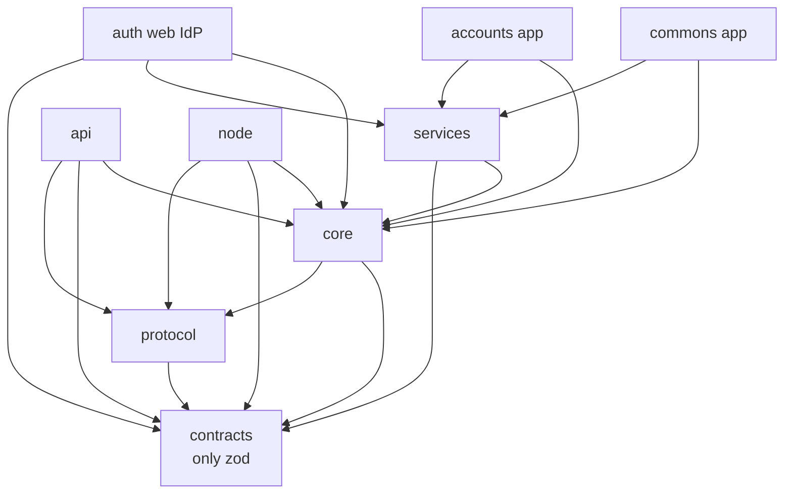
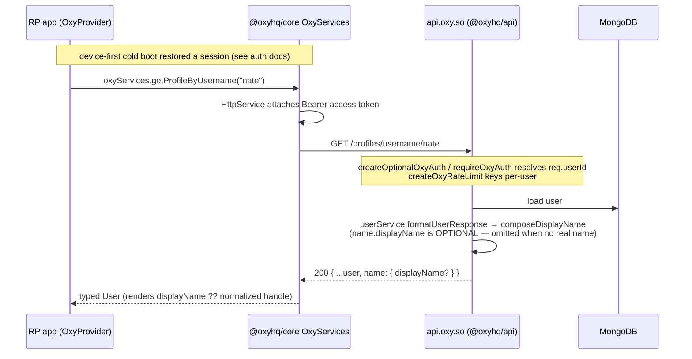

# Architecture Overview

> The monorepo layout, the package dependency graph, package boundaries, build
> order, and how a request flows end to end.
>
> Related: [Auth platform plan (2026)](./oxy-auth-platform.md) · [Agent handoff — ejecutar aquí](./archive/oxy-auth-agent-handoff.md) · [Identity / Oxy ID](../identity/README.md) ·
> [Reputation](../reputation/README.md) · [Nodes](../nodes/README.md) · [Changelog](../CHANGELOG.md)

---

## 1. What OxyHQServices is

OxyHQServices (`@oxyhq/sdk`, a private Bun-workspaces + Turbo monorepo) is the
**platform layer** for the entire Oxy ecosystem. It is four products in one repo:

1. **An identity provider** (`auth.oxy.so` — third-party OAuth authorize/consent
   only) and a **backend API** (`api.oxy.so` — the session authority).
2. **A client SDK** (`@oxyhq/core`, `@oxyhq/services`, `@oxyhq/contracts`,
   `@oxyhq/protocol`) that every Oxy app (Mention, Allo, Homiio, Syra, accounts,
   console, inbox, …) consumes for auth, session, profiles, payments, and media.
   `@oxyhq/services` is the **single UI SDK** — `OxyProvider` serves Expo,
   React Native, and web (React Native Web) alike; there is no separate
   web-only auth package.
3. **A self-sovereign identity layer** — "Oxy ID": `did:web` documents,
   cryptographically signed records (a per-user hash chain), verifiable
   credentials, and proof-of-personhood, surfaced through the native-only
   **Commons** vault app.
4. **A decentralization layer** — user-operated **data nodes** (`@oxyhq/node`)
   that own a user's signed records, with Oxy keeping a fast, always-available
   read copy.

The unifying thesis: **ownership comes from cryptography, not from Oxy granting
it.** A record signed by a user's key verifies identically on Oxy, on a personal
node, and in any third-party verifier — using the exact same `@oxyhq/core` code.

---

## 2. Packages

```
packages/
  contracts/      @oxyhq/contracts   Zod API contracts (zero React/RN/Expo; only zod)
  protocol/       @oxyhq/protocol    Signed-record envelope, canonical JSON, platform crypto
  core/           @oxyhq/core        Platform-agnostic foundation (client + SessionClient + /server)
  services/       @oxyhq/services    The single UI SDK (OxyProvider — Expo/RN/RN Web)
  api/            @oxyhq/api         Express.js backend (api.oxy.so) — PRIVATE
  node/           @oxyhq/node        Self-hostable personal data-node server — PRIVATE
  auth/           (web IdP)          auth.oxy.so — OAuth authorize/consent IdP (Vite + RN Web,
                                     mounts OxyProvider device-first like every app) — PRIVATE
  accounts/                          Expo "Accounts by Oxy" — keyless, management-only
  commons/                           Expo "Commons by Oxy" — NATIVE-ONLY identity vault
  inbox/   console/                  Web apps (email, developer console)
  expo-splash/    @oxyhq/expo-splash Shared native-splash toolkit for Oxy Expo apps
  test-app-expo/                     Playground
```

The former web-only auth SDK package was **deleted from the monorepo** — its
provider and hooks were merged into `@oxyhq/services`, which web apps consume
through React Native Web.

### Versions and publishing

`package.json` / npm are the single source of truth for versions — this doc
does not pin them (run `bun info <pkg> version` for the current target).
Internal packages consume each other as `workspace:*` (NOT `^x`) so they always
resolve TypeScript **source**, not stale published types.

> **Publish order is strict:** `contracts` → `protocol` → `core` → `services`.
> When a consumer starts importing a *new* symbol from a dependency, the
> dependency must be republished **first**, verified with a clean external
> `bun add` + `import()`, then the consumer. The API Docker build compiles
> `contracts`/`protocol`/`core` from source, so API deploys don't require an
> npm publish. `@oxyhq/api`, `@oxyhq/node`, and the web IdP are private and
> deploy from source.

---

## 3. Dependency graph and build order



Turbo derives the build order from this graph:

1. `contracts`
2. `protocol`
3. `core`
4. `services`, `node`, `api` (parallel — all depend on `core`)
5. `commons`, `accounts`, `inbox`, `console`, web IdP (depend on `core`/`services`)

`bun run build:all` (= `turbo run build`) builds every build-required package.
`contracts`, `protocol`, and `core` build dual CJS + ESM + `.d.ts` via `tsc`;
`services` builds with `react-native-builder-bob`. The `api` and `node` build
scripts explicitly pre-build `contracts` → `protocol` → `core` before their own
`tsc`, because they import `@oxyhq/core/server`.

---

## 4. Package boundaries (strict — enforced)

- **`@oxyhq/contracts`** — never imports `react`, `react-native`, or `expo-*`.
  Only `zod`. Both server and client import contract types directly from it.
- **`@oxyhq/protocol`** — platform-agnostic crypto/records substrate; never
  imports `react`, `react-native`, or `expo-*`.
- **`@oxyhq/core`** — never imports `react`, `react-native`, or `expo-*`. Dynamic
  `await import(...)` for optional RN modules (expo-crypto, secure-store,
  async-storage) is allowed. Direct dep `tldts` (Public Suffix List). The ESM
  build must contain **no `require()`** (Vite/ESM bundlers crash on it).
- **`@oxyhq/services`** — does **not** re-export from `@oxyhq/core` or
  `@oxyhq/contracts`. Consumers import core types from `@oxyhq/core` and contract
  types from `@oxyhq/contracts` directly.
- **`@oxyhq/api`** — imports schemas from `@oxyhq/contracts`; server auth helpers
  from `@oxyhq/core/server` only. No re-export shims, no `@deprecated` aliases —
  breaking changes are clean cuts.

There is a hard platform split in `@oxyhq/core`: client code lives under
`src/`, server-only code (Express middleware, `safeFetch`, `createOxyCors`,
`verifySecret`, `createOxyRateLimit`, `authSocket`) lives under `src/server/` and
is published as the `@oxyhq/core/server` subpath. The server subpath declares
`express` + `express-rate-limit` as required peers.

Session logic also has a single home: the device-first session machinery
(`SessionClient`, cold boot, session-state projection) lives in
`packages/core/src/session/` and is consumed by `OxyProvider` — apps never
implement their own restore. See
[../auth/device-session.md](../auth/device-session.md).

---

## 5. How a request flows end to end

Consider a logged-in Oxy app (RP) loading a user's profile:



Cross-cutting rules visible here:

- **Session authority is the server + SDK.** The app never hand-plants tokens
  or builds auth interceptors; `OxyProvider`'s device-first cold boot
  (`runSessionColdBoot` in `@oxyhq/core`) restores the session silently, and
  the server-side `DeviceSession` keeps every app on the device in sync via
  the `session_state` socket event (see
  [../auth/README.md](../auth/README.md) and
  [../auth/device-session.md](../auth/device-session.md)).
- **Display names are an API contract.** `name.displayName` is **optional**
  (`packages/api/src/utils/displayName.ts` returns a real name or `undefined`);
  clients render it when present and fall back to the normalized handle via
  `getNormalizedUserHandle` from `@oxyhq/core` — never recompose from
  `name.first`/`name.last`/`username`.
- **Identity/handle normalization** is shared (`getNormalizedUserHandle` in
  `@oxyhq/core`); apps don't build local route helpers.
- **Backend identity** comes from `@oxyhq/core/server` (`getRequiredOxyUserId`);
  writes resolve owner ids server-side and whitelist fields (no mass-assignment).

For a *write* against an RP's own backend, the RP uses
`oxyServices.createLinkedClient({ baseURL })`, which mirrors the owner's token
and delegates 401 refresh to the session owner.

---

## 6. Deployment topology (summary)

- `@oxyhq/api` → AWS ECS Fargate (`us-west-2`, cluster `oxy-cluster`), behind an
  ALB, image built `linux/arm64` and pushed to ECR by `deploy-aws.yml`. Domains
  `api.oxy.so` (+ website API aliases).
- `packages/auth` (the OAuth authorize/consent IdP) → Cloudflare Pages: the
  Vite + RN-Web SPA is now **pure static output** — the device-account chooser
  runs entirely in the device-first SDK (`useSwitchableAccounts`), so the former
  `/api/device-accounts` Pages Function was deleted in the 2c cutover. The deploy
  workflow deploys via a direct `bunx wrangler@4 pages deploy` step, and a
  post-deploy smoke gate re-checks the live host. Account management is NOT
  hosted here: the IdP's `/settings/*` routes permanently redirect to
  `accounts.oxy.so`.
- Web RP frontends (accounts, console, inbox, …) → Cloudflare Pages.
- `@oxyhq/node` → self-hosted by users (Docker + Caddy) or, for the managed
  vault, an Oxy-operated endpoint (`MANAGED_NODE_BASE_URL`).

Full infra detail lives in the legacy [DEPLOYMENT.md](../DEPLOYMENT.md) and
[INFRASTRUCTURE.md](../INFRASTRUCTURE.md).
