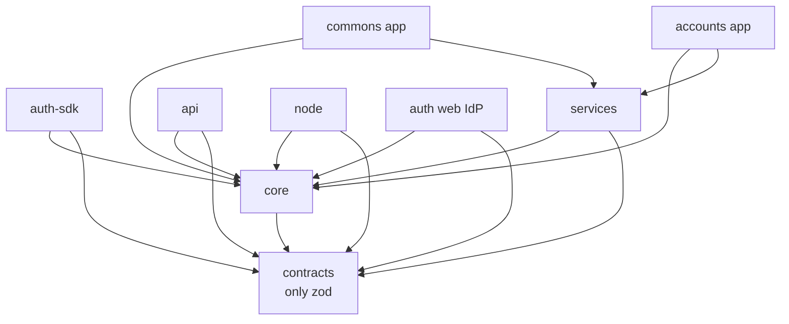
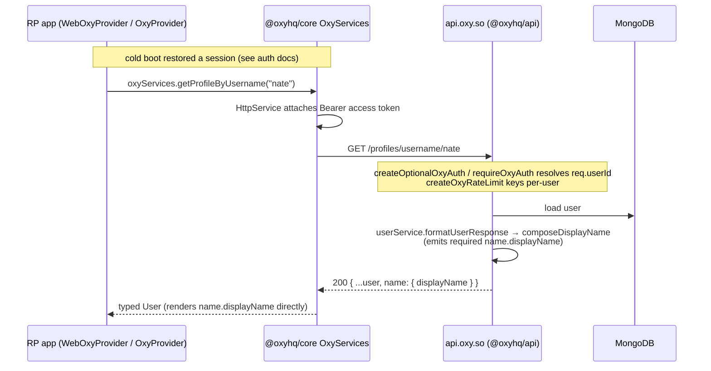

# Architecture Overview

> The monorepo layout, the package dependency graph, package boundaries, build
> order, and how a request flows end to end.
>
> Related: [Auth & session](../auth/README.md) · [Identity / Oxy ID](../identity/README.md) ·
> [Reputation](../reputation/README.md) · [Nodes](../nodes/README.md) · [Changelog](../CHANGELOG.md)

---

## 1. What OxyHQServices is

OxyHQServices (`@oxyhq/sdk`, a private Bun-workspaces + Turbo monorepo) is the
**platform layer** for the entire Oxy ecosystem. It is four products in one repo:

1. **An identity provider** (`auth.oxy.so`) and a **backend API** (`api.oxy.so`).
2. **A client SDK** (`@oxyhq/core`, `@oxyhq/auth`, `@oxyhq/services`,
   `@oxyhq/contracts`) that every Oxy app (Mention, Allo, Homiio, Syra, accounts,
   console, inbox, …) consumes for auth, session, profiles, payments, and media.
3. **A self-sovereign identity layer** — "Oxy ID": `did:web` documents,
   cryptographically signed records (a per-user hash chain), verifiable
   credentials, and proof-of-personhood, surfaced through the native-only
   **Commons** vault app.
4. **A decentralization layer** — user-operated **data nodes** (`@oxyhq/node`)
   that own a user's signed records, with Oxy keeping a fast, always-available
   read copy.

The unifying thesis: **ownership comes from cryptography, not from Oxy granting
it.** A record signed by a user's key verifies identically on Oxy, on a personal
node, and in any third-party verifier — using the exact same `@oxyhq/core` code.

---

## 2. Packages

```
packages/
  contracts/      @oxyhq/contracts   Zod API contracts (zero React/RN/Expo; only zod)
  core/           @oxyhq/core        Platform-agnostic foundation (client + /server)
  auth-sdk/       @oxyhq/auth        Web auth SDK (React hooks, WebOxyProvider)
  services/       @oxyhq/services    Expo/React Native SDK (OxyProvider, screens, sheets)
  api/            @oxyhq/api         Express.js backend (api.oxy.so) — PRIVATE
  node/           @oxyhq/node        Self-hostable personal data-node server — PRIVATE
  auth/           (web IdP)          Standalone Vite+Hono IdP app (auth.oxy.so) — PRIVATE
  accounts/                          Expo "Accounts by Oxy" — keyless, management-only
  commons/                          Expo "Commons by Oxy" — NATIVE-ONLY identity vault
  inbox/   console/                  Web apps (email, developer console)
  test-app-expo/  test-app-vite/     Playgrounds
  oxy-main-domain/                   oxy.so marketing/web
```

### Versions (in-tree workspace vs published)

The in-tree `package.json` versions run ahead of npm because the Oxy ID / nodes /
SSO work has not all been published yet. Internal packages consume each other as
`workspace:*` (NOT `^x`) so they always resolve TypeScript **source**, not stale
published types.

| Package | In-tree | Latest published (npm) | Notes |
|---|---|---|---|
| `@oxyhq/contracts` | `0.4.0` | `0.3.0` | 0.4.0 adds the civic types; published only when an external app needs them |
| `@oxyhq/core` | `3.15.0` | `3.11.0` | 3.12–3.15 added `getUserMutuals`, the nodes mixin, SSO bounce gating |
| `@oxyhq/auth` (auth-sdk) | `6.0.0` | `5.1.1` | 6.0.0 = SSO bounce gating / `disableAutoSso` removal |
| `@oxyhq/services` | `12.0.0` | `11.1.0` | 12.0.0 = SSO bounce gating |
| `@oxyhq/api` | `1.0.3` | — (private) | deploys from source via Docker |
| `@oxyhq/node` | `0.1.0` | — (private) | self-hosted by users; Docker + Caddy |
| `auth` (web IdP) | `0.1.0` | — (private) | Cloudflare Pages `_worker.js` |

> **Publish order is strict:** `contracts` → `core` → `auth`/`services`. When
> core/api start importing a *new* contracts symbol, `@oxyhq/contracts` must be
> republished **first**, verified with a clean external `bun add` + `import()`,
> then the consumers. The API Docker build builds `contracts` from source, so
> current deploys don't require a contracts publish.

---

## 3. Dependency graph and build order



Turbo derives the build order from this graph:

1. `contracts`
2. `core`
3. `auth-sdk`, `services`, `node` (parallel — all depend on `core`)
4. `api` (depends on `contracts` + `core`; parallels step 3)
5. `commons`, `accounts`, web IdP (depend on `core`/`services`)

`bun run build:all` (= `turbo run build`) builds all 9 build-required packages.
`contracts` and `core` build dual CJS + ESM + `.d.ts` via `tsc`; `services`
builds with `react-native-builder-bob`. The `api` and `node` build scripts
explicitly pre-build `contracts` then `core` before their own `tsc`, because they
import `@oxyhq/core/server`.

---

## 4. Package boundaries (strict — enforced)

- **`@oxyhq/contracts`** — never imports `react`, `react-native`, or `expo-*`.
  Only `zod`. Both server and client import contract types directly from it.
- **`@oxyhq/core`** — never imports `react`, `react-native`, or `expo-*`. Dynamic
  `await import(...)` for optional RN modules (expo-crypto, secure-store,
  async-storage) is allowed. Direct dep `tldts` (Public Suffix List). The ESM
  build must contain **no `require()`** (Vite/ESM bundlers crash on it).
- **`@oxyhq/auth`** — never imports `react-native` or `expo-*`. The only exception
  is a dynamic import of `@react-native-async-storage/async-storage`.
- **`@oxyhq/services`** — does **not** re-export from `@oxyhq/core` or
  `@oxyhq/contracts`. Consumers import core types from `@oxyhq/core` and contract
  types from `@oxyhq/contracts` directly.
- **`@oxyhq/api`** — imports schemas from `@oxyhq/contracts`; server auth helpers
  from `@oxyhq/core/server` only. No re-export shims, no `@deprecated` aliases —
  breaking changes are clean cuts.

There is a hard platform split in `@oxyhq/core`: client code lives under
`src/`, server-only code (Express middleware, `safeFetch`, `createOxyCors`,
`verifySecret`, `createOxyRateLimit`, `authSocket`) lives under `src/server/` and
is published as the `@oxyhq/core/server` subpath. The server subpath declares
`express` + `express-rate-limit` as required peers.

---

## 5. How a request flows end to end

Consider a logged-in Oxy app (RP) loading a user's profile:



Cross-cutting rules visible here:

- **Session authority is the SDK.** The app never hand-plants tokens or builds
  auth interceptors; it relies on the SDK's cold-boot + token planting (see
  [auth/README.md](../auth/README.md)).
- **Display names are an API contract.** The server composes a required
  `name.displayName` (`packages/api/src/utils/displayName.ts`); clients render it
  directly and must not recompute from `name.first`/`name.last`/`username`.
- **Identity/handle normalization** is shared (`getNormalizedUserHandle` in
  `@oxyhq/core`); apps don't build local route helpers.
- **Backend identity** comes from `@oxyhq/core/server` (`getRequiredOxyUserId`);
  writes resolve owner ids server-side and whitelist fields (no mass-assignment).

For a *write* against an RP's own backend, the RP uses
`oxyServices.createLinkedClient({ baseURL })`, which mirrors the owner's token
and delegates 401 refresh to the session owner.

---

## 6. Deployment topology (summary)

- `@oxyhq/api` → AWS ECS Fargate (`us-west-2`, cluster `oxy-cluster`), behind an
  ALB, image built `linux/arm64` and pushed to ECR by `deploy-aws.yml`. Domains
  `api.oxy.so` (+ website API aliases).
- `packages/auth` (third-party OAuth IdP + device-account chooser feed) →
  Cloudflare Pages: the SPA is pure static output; the one dynamic route
  (`GET /api/device-accounts`) is a **Pages Function**
  (`packages/auth/functions/api/device-accounts.ts`), not an advanced-mode
  `_worker.js` — CF Pages was not reliably invoking a single-file worker on
  this project. The deploy workflow verifies the Functions directory compiles
  before deploying, and a post-deploy smoke gate re-checks the live host. As of
  this writing the deploy pipeline itself has a separate, unresolved failure
  (an npm override conflict in the deploy action) — see the repo-root
  `AGENTS.md`'s "Auth App" section for the live status before trusting this is
  deployed.
- Web RP frontends (accounts, console, inbox, …) → Cloudflare Pages.
- `@oxyhq/node` → self-hosted by users (Docker + Caddy) or, for the managed
  vault, an Oxy-operated endpoint (`MANAGED_NODE_BASE_URL`).

Full infra detail lives in the legacy [DEPLOYMENT.md](../DEPLOYMENT.md) and
[INFRASTRUCTURE.md](../INFRASTRUCTURE.md).
