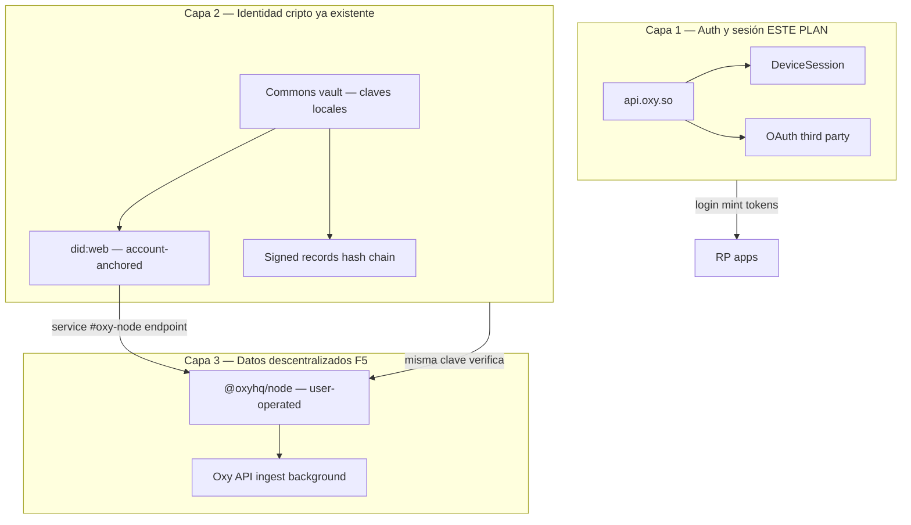
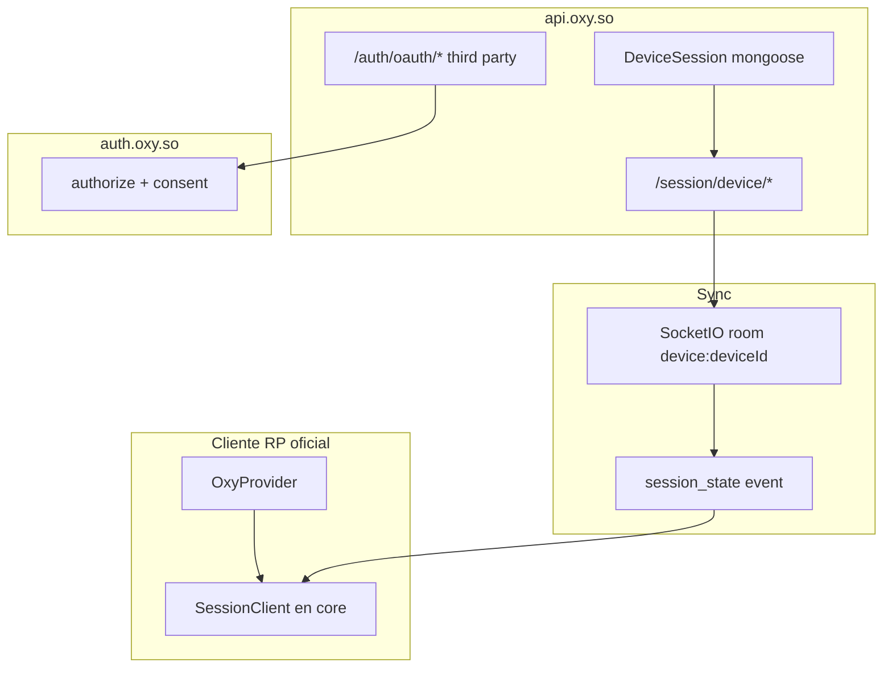
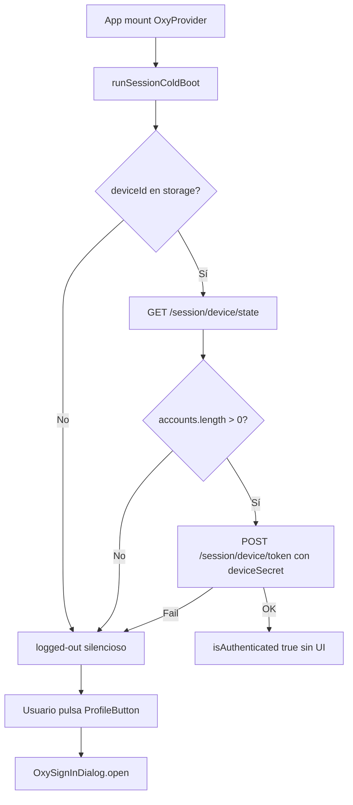

# Oxy Auth Platform — Handoff completo para agente implementador

> **Para Nate:** copia el [Prompt de arranque](#prompt-de-arranque) al agente que ejecute.  
> **Estado:** 2026-07-05 — documento de handoff; **no implica que el código esté migrado**.  
> **Plan maestro:** [`oxy-auth-platform.md`](./oxy-auth-platform.md) (decisiones de producto/arquitectura).  
> **Este doc:** checklist ejecutable, inventario real del repo, fases, borrados, docs, third party, **reglas anti-desvío**.

---

## Cómo usar este documento (obligatorio)

1. **Orden de lectura:** `oxy-auth-platform.md` → **este doc** → spec Fase 1 (`superpowers/plans/2026-07-01-session-sync-phase1-server-authority.md`) cuando llegues a Fase 1.
2. **No improvises arquitectura.** Si algo no está aquí ni en el plan maestro → **para y pregunta a Nate**. No elijas “la opción más rápida”.
3. **Una fase a la vez.** No avances a Fase N+1 hasta pasar el [Gate de salida](#gates-de-salida-obligatorios) de Fase N.
4. **No leas AGENTS.md ni docs retirados** — ver handoff § Documentación retirada. Solo docs canónicos + spec Fase 1.
5. **No marques una fase como hecha** sin tests verdes en los packages tocados y grep de la fase cumplido.
6. **Puedes usar subagentes en paralelo** durante todo el proyecto cuando acelere sin violar el plan — ver § [Subagentes](#subagentes-paralelo).

---

## Subagentes (paralelo)

**Permitido y recomendado** usar subagentes (Task tool / agentes especializados del equipo Oxy) **en cualquier fase**, siempre que:

| Regla | Detalle |
|-------|---------|
| **Coordinación** | El agente principal mantiene el plan, gates y orden de fases. Subagentes ejecutan tareas acotadas y reportan. |
| **Paralelo seguro** | OK en paralelo: Fase 0 grep/inventario + lectura spec Fase 1; contracts tests + api model scaffold; docs stubs + core SessionClient; security review de PR auth. |
| **Serial obligatorio** | Fase 3 antes de borrar auth-sdk; Fase 1 API antes de SessionClient que la consume; Fase 7 delete solo tras reemplazo merged. |
| **No divergencia** | Cada subagente recibe link a `oxy-auth-platform.md` + este handoff + **solo** su tarea IN scope. Prohibido “mejorar” con FedCM/cookies. |
| **Ownership api** | Si otro humano/agente tiene cambios uncommitted en `packages/api`, **no** paralelizar writes ahí — path-scope git add. |

### Subagentes útiles por fase

| Fase | Subagente | Tarea típica |
|------|-----------|--------------|
| 0 | `explore` | Grep inventario, consumidores `@oxyhq/auth` |
| 1 | `oxy-api` | DeviceSession model/service/routes/socket |
| 1 | `oxy-core` | SessionClient + deviceSession mixin (post-contracts) |
| 2 | `oxy-api` + contracts | Zod schemas, Console fields |
| 3 | `oxy-services` + `oxy-auth` | Merge WebOxyProvider → OxyContext; migrar console |
| 4 | `oxy-services` + `bloom` | OxySignInDialog, Bloom Dialog placement |
| 5 | `oxy-frontend` | auth.oxy.so RN Web mount |
| 6 | `oxy-frontend` | accounts/inbox/console migration |
| 7 | `docs-keeper` | AGENTS.md + integration-guide (post-código) |
| Cualquiera | `test-build` | Tests antes de push |
| Cualquiera | `security-reviewer` | Auth/token/cookie regressions |

### Prompt mínimo para subagente

```
Tarea: [concreta, 1 fase IN scope]
Lee: docs/architecture/oxy-auth-platform.md + oxy-auth-agent-handoff.md
Prohibido: FedCM, cookies, SSO, @deprecated, scope fuera de fase [N]
Entrega: archivos tocados + tests PASS + blockers
```

---

## Prompt de arranque

```
Eres el agente implementador del replanteo de auth/sesiones Oxy. NO desvíes del plan.

Lee EN ESTE ORDEN (completo, sin saltar):
1. docs/architecture/oxy-auth-platform.md
2. docs/architecture/oxy-auth-agent-handoff.md

Contrato:
- Ejecuta SOLO fases 0→7 en orden. Una fase = un bloque de PR/commits acotado.
- Puedes lanzar subagentes en paralelo cuando no rompan gates/serial (ver § Subagentes).
- Si una idea no está en esos docs → STOP, pregunta a Nate. No inventes alternativas.
- Cero cookies de sesión (oxy_rt, fedcm_session). Cero FedCM/SSO iframe/bounce.
- Clean cut: sin @deprecated, shims, feature flags legacy, migraciones app-level, back-compat.
- Un solo SDK UI: @oxyhq/services (OxyProvider). Eliminar @oxyhq/auth (auth-sdk).
- Commons-first; password en UI colapsada "Sign in without the app".
- Bloom Dialog para auth (placement={{ base: 'bottom', md: 'center' }}), NO bottom sheet auth.
- Fix upstream: auth compartido SOLO en core + services + api. Apps NO implementan restore local.

Ignora para implementar:
- FedCM/SSO/cookies en AGENTS.md, docs/CROSS_DOMAIN_AUTH.md, docs/SESSION-ARCHITECTURE.md (viejos)

Fase 1: rama impl/session-sync-p1 NO EXISTE. Implementa DeviceSession desde
docs/superpowers/plans/2026-07-01-session-sync-phase1-server-authority.md
SIN cookie transport / silent iframe / SSO de ese diseño.

BLOQUEANTE: Fase 2c POST /session/device/token — NO implementar forma final sin workshop Nate.

Tests: cd packages/<pkg> && bun run test (Jest). packages/auth → bun test solamente.
NUNCA bun test en monorepo entero. Path-scope git add en packages/api si hay otra sesión editando.

Al terminar cada fase: ejecuta el Gate de salida de esa fase en el handoff y repórtalo.
```

---

## Reglas contractuales (incumplimiento = fuera de plan)

### DEBES

| # | Regla |
|---|--------|
| D1 | Tratar `oxy-auth-platform.md` + este handoff como **contrato**. Cualquier desviación requiere aprobación explícita de Nate. |
| D2 | Implementar auth/sesión **solo** en `contracts`, `core`, `services`, `api`. Apps consumen SDK; no duplican lógica. |
| D3 | Usar `@oxyhq/core/server` en backends (`createOxyAuthMiddleware`, `getRequiredOxyUserId`) — nunca parsers bearer locales en apps. |
| D4 | RP con backend propio → `oxyServices.createLinkedClient({ baseURL })` — nunca interceptors Axios/fetch auth en apps. |
| D5 | Perfiles en UI → `name.displayName ?? getNormalizedUserHandle(user)` — nunca recomponer nombre desde first/last/username. |
| D6 | Publicar `@oxyhq/contracts` **antes** que consumidores npm externos cuando añadas schemas nuevos. |
| D7 | Rate limits API: cada `rateLimit()` con `prefix` único `rl:<scope>:`. |
| D8 | Socket rooms derivados de identidad **servidor** (`socket.user.id`, `device:<deviceId>` del token) — nunca room IDs del cliente. |
| D9 | Invalidar `userCache` tras writes de usuario en API (regla existente — no romper). |
| D10 | Al borrar legacy (Fase 7), borrar **tests del legacy en el mismo PR** — no dejar tests skipped. |

### NO DEBES (derailments frecuentes de agentes)

| # | Prohibido | Por qué | En su lugar |
|---|-----------|---------|-------------|
| X1 | Reintroducir FedCM, `/auth/silent`, `/sso`, `__oxy/sso-callback` | Tricky; Nate rechazó explícitamente | DeviceSession + OAuth third party |
| X2 | Mantener `WebOxyProvider` “un release más” con `@deprecated` | Clean cut | Fusionar en `OxyProvider` y borrar auth-sdk |
| X3 | “Arreglar” cross-domain con cookies o iframe | Chrome 3PC / frágil | deviceId + DeviceSession por origen; socket post-login |
| X4 | Ocultar Commons/QR con `crossApex.ts` o heurísticas de apex | Oculta producto | Siempre mostrar Commons-first en official apps |
| X5 | Sign-in en bottom sheet custom | Plan = Bloom Dialog | `@oxyhq/bloom/dialog` |
| X6 | Auth local en Mention/accounts/console (restore, callbacks) | Duplica SDK | Solo `OxyProvider` + `clientId` |
| X7 | Merge entera rama `impl/session-sync-p1` si aparece | Traería cookies/FedCM | Cherry-pick / reimplementar spec sin transport cookie |
| X8 | Implementar `POST /session/device/token` final sin Fase 2c | Spec token mint pendiente | Stub mínimo o esperar workshop |
| X9 | Refactorizar auth app a `WebOxyProvider` | IdP ≠ RP | IdP usa componentes services; OAuth/consent shell |
| X10 | `git add -A` en `packages/api` con otra sesión activa | Incidente histórico casi commit federation ajena | `git add packages/api/src/routes/sessionDevice.ts` path-scope |
| X11 | Leer AGENTS.md FedCM para “cómo funciona hoy” | Contradice plan | Este handoff |
| X12 | Añadir `@deprecated` / alias export / shim de compat | Clean cut | Renombrar y actualizar todos los call sites |
| X13 | `bun test` en raíz del monorepo | ~81 falsos fallos en api | `cd packages/api && bun run test` |
| X14 | Sync cross-domain silenciosa para third party | No es Google-style OAuth | OAuth por RP; DeviceSession solo ecosistema Oxy |
| X15 | Auto-redirect a login en cold boot | UX acordada | Silencioso si hay sesión; Dialog solo vía ProfileButton |
| X16 | Poner sesiones/tokens en `@oxyhq/node` o “descentralizar login” | Auth ≠ data plane | DeviceSession en **api.oxy.so**; nodos solo signed records |
| X17 | Bloquear reads de perfil/feed esperando respuesta del node | Rompe invariante F5 | Reads Oxy API; node ingest **background** (`safeFetch`) |

---

## Auth vs identidad vs nodos (descentralización)

Oxy tiene **tres capas** que el agente **no debe mezclar** durante el replanteo auth (fases 0–7):



| Capa | Qué resuelve | Dónde vive | ¿En scope fases 0–7? |
|------|--------------|------------|----------------------|
| **Auth / sesión** | Quién está logueado, multicuenta, switch, third party OAuth | `api.oxy.so`, DeviceSession, `OxyProvider` | **SÍ — foco del plan** |
| **Identidad (Oxy ID)** | Claves, DID, signed records, domain verify, Sign in with Oxy (Commons) | Commons, `identity/*`, `did.service.ts`, `@oxyhq/core` crypto | **Tocar solo donde auth se une** (Commons sign-in, step-up Verify) |
| **Nodos (F5)** | Dónde el usuario **posee** sus records firmados; réplica read en Oxy | `packages/node`, `UserNode`, ingest worker | **NO — fuera de scope** salvo no romper |

### Invariantes descentralización (NO romper)

Tomadas de [`docs/nodes/README.md`](../nodes/README.md) y [`docs/identity/README.md`](../identity/README.md):

1. **Reads de apps NUNCA await un node.** Perfil, feed, session restore → `api.oxy.so`. Node fetch = background ingest vía `safeFetch`.
2. **El DID `#oxy-node` service** se deriva del row `UserNode` en Mongo (`did.service.ts`) — **no** probando liveness al node en el read path.
3. **Misma crypto en todas partes:** firma Commons = verifica en Oxy API = verifica en `@oxyhq/node` (`@oxyhq/core` `verifyRecordEnvelope`). El replanteo auth **no** añade crypto nueva en nodes.
4. **Commons-first sign-in** (este plan) es el puente humano a la identidad self-sovereign; **no** sustituye DeviceSession ni mueve tokens al node.
5. **Federación ActivityPub** (`packages/api/src/routes/federation.ts`) es otro eje — no confundir con DeviceSession ni OAuth RP.

### Cómo encaja con decisiones del plan auth

| Pieza auth plan | Relación con descentralización |
|-----------------|--------------------------------|
| Commons QR / keychain | Usuario prueba identidad cripto local → API emite sesión **centralizada** (DeviceSession + tokens) |
| `deviceSecret` mint (Fase 2c) | Secreto **por dispositivo/origen** en storage RP — **no** clave del node |
| Password keyless | Cuenta custodial en Oxy; DID custodial; puede usar node managed igual |
| Third party OAuth | Tokens OAuth estándar; **sin** node en el flujo |
| Export / signed records | Ya existente — node es réplica opcional del log, no authority de login |

### Docs de contexto (leer, no implementar en fases auth)

- [`docs/nodes/README.md`](../nodes/README.md) — protocolo `@oxyhq/node`, API `/oxy/log`, blobs
- [`docs/identity/README.md`](../identity/README.md) — DID, records, Commons
- [`docs/architecture/overview.md`](./overview.md) §1 — cuatro productos en un repo

### Fuera de alcance explícito (nodos)

- Cambiar protocolo `oxy-node/1` o owner auth del node
- Montar DeviceSession en SQLite del node
- Hacer cold boot dependiente de `GET /.well-known/oxy-node.json`
- Sustituir `api.oxy.so` auth por “login contra mi node”
- F5b/F5c ingest worker refactors (salvo fix mínimo si auth PR rompe build)

**Si Nate pide “más descentralizado” en auth:** parar — es product decision fuera de este plan; la respuesta por defecto es **auth centralizado + datos/records descentralizables en node**.

---

| Tema | Decisión final | Rechazado explícitamente |
|------|----------------|--------------------------|
| Transporte sesión | `deviceId` + `deviceSecret` + storage first-party | Cookies `oxy_rt_*`, `fedcm_session` |
| Cross-domain web | Primera visita origen nuevo = logged-out; tras sign-in = auto + socket | SSO bounce, silent iframe, FedCM |
| SDK UI | Un `@oxyhq/services` `OxyProvider` (Expo + RN Web) | `@oxyhq/auth` auth-sdk, dual providers |
| Sign-in UX official | Commons-first; password colapsado | FedCM, redirect IdP para first-party |
| Sign-in UX third party | OAuth redirect `auth.oxy.so` + PKCE | Embedded Dialog sin consent |
| Modal auth | Bloom Dialog bottom/center | Bottom sheet SignIn, RN Modal paralelo |
| Multicuenta | DeviceSession + account graph (2 capas) | Solo orgs; solo `oxy_rt` slots |
| IdP auth.oxy.so | OAuth authorize/consent/legal; NO session authority cookies | `refresh-all`, `WebOxyProvider` cold boot |
| Token mint | Híbrido deviceSecret + Commons sign step-up | Refresh en cookies |
| Migraciones | Ninguna — clean cut | Scripts migrate, dual read paths |
| auth-sdk | Eliminar paquete | Mantener para web “por tamaño bundle” |
| Auth en `@oxyhq/node` | Sesión siempre en api.oxy.so | Login descentralizado / tokens en node |
| Node read path | Background ingest only | Await node en GET perfil/session |
| Nombre usuario-facing | “Sign in with Oxy” (nunca “Sign in with Commons”) | — |
| Display name DTO | `displayName ?? handle` vía core | Cadenas first/last/username en UI |

---

## Objetivo en una frase

**Plataforma central de cuenta/sesión estilo Google:** login una vez por dispositivo/origen en apps Oxy, multicuenta, switch instantáneo, third party vía OAuth + Console — **sin cookies ni trucos de navegador**.

---

## Arquitectura objetivo (memorizar)



### Dos capas de multicuenta (NO mezclar)

| Capa | Qué es | API / código |
|------|--------|--------------|
| **DeviceSession** | Cuentas **firmadas en este dispositivo** ahora | `GET/POST /session/device/*`, `SessionClient` |
| **Account graph** | Cuentas que el usuario **puede** usar (orgs, projects, shared) | `GET /accounts`, `account.service.ts`, `switchToAccount` |

Comportamiento switcher:
1. Login personal → cargar device sessions + graph en paralelo.
2. Mostrar cuentas ya en device + cuentas del graph disponibles para `act_as`.
3. Elegir cuenta del graph no firmada → `switchToAccount` → `POST /session/device/add` → `revision++` → socket.
4. Switch en app A → app B (mismo `deviceId`) actualiza al instante.

`operatedByUserId` en `SessionAccount` cuando es cuenta administrada (auditoría).

---

## Cold boot — comportamiento EXACTO objetivo



**Pasos eliminados del cold boot (NO reintroducir):**

| Paso legacy | Archivo aproximado | Estado |
|-------------|-------------------|--------|
| `sso-return` / `#oxy_sso` | `ssoReturn.ts`, `OxyContext` | DELETE Fase 7 |
| `fedcm-silent` | `OxyServices.fedcm.ts`, `useWebSSO` | DELETE Fase 7 |
| `silent-iframe` `/auth/silent` | `OxyServices.silent.ts`, auth server | DELETE Fase 7 |
| `cookie-restore` / `refresh-all` | `AuthManager`, `useDeviceAccounts` | DELETE Fase 7 |
| `sso-bounce` top-level | `ssoBounce.ts` | DELETE Fase 7 |
| `stored-session` bearer solo | Parcialmente KEEP como cache offline, no authority | REWRITE |

**Native-only extra (después de device state fail):**
- `signInWithSharedIdentity()` — keychain Commons, **sin QR**.

**Web logged-out UI:**
- QR Commons en Dialog (escaneo desde móvil).
- Password bajo “Sign in without the app”.

**Regla UX:** cold boot **nunca** abre Dialog ni redirige a login automáticamente.

---

## Persistencia permitida (única)

| Dato | Web | Native |
|------|-----|--------|
| `deviceId` | localStorage **por origen** | SecureStore + app group `group.so.oxy.shared` |
| `deviceSecret` | localStorage (cifrado si viable) | SecureStore / app group |
| `DeviceSessionState` cache | localStorage / IndexedDB | SecureStore |
| Access token | memoria + cache offline RQ | memoria + keychain |
| Identidad Commons | — | KeyManager shared keychain |

**Prohibido:** cualquier cookie de sesión Oxy en RP o IdP para restore (`Set-Cookie` session).

---

## Socket — migración eventos

| Hoy (legacy) | Objetivo | Acción |
|--------------|----------|--------|
| Room `user:<userId>` | Mantener para notificaciones legacy | KEEP selectivo |
| Event `session_update` | Parcialmente KEEP sign-out whitelist | Mantener `useSessionSocket` whitelist estricta |
| Room `device:<deviceId>` | **NUEVO** | CREATE Fase 1 |
| Event `session_state` payload `DeviceSessionState` | **NUEVO** | CREATE Fase 1 |

`useSessionSocket`: **nunca** añadir `else` que haga sign-out en eventos desconocidos (regla AGENTS existente — conservar).

---

## Gates de salida obligatorios

El agente **no avanza** sin cumplir todo lo de la fase actual.

### Gate Fase 0

- [ ] Tabla inventario § [Inventario por archivo](#inventario-por-archivo) revisada file-by-file
- [ ] Lista consumidores `@oxyhq/auth`: `console`, `test-app-vite`, root scripts
- [ ] Baseline tests anotado: contracts 81, core 623, api 997, services 178, auth IdP 10
- [ ] Confirmado: p1 branch ausente → Fase 1 = implement from spec

### Gate Fase 1

- [ ] `deviceSessionStateSchema` en contracts + tests PASS
- [ ] Modelo `devicesessions` + service + routes montadas en `server.ts`
- [ ] `broadcastDeviceState` emite `session_state` sin tokens en payload
- [ ] `bun run test` PASS en contracts + api (count ≥ baseline)
- [ ] **NO** hay Set-Cookie nuevo en rutas device
- [ ] Legacy `/session/device/sessions` sigue funcionando o migrado con doc — **no dos autoridades**

### Gate Fase 2

- [ ] Contratos session events / consent publicados si tocan npm
- [ ] Console privacy/terms URLs si en scope 2b
- [ ] **NO** endpoint token mint final sin workshop

### Gate Fase 3

- [ ] `console` y `test-app-vite` compilan con `@oxyhq/services` only
- [ ] `packages/auth-sdk` eliminado del workspace
- [ ] Web path funciona con `OxyProvider` único
- [ ] `bun run test` PASS services + core

### Gate Fase 4

- [ ] Sign-in usa Bloom Dialog (screenshot o test)
- [ ] `OxySignInButton`: third_party → OAuth redirect; official → Dialog
- [ ] Un solo account menu export público
- [ ] `crossApex.ts` eliminado

### Gate Fase 5

- [ ] auth.oxy.so authorize/consent renderiza componentes services (RN Web)
- [ ] Sin `refresh-all` en IdP client
- [ ] FedCM routes removidas del auth server

### Gate Fase 6

- [ ] accounts, inbox, console sin bootstrap SSO en `+html.tsx`
- [ ] Sin `@oxyhq/auth` en dependencias apps oficiales migradas

### Gate Fase 7 (final)

- [ ] Grep [must-be-zero](#verificación-must-be-zero) = **0 hits** (excl. CHANGELOG)
- [ ] AGENTS.md reescrito
- [ ] Docs DELETE borrados; REWRITE hechos
- [ ] `docs/auth/integration-guide.md` + `device-session.md` creados
- [ ] Todos los tests baseline PASS

---

## Fases — alcance IN / OUT explícito

### Fase 0 — Auditoría

**IN:** grep, inventario, baselines, gaps RN Web.  
**OUT:** cualquier cambio de código productivo.

### Fase 1 — DeviceSession server

**IN:** contracts schema, mongoose model, service, REST, socket broadcast, tests.  
**OUT:** borrar FedCM; fusionar auth-sdk; UI Dialog; token mint final; migrar apps.

### Fase 2 — Contratos + Console

**IN:** Zod additions, Console fields, workshop prep 2c.  
**OUT:** eliminar legacy; SessionClient completo si no especificado en 2.

### Fase 3 — merge auth-sdk

**IN:** WebOxyProvider → OxyContext; migrar console/test-app-vite; delete auth-sdk package.  
**OUT:** Bloom Dialog; Fase 7 borrados masivos FedCM (puede dejar código muerto temporalmente **solo si** no se importa — preferible eliminar imports legacy en cold boot ya).

### Fase 4 — UI

**IN:** OxySignInDialog, OxySignInButton bifurcado, account menu unificado, PKCE helpers.  
**OUT:** auth.oxy.so full RN Web; borrar todos los archivos FedCM (Fase 7).

### Fase 5 — auth IdP

**IN:** Montar services components; OAuth pages; quitar refresh-all/FedCM server.  
**OUT:** migrar Mention externo; npm publish.

### Fase 6 — apps oficiales

**IN:** accounts, inbox, console, commons bootstrap cleanup.  
**OUT:** repos externos (Mention, Allo…) — solo documentar npm bump order.

### Fase 7 — clean cut

**IN:** DELETE inventario completo; docs; AGENTS.md; grep zero.  
**OUT:** nuevas features; refactors no listados.

---

## Fuera de alcance (NO hacer aunque parezca útil)

- Migrar **Mention / Allo / Homiio** repos externos (solo bump npm post-publish)
- FedCM “solo para Chrome mientras tanto”
- Cookie `oxy_rt` “solo para auth.oxy.so IdP”
- Mantener `WebOxyProvider` export deprecated
- Script Mongo migrate `devicesessions` desde cookies — **no hay migración**
- Bottom sheet para EditProfile etc. (solo auth va a Dialog en Fase 4; resto bottom sheet puede quedar)
- Publicar `@oxyhq/contracts` civic types — reglas AGENTS unchanged
- Fase 2c token mint **forma final**
- Infra AWS / Cloudflare / DNS changes
- **`@oxyhq/node` protocol, ingest worker, UserNode model** — ver § Auth vs nodos
- `packages/commons` A0 clientId EAS — pending ops Nate

---

## Cuándo PARAR y preguntar a Nate

1. Antes de implementar `POST /session/device/token` más allá de stub (Fase 2c).
2. Si aparece rama `impl/session-sync-p1` con código distinto al superpowers spec — **no merge**; diff con Nate.
3. Si cold boot web “necesita” cookies para UX aceptable.
4. Si third party pide embedded Dialog sin redirect — product decision.
5. Si tests baseline caen >5 tests sin relación directa — investigar antes de borrar tests.
6. Cualquier conflicto con otra sesión en `packages/api` uncommitted.

---

## Estado del repo al generar este handoff

> ⚠️ **OBSOLETO (verificado Fase 0, 2026-07-05):** esta tabla se escribió desde una base 124 commits por detrás de `origin/main`. La realidad actual (Fase 1 YA mergeada en main, p1 superseded, FedCM/SSO ya borrados de main, transporte vigente = cookie `oxy_device` + refresh family) está en [`oxy-auth-audit.md`](./oxy-auth-audit.md) — usar ese doc como ground truth.

| Hecho | Detalle |
|-------|---------|
| Rama `impl/session-sync-p1` | **No existe** localmente — solo en docs |
| Worktree `~/Oxy/OxyHQServices-p1` | **No existe** |
| Checkout típico | `design/cross-domain-session-sync` o `main` |
| DeviceSession server-authority | **No implementado** — spec en `docs/superpowers/plans/2026-07-01-session-sync-phase1-server-authority.md` |
| `SessionClient` en core | **No existe** |
| Socket `session_state` / room `device:<deviceId>` | **No existe** |
| Legacy en main | `oxy_rt` cookies, FedCM, SSO, `WebOxyProvider`, `AuthManager`, 3 account menus |
| OAuth third party | **Ya existe** en API: `/auth/oauth/*`, AppGrant, Console Application registry |

### Colisión de nombres (crítico)

Hoy en main, **`DeviceSession` en contracts/core** = DTO de “sesiones que comparten device fingerprint” (`GET /session/device/sessions/:sessionId`).  
El **nuevo `DeviceSession`** del plan = modelo mongoose `devicesessions` + `/session/device/{state,add,switch,signout}`. Son conceptos distintos; el agente debe migrar/reemplazar sin dejar dos modelos paralelos.

---

## Fases — checklist ejecutable

### Fase 0 — Auditoría (`oxy-auth-audit` verificable)

- [ ] Confirmar grep de cada patrón en § [Verificación must-be-zero](#verificación-must-be-zero)
- [ ] Marcar cada fila de § [Inventario por archivo](#inventario-por-archivo) como hecha en Fase 7
- [ ] Listar consumidores `@oxyhq/auth` en monorepo: `console`, `test-app-vite`, root scripts
- [ ] Documentar gaps RN Web para auth.oxy.so (Fase 5)
- [ ] Entregable: actualizar tabla “Estado” al final de este doc cuando Fase 7 cierre

### Fase 1 — DeviceSession server + socket (sin cookies)

**Spec:** [`docs/superpowers/plans/2026-07-01-session-sync-phase1-server-authority.md`](../superpowers/plans/2026-07-01-session-sync-phase1-server-authority.md)

Crear (no cherry-pick — p1 ausente):

| Archivo | Acción |
|---------|--------|
| `packages/contracts/src/deviceSession.ts` | CREATE — `sessionAccountSchema`, `deviceSessionStateSchema` |
| `packages/contracts/src/index.ts` | EXPORT nuevos schemas |
| `packages/contracts/src/__tests__/deviceSession.test.ts` | CREATE |
| `packages/api/src/models/DeviceSession.ts` | CREATE — colección `devicesessions` |
| `packages/api/src/services/deviceSession.service.ts` | CREATE — getState/add/switch/signout + revision |
| `packages/api/src/routes/sessionDevice.ts` | CREATE — REST `/session/device/*` |
| `packages/api/src/utils/socket.ts` | MODIFY — `broadcastDeviceState()` → event `session_state`, room `device:<deviceId>` |
| `packages/api/src/server.ts` | MODIFY — mount router + join room desde JWT/deviceId |
| Tests en `packages/api/src/**/__tests__/` | CREATE según spec |

**NO traer de p1:** cookie transport, silent iframe, SSO bounce, FedCM.

- [ ] `POST /session/device/add` tras login y tras `switchToAccount`
- [ ] `operatedByUserId` en SessionAccount para cuentas administradas
- [ ] Switch persiste tras reload (reemplaza bug `oxy_active_authuser` / `oxy_rt`)
- [ ] Socket sync instantáneo entre apps mismo `deviceId`

**Cliente (parte de Fase 1/2):** `SessionClient` en `@oxyhq/core` — ver plan maestro § cold boot.

### Fase 2 — Contratos + Console + workshop token

- [ ] Publicar `@oxyhq/contracts` antes de consumidores externos
- [ ] Session events, logout actions, consent schemas
- [ ] Console: `privacyPolicyUrl` / `termsUrl` en Application
- [ ] **Fase 2c:** workshop Nate → spec `POST /session/device/token` (deviceSecret mint)

### Fase 3 — Fusionar auth-sdk → services

- [ ] Portar `WebOxyProvider` → `OxyContext` (web path unificado)
- [ ] Migrar `console`, `test-app-vite` de `@oxyhq/auth` → `@oxyhq/services`
- [ ] Eliminar `packages/auth-sdk/` y workspace en root `package.json`
- [ ] Eliminar script `auth:build`
- [ ] Un solo export: `OxyProvider`, `useAuth` / `useOxy`

Duplicados a consolidar (merge, no copiar dos veces):

| auth-sdk | services (destino) |
|----------|-------------------|
| `WebOxyProvider.tsx` | `OxyContext.tsx` |
| `utils/sessionHelpers.ts` | `ui/utils/sessionHelpers.ts` |
| `hooks/useSessionSocket.ts` | `ui/hooks/useSessionSocket.ts` |
| `hooks/useWebSSO.ts` | **DELETE** (Fase 7) |
| `hooks/queries/useServicesQueries.ts` | `ui/hooks/queries/useServicesQueries.ts` |
| stores auth/account/follow/asset | unificar en services |

### Fase 4 — UI unificada + Bloom Dialog

- [ ] `OxySignInDialog` — Bloom `<Dialog placement={{ base: 'bottom', md: 'center' }}>`
- [ ] `OxySignInButton`: official → Dialog; `third_party` → OAuth redirect + PKCE
- [ ] `buildOAuthAuthorizeUrl` + PKCE helpers en `@oxyhq/core`
- [ ] Un solo `OxyAccountMenu` + `OxyAccountSwitcher` (device + account graph)
- [ ] Eliminar auth routes de `bottomSheetManager` / `SignInModal` RN Modal paralelo
- [ ] Eliminar `crossApex.ts` gating

### Fase 5 — auth.oxy.so sobre @oxyhq/services (RN Web)

- [ ] IdP monta componentes services (authorize, consent, login, signup)
- [ ] Eliminar `useDeviceAccounts` + `refresh-all`
- [ ] Conservar OAuth authorize/consent/legal; eliminar FedCM server routes

### Fase 6 — Migrar apps oficiales

Orden sugerido: accounts → inbox → console → externos (npm bump).

- [ ] Quitar auth local, interceptors, restore custom
- [ ] Solo `OxyProvider` + `clientId`
- [ ] Quitar `getSsoCallbackBootstrapScript()` de `+html.tsx`

### Fase 7 — Clean cut + docs

- [ ] Ejecutar § [Inventario por archivo](#inventario-por-archivo) (DELETE)
- [ ] Reescribir docs § [Documentación](#documentación)
- [ ] Reescribir `AGENTS.md` (FedCM/SSO/cookies → device-first)
- [ ] Grep must-be-zero = 0 en `packages/` + `docs/` (salvo CHANGELOG histórico)

---

## Sign in with Oxy — third party (estilo Google)

Ver sección completa en [`oxy-auth-platform.md` § third party](./oxy-auth-platform.md).

### Resumen para el agente

1. **Console:** Application `type: third_party`, `redirectUris`, credential `public` (PKCE) o `confidential`
2. **Web:** redirect `auth.oxy.so/authorize?client_id&redirect_uri&code_challenge&state` → callback → `POST /auth/oauth/token`
3. **SDK:** `OxySignInButton` detecta tipo vía `GET /auth/oauth/client/:clientId`
4. **Backend RP:** `createOxyAuthMiddleware` de `@oxyhq/core/server`
5. **Revoke:** Accounts Connected apps → `DELETE /auth/grants/:applicationId`

### Official vs third party

| | Official Oxy | Third party |
|--|-------------|-------------|
| Consent | No | Sí (AppGrant) |
| Sign-in UI | Dialog in-app (Commons/keychain/password) | Redirect OAuth |
| Cross-app sync | DeviceSession + socket | No — sesión por RP/origen |
| Cookies/FedCM/SSO | **Prohibido** | **Prohibido** |

### API ya existente (conservar)

- `POST /auth/oauth/authorize`
- `POST /auth/oauth/token`
- `GET /auth/oauth/consent`
- `GET /auth/oauth/client/:clientId`
- `GET /auth/grants`, `DELETE /auth/grants/:applicationId`

### Doc a crear en Fase 7

`docs/auth/integration-guide.md` — guía copy-paste SPA (PKCE), server (confidential), native (custom scheme).

### Flujo third party paso a paso (no omitir pasos)

1. **Developer** crea Application `third_party` en Console + credential `public` + `redirectUris` exactos.
2. **RP** monta `OxyProvider clientId={oxy_dk_…}` (opcional si solo OAuth redirect).
3. Usuario click **Sign in with Oxy** → SDK genera `state`, `code_verifier`, `code_challenge` (S256).
4. Browser **top-level** navigate (no iframe):

   `https://auth.oxy.so/authorize?client_id=…&redirect_uri=…&response_type=code&state=…&scope=…&code_challenge=…&code_challenge_method=S256`

5. **auth.oxy.so** resuelve app: `GET /auth/oauth/client/:clientId` (sin auth).
6. Si usuario no logueado en IdP → pantalla login (Commons/password) — **sin cookies cross-site para RP**.
7. `GET /auth/oauth/consent` (Bearer usuario IdP) → si `consentRequired` → `OxyConsentScreen`.
8. Usuario Allow → `POST /auth/oauth/authorize` → code single-use (~60s TTL).
9. Redirect: `{redirectUri}?code=…&state=…` — **nunca** access_token en URL.
10. RP valida `state`, POST `https://api.oxy.so/auth/oauth/token` con `codeVerifier`.
11. RP guarda tokens; llamadas API con `Authorization: Bearer`.
12. Backend RP: `createOxyAuthMiddleware(oxy)` — validar JWT Oxy.

**Errores comunes agente:** usar FedCM para third party; usar `__oxy/sso-callback`; poner secret en SPA; skip consent check.

---

## Legacy vs objetivo (referencia rápida)

| Área | HOY (legacy) | OBJETIVO |
|------|--------------|----------|
| Session authority web | Cookies + FedCM + SSO bounce | deviceId + DeviceSession + token mint |
| Web SDK | `@oxyhq/auth` WebOxyProvider | `@oxyhq/services` OxyProvider |
| Native SDK | OxyProvider + bottom sheet sign-in | OxyProvider + Bloom Dialog |
| IdP session | refresh-all cookies | OAuth shell; usuario login inline |
| Cross-app sync | Incompleto / cookies | socket `session_state` |
| Multicuenta switch reload | `oxy_active_authuser` / `oxy_rt` bug | DeviceSession `activeAccountId` |
| Third party | OAuth API exists; docs FedCM | OAuth + integration-guide |
| Cold boot | 6–7 steps FedCM/iframe/cookie | 3 steps device state/mint/out |
| Sign-in label | A veces Commons visible | Siempre “Sign in with Oxy” |

---

## Fase 1 — API REST exacta (implementar tal cual spec)

Montar en `packages/api/src/routes/sessionDevice.ts` (prefijo `/session/device`):

| Método | Ruta | Auth | Body / notas |
|--------|------|------|--------------|
| GET | `/state` | deviceId header o query según spec | Retorna `DeviceSessionState` sin tokens |
| POST | `/add` | Bearer + device binding | Añade cuenta tras login o switchToAccount |
| POST | `/switch` | Bearer | `{ accountId }` → activeAccountId + revision++ |
| POST | `/signout` | Bearer | Quita cuenta o all; revision++ |

**Schema respuesta:** validar salida con `deviceSessionStateSchema` de `@oxyhq/contracts`.

**Socket:** tras cada mutación → `broadcastDeviceState(deviceId, state)` → emit `session_state`.

**Tests obligatorios:** ver Tasks 1–5 en superpowers plan; baseline api no debe bajar de ~997.

**Colisión legacy:** rutas existentes `GET /session/device/sessions/:sessionId` listan Session Mongo por fingerprint — renombrar DTO en contracts si hace falta (`DeviceSessionAccount` vs `SessionAccount`) para no confundir tipos.

---

## IdP vs RP (excepción que confunde agentes)

| | auth.oxy.so (IdP) | Apps Oxy (RP official) | Third party web |
|--|-------------------|------------------------|-----------------|
| Rol | OAuth + consent + login/signup UI | Consumen sesión device-first | Consumen OAuth tokens |
| Provider | Componentes `@oxyhq/services` (Fase 5) | `OxyProvider` | `OxyProvider` o redirect manual |
| Session restore | Usuario login en IdP **solo para OAuth flow** | DeviceSession cold boot | Token en storage RP |
| refresh-all | **ELIMINAR** | **NUNCA existió en target** | N/A |
| WebOxyProvider | **PROHIBIDO** | **PROHIBIDO** (post Fase 3) | **PROHIBIDO** |

Post-migración el IdP **no es** session authority del ecosistema — es pantalla OAuth/consent + registro keyless.

---

## Package boundaries (no violar)

- `@oxyhq/contracts` — solo Zod; nunca react/RN/expo.
- `@oxyhq/core` — sin react/RN; ESM sin `require()`.
- `@oxyhq/services` — no re-export core/contracts; RN + RN Web.
- `@oxyhq/api` — schemas desde contracts; auth server desde `@oxyhq/core/server`.
- Apps (`accounts`, `inbox`, …) — solo import services/core/contracts; **cero** lógica auth duplicada.

---

## Ejemplos wrong vs right

### Wrong — cookie restore en app

```typescript
// PROHIBIDO en RP app
await fetch('https://api.oxy.so/auth/refresh-all', { credentials: 'include' });
```

### Right — SDK cold boot

```typescript
<OxyProvider clientId={OXY_CLIENT_ID} baseURL="https://api.oxy.so">
  <App />
</OxyProvider>
// OxyProvider internamente: deviceId → GET /session/device/state → mint
```

### Wrong — dual provider web

```tsx
<WebOxyProvider> {/* @oxyhq/auth */}
  <OxyProvider> {/* @oxyhq/services */}
```

### Right — single provider

```tsx
<OxyProvider clientId={...}>
```

### Wrong — shim deprecated

```typescript
/** @deprecated use OxyProvider */
export { OxyProvider as WebOxyProvider };
```

### Right — clean cut

```typescript
// WebOxyProvider eliminado; actualizar imports en console/test-app-vite
```

### Wrong — third party embedded Dialog sin consent

```typescript
// official app pattern en merchant.co third_party
showSignInModal(); // sin OAuth redirect
```

### Right — third party OAuth

```typescript
window.location.href = buildOAuthAuthorizeUrl({ clientId, redirectUri, pkce });
```

---

## Publicación npm (orden estricto)

Cuando toque release externo:

1. `@oxyhq/contracts` publish + verify clean install
2. `@oxyhq/core` publish
3. `@oxyhq/services` publish
4. Bump consumidores (Mention, etc.)

Docker API build: contracts → core → api (ya en Dockerfile).

---

## Autoevaluación antes de cada PR (agente)

Responde sí/no; cualquier **no** = no merge:

1. ¿Leí oxy-auth-platform.md + este handoff para esta fase?
2. ¿Mi diff toca solo el IN scope de la fase actual?
3. ¿Introduje cookies, FedCM, SSO, o `@deprecated`?
4. ¿Tests del package PASS con `bun run test`?
5. ¿Path-scope git add si toqué api compartido?
6. ¿Documenté en PR qué Gate de salida cumplo?
7. ¿Third party sigue OAuth si apliqué a SignInButton?
8. ¿Commons-first visible en official apps (no crossApex hide)?

---

## Inventario por archivo

Acciones: **DELETE** | **REWRITE** | **MERGE→services** | **KEEP** | **CREATE**

### Paquete entero

| Path | Acción | Fase |
|------|--------|------|
| `packages/auth-sdk/` (53 files) | **DELETE** tras merge | 3→7 |
| Root `package.json` workspace `packages/auth-sdk` | **DELETE** | 3 |
| Root script `auth:build` | **DELETE** | 3 |

### `@oxyhq/core`

| Path | Acción | Fase |
|------|--------|------|
| `src/AuthManager.ts` | **DELETE** | 7 |
| `src/AuthManagerTypes.ts` | **DELETE** | 7 |
| `src/CrossDomainAuth.ts` | **DELETE** | 7 |
| `src/utils/ssoBounce.ts` | **DELETE** | 7 |
| `src/utils/ssoReturn.ts` | **DELETE** | 7 |
| `src/utils/coldBoot.ts` (cadena FedCM/SSO) | **REWRITE** → `runSessionColdBoot` device-only | 1–7 |
| `src/mixins/OxyServices.fedcm.ts` | **DELETE** | 7 |
| `src/mixins/OxyServices.sso.ts` | **DELETE** | 7 |
| `src/mixins/OxyServices.silent.ts` | **DELETE** | 7 |
| `src/mixins/OxyServices.redirect.ts` | **DELETE** si solo SSO | 7 |
| `src/mixins/__tests__/fedcm.test.ts` | **DELETE** | 7 |
| `src/mixins/__tests__/sso.test.ts` | **DELETE** | 7 |
| `src/__tests__/crossDomainAuth.test.ts` | **DELETE** | 7 |
| `src/__tests__/establishDeviceRefreshSlot.test.ts` | **DELETE** | 7 |
| `src/__tests__/authManager.*.test.ts` | **DELETE** | 7 |
| `src/utils/__tests__/sso*.test.ts` | **DELETE** | 7 |
| `src/index.ts` exports SSO/FedCM/AuthManager/bootstrap | **DELETE** exports | 7 |
| `src/SessionClient.ts` (nuevo) | **CREATE** | 1–2 |
| `src/mixins/OxyServices.deviceSession.ts` (nuevo) | **CREATE** | 1–2 |

### `@oxyhq/api`

| Path | Acción | Fase |
|------|--------|------|
| `src/routes/fedcm.ts` | **DELETE** | 7 |
| `src/routes/sso.ts` | **DELETE** | 7 |
| `src/controllers/fedcm.controller.ts` | **DELETE** | 7 |
| `src/controllers/sso.controller.ts` | **DELETE** | 7 |
| `src/services/fedcm.service.ts` | **DELETE** | 7 |
| `src/services/ssoCode.service.ts` | **DELETE** | 7 |
| `src/models/FedCMGrant.ts` | **DELETE** | 7 |
| `src/models/FedCMNonce.ts` | **DELETE** | 7 |
| `src/models/FedCMClient.ts` | **DELETE** | 7 |
| `src/routes/auth.ts` — `refresh-all`, cookie slots | **DELETE** handlers | 7 |
| `src/services/refreshToken.service.ts` — cookie paths | **REWRITE** (sin Set-Cookie session) | 7 |
| `src/routes/__tests__/sso.test.ts` | **DELETE** | 7 |
| `src/routes/__tests__/refreshAll.test.ts` | **DELETE** | 7 |
| `src/services/__tests__/fedcm.service.test.ts` | **DELETE** | 7 |
| `src/services/__tests__/issueAndSetRefreshCookie.test.ts` | **DELETE** | 7 |
| `src/models/DeviceSession.ts` | **CREATE** | 1 |
| `src/services/deviceSession.service.ts` | **CREATE** | 1 |
| `src/routes/sessionDevice.ts` | **CREATE** | 1 |
| OAuth routes `/auth/oauth/*` | **KEEP** | — |
| `src/models/AppGrant.ts` | **KEEP** | — |

### `packages/auth` (auth.oxy.so)

| Path | Acción | Fase |
|------|--------|------|
| `server/index.ts` — `/fedcm/*`, `/sso`, `/auth/silent`, web-identity | **DELETE** | 5–7 |
| `lib/auth-utils.ts` — FedCM iframe/set-session | **DELETE** | 5–7 |
| `lib/use-device-accounts.ts` — refresh-all | **DELETE** | 5–7 |
| `lib/__tests__/refresh-all-schema.test.ts` | **DELETE** | 7 |
| `components/__tests__/authorize-fedcm-session.test.tsx` | **DELETE** | 7 |
| `server/__tests__/fedcm.idp.test.ts` | **DELETE** | 7 |
| `src/pages/authorize.tsx` | **REWRITE** (services components, sin FedCM) | 5 |
| OAuth/consent/legal pages | **KEEP** / reimplement | 5 |

### `@oxyhq/services`

| Path | Acción | Fase |
|------|--------|------|
| `src/utils/crossApex.ts` | **DELETE** | 4–7 |
| `src/ui/utils/activeAuthuser.ts` | **DELETE** → DeviceSession | 4–7 |
| `src/ui/hooks/useWebSSO.ts` | **DELETE** | 7 |
| `src/ui/hooks/useDeviceAccounts.ts` (refresh-all) | **DELETE** | 7 |
| `src/ui/components/SignInModal.tsx` | **DELETE** → OxySignInDialog | 4 |
| `src/ui/context/OxyContext.tsx` | **REWRITE** — device cold boot, sin FedCM/SSO | 3–4 |
| Menús duplicados AccountMenu/ProfileMenu | **MERGE** → OxyAccountMenu | 4 |
| `__tests__/context/sso*.test.tsx` | **DELETE** | 7 |
| `__tests__/context/coldBootOrder.test.tsx` | **REWRITE** | 4 |
| `__tests__/context/refreshCookieRestore.test.tsx` | **DELETE** | 7 |
| `__tests__/utils/crossApex.test.ts` | **DELETE** | 7 |
| `docs/BOTTOM_SHEET_ROUTING.md` (auth) | **DELETE** doc | 7 |

### Apps consumidoras

| Path | Acción | Fase |
|------|--------|------|
| `packages/accounts/app/+html.tsx` | **DELETE** SSO bootstrap script | 6–7 |
| `packages/inbox/app/+html.tsx` | **DELETE** SSO bootstrap script | 6–7 |
| `packages/commons/app/+html.tsx` | **DELETE** SSO bootstrap script | 6–7 |
| `packages/console/package.json` `@oxyhq/auth` | **REPLACE** `@oxyhq/services` | 3 |
| `packages/console/src/routes/__root.tsx` etc. | **REWRITE** imports | 3 |
| `examples/web-react-auth.tsx` | **REWRITE** | 7 |
| `examples/expo-54-universal-auth.tsx` | **REWRITE** | 7 |
| `packages/accounts/app/(auth)/index.tsx` FedCM sign-in | **REWRITE** | 6 |

### Scripts / seeds

| Path | Acción | Fase |
|------|--------|------|
| `packages/api/scripts/seed-oxy-applications.ts` — `__oxy/sso-callback` | **REWRITE** redirect URIs | 7 |
| `packages/api/scripts/register-commons-clients.ts` | **REWRITE** | 7 |
| `packages/api/openapi.json` FedCM/SSO | **REGENERATE** sin legacy | 7 |

---

## Documentación

### Retirada / borrada (2026-07-05 — NO leer, NO restaurar)

| Doc | Estado |
|-----|--------|
| `docs/CROSS_DOMAIN_AUTH.md` | **DELETED** |
| `docs/superpowers/specs/2026-07-01-cross-domain-session-sync-design.md` | **DELETED** |
| `packages/services/docs/BOTTOM_SHEET_ROUTING.md` | **DELETED** |
| `docs/SESSION-ARCHITECTURE.md` | **STUB** → docs canónicos |
| `docs/AUTHENTICATION.md` | **STUB** |
| `docs/auth/README.md` | **STUB** |
| `packages/services/docs/ARCHITECTURE.md` | **STUB** |

Handoffs raíz si reaparecen (`SESSION-SYNC-*`, `ACCOUNT_SWITCH_*`): **DELETE** de inmediato.

### REWRITE en Fase 7 (reemplazar STUBs + resto)

| Doc | Contenido nuevo |
|-----|-----------------|
| `docs/SESSION-ARCHITECTURE.md` | DeviceSession + SessionClient + socket; cero cookies |
| `docs/AUTHENTICATION.md` | Quick start `@oxyhq/services`; Commons-first; third party OAuth |
| `docs/auth/README.md` | IdP OAuth-only |
| `docs/ARCHITECTURE.md` | Sin FedCM/SSO |
| `packages/services/docs/ARCHITECTURE.md` | services único SDK UI |
| `README.md` | Sin `@oxyhq/auth` |
| `wiki/Service-Tokens.md` | Application no DeveloperApp |
| `wiki/Architecture.md` | device-first |
| `examples/*.tsx` | OxyProvider + Dialog / OAuth |

### CREATE en Fase 7

| Doc | Propósito |
|-----|-----------|
| `docs/auth/integration-guide.md` | Third party Sign in with Oxy |
| `docs/auth/device-session.md` | DeviceSession API, socket, multicuenta |
| `docs/architecture/oxy-auth-audit.md` | Checklist Fase 0 verificada |

### AGENTS.md — secciones a reemplazar (crítico)

1. **FedCM** — eliminar; pointer a `oxy-auth-platform.md`
2. **Sign in with Oxy / QR** — web QR; native keychain; sin FedCM
3. **Auth App** — OAuth IdP; no WebOxyProvider; no refresh-all
4. **Auth / Session Contract** — device-first cold boot
5. **Accounts App** — quitar FedCM web
6. Alinear `~/AGENTS.md` y `~/Oxy/AGENTS.md` (wave 2 device-first sin pasos FedCM)

---

## Verificación must-be-zero

Tras Fase 7, en `packages/` + `docs/` (excepto CHANGELOG histórico explícito):

```
fedcm_session
refresh-all
WebOxyProvider
signInWithFedCM
silentSignInWithFedCM
sso/exchange
ssoBounce
ssoReturn
__oxy/sso-callback
getSsoCallbackBootstrapScript
oxy_rt_
AuthManager
establishDeviceRefreshSlot
@oxyhq/auth
packages/auth-sdk
oxy_active_authuser
crossDomainAuth
useWebSSO
DeveloperApp
signInWithRedirect
bottomSheetManager (en rutas auth)
```

Comando sugerido:

```bash
cd /home/nate/Oxy/OxyHQServices
rg -l 'fedcm_session|refresh-all|WebOxyProvider|signInWithFedCM|sso/exchange|__oxy/sso-callback|getSsoCallbackBootstrapScript|oxy_rt_|AuthManager|@oxyhq/auth|packages/auth-sdk|oxy_active_authuser|crossDomainAuth|DeveloperApp|signInWithRedirect' packages docs --glob '!**/CHANGELOG.md'
# Debe devolver vacío
```

---

## Anti-patterns prohibidos

1. No cookies de sesión Oxy en RP (`Set-Cookie`, `credentials: include` para restore)
2. No `/__oxy/sso-callback` ni `getSsoCallbackBootstrapScript`
3. No dual providers (`WebOxyProvider` + `OxyProvider`)
4. No fallback chain silencioso (FedCM → iframe → bounce → cookie)
5. No `@deprecated` / alias exports — clean cut
6. No leer `docs/CROSS_DOMAIN_AUTH.md` para implementar
7. No `oxy_active_authuser` — usar DeviceSession `activeAccountId`
8. No bottom sheet para sign-in — Bloom Dialog
9. No `crossApex.ts` ocultando Commons/QR
10. Fix upstream — apps no implementan restore/token plumbing local

---

## Comandos de test

```bash
# Por package (NUNCA bun test monorepo-wide)
cd packages/contracts && bun run test
cd packages/core && bun run test
cd packages/api && bun run test      # baseline ~997+
cd packages/services && bun run test # baseline ~178+
cd packages/auth && bun test         # IdP — bun native

# Build order
bun run core:build
bun run services:build
```

---

## Criterios de aceptación global

- [ ] Cero cookies; Commons-first; Bloom Dialog
- [ ] Cold boot silencioso con deviceId + DeviceSession; Dialog solo si logged-out
- [ ] Multicuenta: grafo visible al login; switch persiste; socket sync cross-app Oxy
- [ ] Third party: OAuth + consent + OxySignInButton; integration-guide publicada
- [ ] Console + connected apps revoke
- [ ] Un solo `OxyProvider`; sin auth local en apps oficiales
- [ ] grep must-be-zero = 0
- [ ] AGENTS.md alineado

---

## Referencias código clave (KEEP / extender)

| Tema | Archivo |
|------|---------|
| Plan maestro | `docs/architecture/oxy-auth-platform.md` |
| Fase 1 server spec | `docs/superpowers/plans/2026-07-01-session-sync-phase1-server-authority.md` |
| Account graph | `packages/api/src/services/account.service.ts` |
| Account switch | `packages/api/src/routes/accounts.ts` |
| AccountSwitcher UI | `packages/services/src/ui/components/AccountSwitcher.tsx` |
| OAuth API | `packages/api/src/routes/auth.ts` (§ OAuth2) |
| AppGrant | `packages/api/src/models/AppGrant.ts` |
| Connected apps mixin | `packages/core/src/mixins/OxyServices.connectedApps.ts` |
| Console apps | `packages/console/src/hooks/use-applications.ts` |
| Device-flow sign-in | `packages/services/src/ui/hooks/useOxyAuthSession.ts` |
| Session socket (legacy) | `packages/services/src/ui/hooks/useSessionSocket.ts` — migrar eventos a `session_state` |
| Nodos F5 (no mezclar auth) | `docs/nodes/README.md`, `packages/node/` |
| DID + `#oxy-node` | `packages/api/src/services/did.service.ts` |

---

## Estado de ejecución (actualizar al cerrar fases)

| Fase | ID | Estado |
|------|-----|--------|
| 0 | audit | ✅ 2026-07-05 — [`oxy-auth-audit.md`](./oxy-auth-audit.md); baselines main: contracts 150 / core 723 / api 1358 / services 165 / auth 51+9f(env); **blockers §10 del audit esperan decisión Nate** |
| 1 | reconcile-p1 / DeviceSession | ✅ 2026-07-05 — ya estaba en main (waves 1+2); gate re-scoped verificado + colisión DTO resuelta (`DeviceLinkedSession*`, PR #556) |
| 2 | contracts | 🟡 schemas ya en main+npm; **2b ✅** (PR #556); **2c ⬜ BLOQUEADA hasta workshop Nate** — decisión 2026-07-06: objetivo final cero-cookies confirmado, pero NO tocar transporte (oxy_device + refresh family + bootstrap/exchange se mantienen tal cual) hasta workshop explícito; orden acordado 5→6→7→workshop 2c |
| 3 | merge-auth-sdk | ✅ 2026-07-05 — console en @oxyhq/services; auth-sdk ELIMINADO; rolldown-vite + vite-plugin-react-native-web; bloom ^0.29.2 (PR #557) |
| 4 | unify-ui | ✅ 2026-07-06 — OxyAccountDialog sobre Bloom Dialog (placement bottom/md-center; mata bug RNW Modal+StrictMode); OxySignInButton bifurcado official→Dialog / third_party→OAuth+PKCE; helpers PKCE en core; i18n scan* keys |
| 5 | auth-idp-rnweb | 🔨 EN CURSO 2026-07-06 — gate re-scoped con Nate: checkboxes refresh-all/FedCM-server ya satisfechos en main; integración = provider services modo-IdP (sin cold boot / sin session authority, fix upstream limpio) + montar piezas services existentes (QR/device-flow) + OxyConsentScreen nueva en services; consent/password/signup/recover conservan shell DOM+Bloom; /settings/* (rotas: POST /auth/refresh borrado) → DELETE + redirect a accounts.oxy.so |
| 6 | migrate-apps | ⬜ Pendiente |
| 7 | clean-cut-docs | ⬜ Pendiente |

---

## Notas para Nate

- **No ejecutar Fase 2c token mint** sin workshop — spec final pendiente.
- **p1 no existe** — Fase 1 = implementar desde superpowers plan, no merge de rama.
- Este doc + `oxy-auth-platform.md` son suficientes para un agente; no hace falta el `.plan.md` de Cursor.
- Tras Fase 7, borrar handoffs obsoletos y specs superseded listados arriba.

---

## Formato de reporte por fase (agente → Nate)

Al cerrar cada fase, el agente envía:

```markdown
## Fase N completada

### Gate checklist
- [x] item 1 …
- [x] item 2 …

### Archivos principales tocados
- path (CREATE|DELETE|REWRITE)

### Tests
- packages/api: XXX passed (baseline 997)
- …

### Grep fase (si aplica)
- patrón X: N hits restantes (esperado: …)

### Fuera de plan / blockers
- (vacío o listar)

### Siguiente fase
- Fase N+1: primer task concreto
```

Si cualquier ítem **Fuera de plan** aparece → Nate decide antes de continuar.

---

## Jerarquía documental (conflictos)

Si dos documentos discrepan, gana este orden:

1. **`oxy-auth-agent-handoff.md`** — ejecución, gates, prohibiciones
2. **`oxy-auth-platform.md`** — producto/arquitectura
3. **`superpowers/plans/2026-07-01-session-sync-phase1-server-authority.md`** — detalle Fase 1 API (único spec superpowers vigente para auth)
4. AGENTS.md — **ignorar secciones FedCM/SSO/cookies** hasta Fase 7 complete

**Docs retirados (2026-07-05):** no existen ni deben recrearse desde memoria — ver § Documentación retirada.

---

## Resumen una página (pegar en chat si contexto limitado)

**Objetivo:** Google-style account platform; device-first auth **centralizado en api.oxy.so**; datos/records **opcionalmente descentralizados** en `@oxyhq/node` (capa separada — no mover sesión ahí).  
**SDK:** one `@oxyhq/services` OxyProvider; delete auth-sdk.  
**Official apps:** DeviceSession + socket + Commons-first Dialog.  
**Third party:** OAuth PKCE via auth.oxy.so + Console.  
**Phases:** 0 audit → 1 DeviceSession API → 2 contracts → 3 merge auth-sdk → 4 Bloom Dialog UI → 5 IdP on services → 6 migrate apps → 7 delete all legacy + docs.  
**Blockers:** Fase 2c token mint; no p1 branch; no scope creep.  
**Verify:** gates per phase + grep must-be-zero at end.
