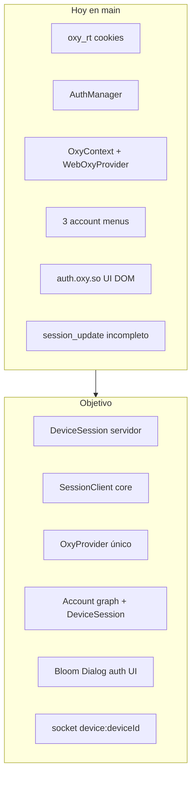
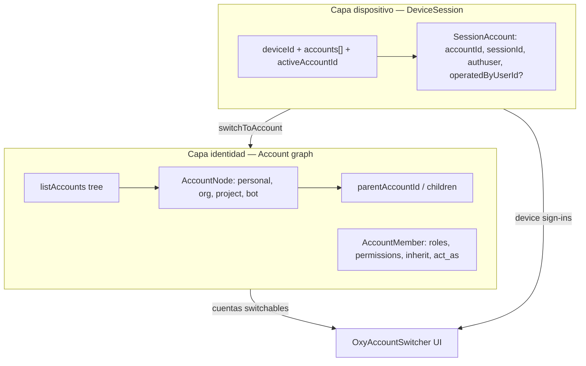
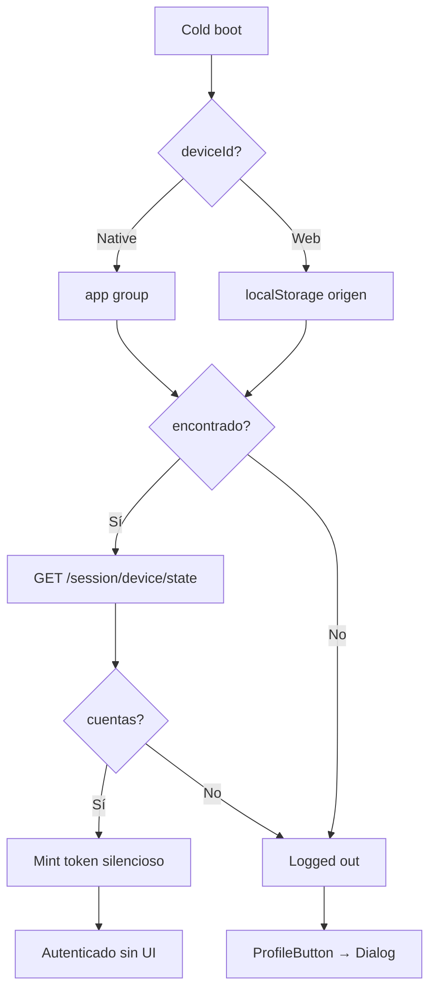
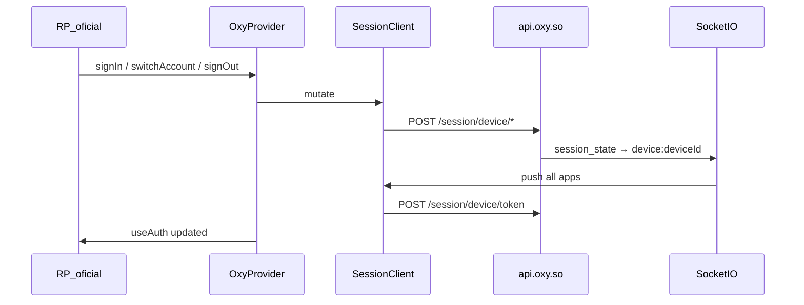
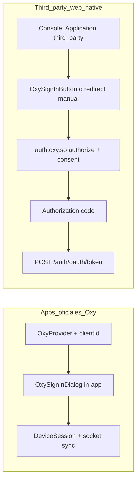
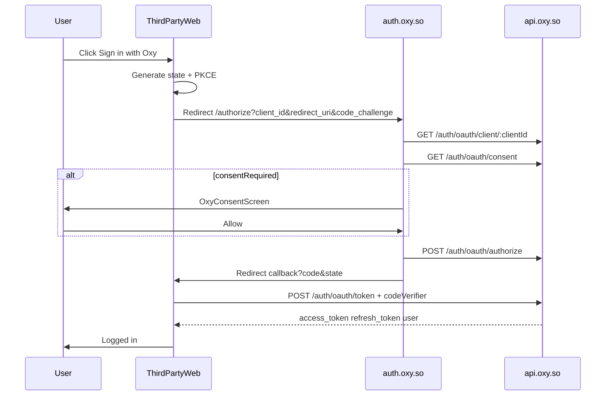
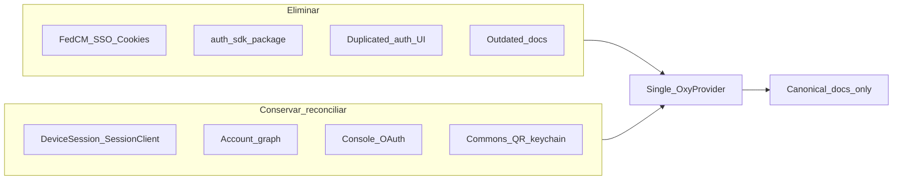

# Oxy Authentication, Sessions & Account System — Plan Maestro

> **Estado:** ✅ **IMPLEMENTADO — proyecto cerrado (2026-07-07).** Fases 0–7 + 2c en `main` y en producción (core 9 / services 19 / contracts 0.13; sesión device-first cero-cookie; IdP device-first sin excepción de transporte/chooser). Este documento es el plan maestro de referencia; el estado de ejecución y el cierre están en [`oxy-auth-audit.md`](./oxy-auth-audit.md) → "🏁 PROYECTO AUTH-PLATFORM CERRADO". Aprobado para ejecución 2026-07-05 (Nate + agente planificación).  
> **Ubicación canónica:** `docs/architecture/oxy-auth-platform.md`  
> **Handoff agente implementador (archivado):** [`docs/architecture/archive/oxy-auth-agent-handoff.md`](./archive/oxy-auth-agent-handoff.md) — checklist, gates, subagentes, inventario borrado  

---

## Briefing para el agente implementador

1. **Leer este doc completo** antes de tocar código. **Luego leer** [`oxy-auth-agent-handoff.md`](./archive/oxy-auth-agent-handoff.md) — reglas contractuales, gates, anti-derailments. **Ignorar** FedCM/SSO/cookies en AGENTS.md y docs legacy hasta Fase 7.
2. **Principios no negociables:** cero cookies, cero trucos (no FedCM, no SSO iframe, no cross-apex gating oculto), Commons-first, Bloom Dialog.
3. **Cherry-pick selectivo de p1** — traer DeviceSession + SessionClient + socket; **NO** traer cookie transport / silent iframe / SSO bounce de p1.
4. **Un solo SDK UI:** `@oxyhq/services` (`OxyProvider`); eliminar `@oxyhq/auth-sdk`.
5. **Tests:** Jest en api/core/services/contracts; `bun test` solo en `packages/auth` (IdP).
6. **Deploy:** cherry-pick sobre `origin/main` limpio; nunca merge rama p1 entera.
7. **Path-scope git adds** en `packages/api` si hay sesiones concurrentes.
8. **Fase 2c workshop** con Nate antes de implementar `POST /session/device/token` final.

### Checklist de fases

| Fase | ID | Entregable clave |
|------|-----|------------------|
| 0 | `audit` | `docs/architecture/oxy-auth-audit.md` |
| 1 | `reconcile-p1` | DeviceSession + socket en main, sync instantáneo verificado |
| 2 | `contracts` | Schemas en `@oxyhq/contracts` + publish |
| 2b | `console-registry` | privacy/terms URLs, docs Console |
| 2c | `cookie-free-design` | Spec token mint + offline (workshop Nate) |
| 3 | `merge-auth-sdk` | Un solo `OxyProvider`; eliminar auth-sdk |
| 4 | `unify-ui` | OxySignInDialog, OxySignInButton (official vs third_party OAuth), Bloom Dialog, account menu unificado |
| 5 | `auth-idp-rnweb` | auth.oxy.so monta componentes services |
| 6 | `migrate-apps` | Apps oficiales sin auth local |
| 7 | `clean-cut-docs` | Borrar legacy (§ Inventario); reescribir docs; AGENTS.md; grep must-be-zero = 0 |

---

## Objetivo

Una **plataforma central de cuenta/sesión** estilo Google: login una vez (por origen/dispositivo), multicuenta, switch instantáneo, sign-out remoto, apps oficiales sin consent OAuth, third party vía auth.oxy.so + Console.

---

## Decisiones acordadas

| Decisión | Elección |
|----------|----------|
| Base técnica | Híbrido sobre `impl/session-sync-p1` — DeviceSession + socket; rediseñar UI y eliminar auth-sdk |
| SDK | Un solo `OxyProvider` en `@oxyhq/services` (Expo + RN Web) |
| UI compartida | `@oxyhq/services` = fuente única; auth.oxy.so monta los mismos componentes |
| Apps oficiales | Sin consent — `Application.isOfficial` / `type: first_party\|internal\|system` |
| Third party | OAuth vía auth.oxy.so; apps registradas en **Console** |
| **Cero cookies** | Ninguna cookie de sesión. Compatible con cualquier navegador (sin 3PC) |
| **Sin tricky things** | Flujos lineales; sin iframes SSO, FedCM, fallbacks encadenados |
| Identidad primaria | **Commons** — clave local; QR (web) / keychain + deep-link (native) |
| Identidad secundaria | Username/password — UI colapsada "Sign in without the app" |
| Sign up | Commons (identidad cripto); auth.oxy.so puede registrar keyless con password |
| UI modales | Bloom `<Dialog placement={{ base: 'bottom', md: 'center' }}>` — reemplaza bottom sheet |
| Multicuenta | **In scope** — grafo de cuentas + DeviceSession + switcher unificado (ver § Multicuenta) |
| Cold boot | Silencioso si hay deviceId + sesión; Dialog solo vía ProfileButton si no |
| Token mint | Híbrido: `deviceSecret` para todos; firma Commons solo en step-up (Verify) |

---

## Estado actual vs objetivo



### Conservar de p1 (selectivo)

- Modelo `DeviceSession` + `/session/device/{state,add,switch,signout}`
- `SessionClient` en `@oxyhq/core`
- Socket room `device:<deviceId>`, evento `session_state`
- Perfiles vía `POST /users/by-ids` (no snapshots en sesión)

### Rediseñar / rechazar de p1

| Área | Acción |
|------|--------|
| auth-sdk | Fusionar en services; eliminar paquete |
| FedCM, silent iframe, `/sso` | Eliminar por completo |
| Token transport basado en cookies | **Rechazado** → mint server-side (`deviceSecret`) |
| bottomSheetManager | → Bloom Dialog |
| 3 account menus | → `OxyAccountMenu` + `OxyAccountSwitcher` |
| auth.oxy.so DOM | → componentes services (RN Web) |

---

## Principio: cero cookies, cero trucos — auth centralizado, datos descentralizables

**Auth/sesión (este plan):** authority en `api.oxy.so` (DeviceSession, OAuth, tokens). No se descentraliza el login.

**Datos/identidad (capas ya existentes):** Commons + DID + signed records; réplica opcional en [`@oxyhq/node`](../nodes/README.md). Invariante: **reads de apps no await el node** — ingest en background.

**Eliminar (clean cut):** `oxy_rt_*`, `fedcm_session`, FedCM, `/auth/silent`, `/sso`, `CrossDomainAuth`, `AuthManager`, `refresh-all`, cross-apex gating que oculta Commons.

**Persistencia permitida (storage first-party, no cookies):**

| Dato | Web | Native |
|------|-----|--------|
| `deviceId` | localStorage por origen | SecureStore + app group `group.so.oxy.shared` |
| `deviceSecret` | localStorage (cifrado si viable) | SecureStore / app group |
| `SessionState` cache | localStorage / IndexedDB | SecureStore |
| Access token | memoria + cache offline | memoria + keychain cache |
| Identidad Commons | — | KeyManager shared keychain |

**Offline native (estilo Twitter):** SessionState + token cacheado + React Query persistido; mutaciones encoladas; mint al reconectar.

---

## Modelo de identidad: Commons vs password

| | Commons (primario) | Password (secundario) |
|--|-------------------|----------------------|
| Sign up | Solo Commons app | auth.oxy.so (keyless) |
| Sign in native | shared keychain + `oxycommons://approve` — **sin QR** | password colapsado en Dialog |
| Sign in web | QR desde Commons en el móvil | password colapsado |
| Seguridad | Clave local + biometric | Password + 2FA |

**Accounts** = management-only (no crea identidad).

---

## Multicuenta y grafo de cuentas (IN SCOPE)

No es solo "organizaciones" — es un **modelo unificado de cuentas** ya iniciado en el repo:

### Dos capas distintas (no mezclar)



| Capa | Qué es | API / código |
|------|--------|--------------|
| **DeviceSession** | Qué cuentas están **firmadas en este dispositivo** ahora | `/session/device/*`, `SessionClient` |
| **Account graph** | Qué cuentas el usuario **puede** usar (propias, hijas, compartidas) | `GET /accounts`, [`account.service.ts`](../../packages/api/src/services/account.service.ts), [`OxyServices.accounts`](../../packages/core/src/mixins/OxyServices.accounts.ts) |

- **`User` = Account principal** con `kind`: `personal` \| `organization` \| `project` \| `bot`
- **Árbol:** `parentAccountId`, `ancestors`, profundidad máxima
- **Membership:** [`AccountMember`](../../packages/api/src/models/AccountMember.ts) — roles, permisos, herencia; `account:act_as` para switch
- **Switch a cuenta administrada:** `POST /accounts/:id/switch` → sesión real con `operatedByUserId` (auditoría)

### Comportamiento esperado en el switcher

1. **Al iniciar sesión** (cuenta personal): cargar **device sessions** + **account graph** en paralelo
2. **El switcher muestra al instante:**
   - Cuentas ya firmadas en el dispositivo (device set)
   - Cuentas del grafo a las que puede hacer `act_as` (orgs, projects, bots, cuentas compartidas vía parent/membership) — aunque aún no estén en el device set
3. **Al elegir cuenta del grafo** no firmada → `switchToAccount` → añade al DeviceSession → `revision++` → **socket sync** a todas las apps del deviceId
4. **Varios humanos** pueden administrar la misma cuenta con roles distintos (AccountMember) — eso no duplica DeviceSession; cada humano tiene su propio deviceId

### Integración con DeviceSession (requisitos implementación)

- [ ] `POST /session/device/add` tras login primary **y** tras `switchToAccount`
- [ ] `operatedByUserId` en SessionAccount cuando es cuenta administrada
- [ ] Switch persiste tras reload — **debe resolverse con DeviceSession**, no `oxy_rt`
- [ ] `OxyAccountSwitcher` unificado: sección A device sign-ins + sección B graph ([`AccountSwitcher.tsx`](../../packages/services/src/ui/components/AccountSwitcher.tsx) ya esboza esto)
- [ ] Socket `session_state` invalida queries de perfil al cambiar `activeAccountId`
- [ ] Sign-out de una cuenta del device set no revoca membership del grafo

### Criterios de aceptación multicuenta

- Login cuenta personal → switcher lista hijas/compartidas **sin segundo login**
- Switch a org/project → app entera cambia de identidad; reload persiste
- Switch en app A → app B (mismo deviceId) actualiza **al instante** vía socket
- Cuenta con varios admins: cada uno ve la cuenta en su grafo según permisos

---

## Flujos sign-in por plataforma

### Native — sin QR

1. Cold boot: app group deviceId → `GET /session/device/state` → mint silencioso
2. Fallback: `signInWithSharedIdentity()` si hay clave Commons
3. Si logged-out → ProfileButton → `OxySignInDialog` (deep-link Commons + password colapsado)

### Web — QR sí

1. Cold boot silencioso si hay deviceId + state en localStorage
2. Si logged-out → ProfileButton → Dialog con QR + "Open Oxy app" (móvil) + password colapsado
3. QR vincula sesión web al DeviceSession del teléfono (mismo deviceId)

### Third party OAuth

auth.oxy.so + `OxyConsentScreen`; metadata desde Console/Application registry.

---

## Cold boot (UX acordada)



- Primera visita a un **origen web nuevo**: logged-out hasta un sign-in ahí (limitación sin cookies cross-origin)
- Tras un sign-in en ese origen: automático + socket sync
- **Dominio irrelevante** (mention.earth = mercaria.co = inbox.oxy.so)

---

## Token mint server-side (modelo híbrido)

| Usuario | Login | Mint rutinario | Step-up |
|---------|-------|----------------|---------|
| Commons | QR/deep-link/keychain | `deviceSecret` | Firma challenge (Verify screen) |
| Password | `signInWithPassword` | `deviceSecret` | Password re-entry / 2FA |

- API: `POST /session/device/token` con `deviceId` + `deviceSecret`
- Sin refresh token en cookies
- **Fase 2c:** especificar rotación/revocación `deviceSecret`, TTL access token offline

---

## UI: Bloom Dialog

Reemplazar [`bottomSheetManager`](../../packages/services/src/ui/navigation/bottomSheetManager.ts) y `SignInModal` RN Modal:

```tsx
import { Dialog, useDialogControl } from '@oxyhq/bloom/dialog';

<Dialog
  control={signInControl}
  placement={{ base: 'bottom', md: 'center' }}
  title="Sign in to Oxy"
>
  <OxySignInContent />
</Dialog>
```

- `useAuth().signIn()` → `signInControl.open()`
- Migrar auth primero; después EditProfile, ManageAccount, etc.
- Referencia Bloom: [`packages/Bloom/src/dialog/placement.ts`](../../../Bloom/src/dialog/placement.ts)

---

## Arquitectura sesión (diagrama)



---

## Capas de paquetes

| Paquete | Rol |
|---------|-----|
| `contracts` | DeviceSessionState, session events, consent, applicationPublic, authActions |
| `core` | SessionClient, cold boot, token mint client, OAuth helpers, server middleware |
| `services` | OxyProvider, hooks, componentes auth Dialog, RN Web exports |
| ~~auth-sdk~~ | Eliminar |
| `auth` | IdP shell OAuth/consent/legal — componentes de services |
| `api` | DeviceSession, account graph, AppGrant, socket unificado |
| `accounts` | Gestión cuenta — consume SDK |
| `console` | Developer portal — Application + credentials + docs |
| `commons` | Identity vault — sign up + approve QR |

---

## Oxy Console (developer portal)

Ya existe: Application CRUD, credentials (`oxy_dk_*`), redirect URIs, OAuth consent, AppGrant, connected apps en Accounts.

**Gaps:** `privacyPolicyUrl` / `termsUrl` en Application; `OxyConsentScreen` unificada; **`docs/auth/integration-guide.md`** (guía third-party completa, Fase 7).

---

## Sign in with Oxy — integración third party (estilo Google)

Modelo mental equivalente a **Google Sign-In / Sign in with Google**:

| Google | Oxy |
|--------|-----|
| Google Cloud Console → OAuth client | **Oxy Console** → Application + Credential |
| `client_id` | `oxy_dk_…` (`ApplicationCredential.publicKey`) |
| Consent screen | `auth.oxy.so/authorize` + `OxyConsentScreen` |
| OAuth 2.0 Authorization Code + PKCE | `POST /auth/oauth/authorize` + `POST /auth/oauth/token` |
| "Sign in with Google" button | **`OxySignInButton`** o link branded a `auth.oxy.so` |
| Connected apps en Google Account | **Accounts → Connected apps** (`GET /auth/grants`, revoke) |

### Dos caminos de integración (no mezclar)



| | Apps oficiales Oxy | Third party (cualquier dominio) |
|--|-------------------|----------------------------------|
| Registro | Console, `type: first_party\|internal\|system` o `isOfficial` | Console, `type: third_party` |
| Consent OAuth | **No** — confianza por registro interno | **Sí** — pantalla consent + `AppGrant` |
| UI sign-in | Dialog embebido (Commons QR / keychain / password) | **Redirect** a `auth.oxy.so` (o in-app browser en native) |
| Sesión cross-app | **Sí** — mismo `deviceId` sincroniza vía socket entre apps Oxy | **No** — sesión por `client_id` + origen; independiente de otras webs |
| Persistencia | `deviceId` + `deviceSecret` + DeviceSession | Tokens OAuth en storage first-party del RP (localStorage / SecureStore) |
| Revocación usuario | Sign-out device / connected apps | Revoke en Accounts → desaparece `AppGrant`; próximo login pide consent de nuevo |

**Regla para agentes:** third party **nunca** usa FedCM, SSO bounce, cookies, ni `/__oxy/sso-callback`. Solo OAuth estándar + PKCE.

---

### Paso 1 — Registrar la app (Console)

1. Crear **Workspace** (personal o team) en [console.oxy.so](https://console.oxy.so).
2. **Applications → Create** con `type: third_party`.
3. Configurar:
   - **Name, logo, description** — mostrados en consent
   - **`redirectUris[]`** — match **exacto** (RFC 6749 §3.1.2); ej. `https://merchant.co/auth/callback`
   - **`scopes`** — permisos que la app solicitará (openid profile, etc.)
   - **`privacyPolicyUrl` / `termsUrl`** — requeridos en consent (gap Fase 2b)
4. **Credentials → Create:**
   - **`public`** — SPAs, mobile apps (PKCE; **sin** secret en el cliente)
   - **`confidential`** — backends con `clientSecret` (solo server-side token exchange)

El **`client_id`** es el `publicKey` del credential (`oxy_dk_…`). El secret se muestra **una vez** al crear/rotar.

---

### Paso 2 — Web third party (SPA o sitio estático)

Flujo OAuth 2.0 Authorization Code **con PKCE** (equivalente a Google GIS + OAuth para SPAs):

1. Usuario pulsa **Sign in with Oxy** (`<OxySignInButton clientId="oxy_dk_…" />` o link manual).
2. RP genera `state` + PKCE (`code_verifier`, `code_challenge` S256) y redirige:

```
https://auth.oxy.so/authorize
  ?client_id=oxy_dk_…
  &redirect_uri=https://merchant.co/auth/callback
  &response_type=code
  &state=<csrf>
  &scope=openid profile
  &code_challenge=<S256>
  &code_challenge_method=S256
```

3. En **auth.oxy.so** (Fase 5 — componentes `@oxyhq/services` vía RN Web):
   - Login si no hay sesión IdP (Commons / password — **no cookies**)
   - `GET /auth/oauth/consent` decide si hace falta consent (`third_party` → casi siempre la primera vez)
   - Usuario acepta → `POST /auth/oauth/authorize` (Bearer del usuario IdP) → code single-use
4. Redirect: `https://merchant.co/auth/callback?code=…&state=…`
5. RP valida `state`, intercambia code:

```http
POST https://api.oxy.so/auth/oauth/token
Content-Type: application/json

{
  "code": "...",
  "clientId": "oxy_dk_...",
  "redirectUri": "https://merchant.co/auth/callback",
  "codeVerifier": "<pkce_verifier>"
}
```

6. Respuesta: `{ access_token, refresh_token, sessionId, user }` — **tokens nunca en la URL**.
7. RP guarda tokens en storage local; opcionalmente monta `OxyProvider` solo para refresh/UI account menu.

**Backend propio del third party** (Node/Express):

```typescript
import { createOxyAuthMiddleware, OxyServices } from '@oxyhq/core/server';

const oxy = new OxyServices({ baseURL: 'https://api.oxy.so' });
app.use('/api', createOxyAuthMiddleware(oxy)); // Authorization: Bearer <access_token>
```

No implementar parsers bearer locales — usar `@oxyhq/core/server`.

---

### Paso 3 — Web third party (confidential / server-side)

Mismo redirect a `auth.oxy.so`, pero el **intercambio code→token ocurre en el backend** del RP:

```http
POST https://api.oxy.so/auth/oauth/token
{
  "code": "...",
  "clientId": "oxy_dk_...",
  "redirectUri": "https://merchant.co/auth/callback",
  "clientSecret": "<secret>"
}
```

El secret **nunca** va al browser. El backend emite su propia cookie de sesión de app o JWT propio si lo necesita — eso es responsabilidad del RP, no de Oxy.

---

### Paso 4 — Native third party (Expo / React Native)

Dos opciones soportadas (como Google Sign-In mobile):

| Opción | Cuándo | Cómo |
|--------|--------|------|
| **A — OAuth + custom scheme** | App standalone third party | Registrar `redirectUri` tipo `myapp://oauth/callback`; abrir `auth.oxy.so/authorize` en **in-app browser** / `WebBrowser.openAuthSessionAsync`; capturar code en deep link; exchange en backend o PKCE en app |
| **B — SDK embebido** | App que ya usa `@oxyhq/services` | `OxyProvider` + `OxySignInButton`; para `third_party` el botón abre OAuth redirect (no Dialog Commons-only) |

Native **no usa QR** para sign-in routine — Commons deep-link / keychain aplica a apps Oxy first-party, no al flujo OAuth third party estándar.

Schemes nativos: [`authorize.tsx`](../../packages/auth/src/pages/authorize.tsx) ya allowlista schemes registrados (extender vía Application config, no hardcode).

---

### Paso 5 — UI pública del botón (SDK)

Export único desde `@oxyhq/services` (Fase 4):

```tsx
import { OxyProvider, OxySignInButton, useAuth } from '@oxyhq/services';

export function App() {
  return (
    <OxyProvider clientId={process.env.OXY_CLIENT_ID} baseURL="https://api.oxy.so">
      <LoginPage />
    </OxyProvider>
  );
}

function LoginPage() {
  const { isAuthenticated } = useAuth();
  if (isAuthenticated) return <Dashboard />;
  return <OxySignInButton variant="contained" />; // "Sign in with Oxy"
}
```

Comportamiento del botón según Application resuelta vía `GET /auth/oauth/client/:clientId`:

| `type` / flags | Acción al click |
|----------------|-----------------|
| `first_party` / `internal` / `system` / `isOfficial` | Abre **OxySignInDialog** in-app (Commons-first) |
| `third_party` | **Redirect OAuth** a `auth.oxy.so/authorize` (PKCE generado por SDK) |

Branding: logo Oxy + texto **"Sign in with Oxy"** (nunca "Sign in with Commons"). Assets en `@oxyhq/services` / Bloom.

---

### Paso 6 — Gestión post-login (connected apps)

- Usuario ve apps autorizadas en **Accounts → Connected apps**
- API: `GET /auth/grants`, `DELETE /auth/grants/:applicationId` ([`OxyServices.connectedApps`](../../packages/core/src/mixins/OxyServices.connectedApps.ts))
- Revocar grant → próximo sign-in del third party vuelve a pedir consent
- (Fase 2b, opcional) revocar grant invalida sesiones OAuth activas de ese RP

---

### Secuencia completa (third party web)



---

### Qué NO prometer a third party (evitar confusión de agentes)

1. **No** sync silenciosa cross-domain entre `merchant.co` y `mention.earth` — eso es solo ecosistema Oxy con DeviceSession.
2. **No** `deviceSecret` mint para third party en v1 — tokens vienen del OAuth exchange estándar.
3. **No** registrar `/__oxy/sso-callback` — usar callback OAuth real del RP.
4. **No** `@oxyhq/auth` — solo `@oxyhq/services` + `@oxyhq/core`.
5. **No** FedCM, silent iframe, ni cookies de sesión Oxy en dominios third party.

---

### Entregables SDK/docs (fases)

| Fase | Entregable third party |
|------|------------------------|
| 2 | Contratos Zod: OAuth authorize/token responses, `PublicApplication`, consent decision |
| 2b | Console: privacy/terms URLs, copy consent, link a integration guide |
| 4 | `OxySignInButton` bifurcado official vs third_party; helper `buildOAuthAuthorizeUrl` + PKCE en `@oxyhq/core` |
| 5 | auth.oxy.so authorize/consent/signup con componentes services |
| 7 | **`docs/auth/integration-guide.md`** — guía completa copy-paste (web SPA, server, native) |

API existente a conservar (ya implementada): [`auth.ts` OAuth section](../../packages/api/src/routes/auth.ts) (`/oauth/authorize`, `/oauth/token`, `/oauth/consent`, `/oauth/client/:clientId`, `/grants`).

---

## Fases de ejecución

### Fase 0 — Auditoría

Checklist → `docs/architecture/oxy-auth-audit.md`. Incluir:

- Duplicación auth-sdk vs services; consumidores `@oxyhq/auth` en monorepo y repos externos
- Auth local por app (interceptors, restore, `/__oxy/sso-callback`)
- Account graph vs DeviceSession gaps (switch managed/org + reload)
- RN Web bundle auth.oxy.so
- Console Application registry gaps
- **Inventario de borrado:** grep cada patrón de § “must be zero”; listar archivos reales con path + owner package
- **Docs contradictorias:** marcar cada doc de § “Docs outdated” como DELETE / REWRITE / OK
- Handoffs y specs obsoletos en raíz

Entregable audit = tabla archivo → acción (delete | rewrite | merge | keep) verificable en Fase 7.

### Fase 1 — Reconciliar p1 (sin cookies)

Cherry-pick DeviceSession + SessionClient + socket. Centralizar socket emits en revocación. Verificar sync instantáneo + multicuenta switch.

### Fase 2 — Contratos + 2b Console + 2c workshop token

### Fase 3 — Fusionar auth-sdk → services

### Fase 4 — UI: OxySignInDialog, OxySignInButton (official vs third_party OAuth), OxyAccountMenu/Switcher, Bloom Dialog

### Fase 5 — auth.oxy.so sobre services

### Fase 6 — Migrar apps oficiales (+ repos externos npm bump)

### Fase 7 — Clean cut legacy + docs (sin migraciones, sin back-compat)

**Regla:** borrar código y docs obsoletos en el mismo PR que introduce el reemplazo. Nada de `@deprecated`, shims, feature flags legacy, ni “mantener un release por si acaso”. Si un test solo cubre comportamiento eliminado, se borra con el código.

Entregables Fase 7:
- `docs/architecture/oxy-auth-audit.md` marcado **DONE** con checklist verificada
- [`AGENTS.md`](../../AGENTS.md) reescrito (solo device-first, cero FedCM/SSO/cookies)
- Docs listadas abajo reemplazadas o eliminadas
- Grep en repo = **0 hits** en la lista “must be zero” (salvo CHANGELOG histórico si se decide conservarlo)

---

## Inventario de borrado (para agentes — NO reintroducir)

> **Fuente de verdad única para auth:** este documento + `oxy-auth-audit.md` tras Fase 0.  
> **Ignorar** secciones FedCM/SSO/cookies de AGENTS.md hasta que Fase 7 las reemplace.

### Paquetes / workspaces enteros

| Qué | Acción |
|-----|--------|
| [`packages/auth-sdk/`](../../packages/auth-sdk/) (`@oxyhq/auth`) | **Eliminar** tras Fase 3. Fusionar exports útiles en `@oxyhq/services`. |
| Root `package.json` workspace + scripts `auth:build` | Quitar referencias a auth-sdk. |

### `@oxyhq/core` — archivos y exports a eliminar

| Área | Archivos / símbolos |
|------|---------------------|
| FedCM mixin | `mixins/OxyServices.fedcm.ts`, tests `mixins/__tests__/fedcm.test.ts` |
| SSO mixin | `mixins/OxyServices.sso.ts`, tests `mixins/__tests__/sso.test.ts` |
| SSO bounce/return | `utils/ssoBounce.ts`, `utils/ssoReturn.ts`, tests en `utils/__tests__/sso*.ts`, `consumeSsoReturn.test.ts` |
| Cross-domain auth | `utils/crossDomainAuth.ts` (o equivalente), `__tests__/crossDomainAuth.test.ts` |
| Cold boot legacy | `utils/coldBoot.ts` (cadena FedCM/silent/SSO) → reemplazar por `runSessionColdBoot` device-first únicamente |
| Redirect helpers SSO | `mixins/OxyServices.redirect.ts` (si solo sirve SSO) |
| Bootstrap HTML | `getSsoCallbackBootstrapScript`, `SSO_CALLBACK_PATH`, `consumeSsoReturn`, `buildSsoBounceUrl`, `isCentralIdPOrigin`, `guardActive` — **eliminar exports** de `index.ts` |
| Device refresh slots | `establishDeviceRefreshSlot`, `AuthManager`, cookie slot helpers — **eliminar** |
| FedCM types/helpers | Cualquier export FedCM en `index.ts` |

### `@oxyhq/services` — eliminar / consolidar

| Área | Qué borrar |
|------|------------|
| Duplicado web | Toda lógica paralela a `WebOxyProvider` una vez fusionada en `OxyContext` |
| FedCM / SSO hooks | `useWebSSO`, guards `silentSignInWithFedCM`, tests `sso*.test.tsx`, `coldBootOrder` SSO |
| Cross-apex gating | [`utils/crossApex.ts`](../../packages/services/src/utils/crossApex.ts) — lógica que oculta Commons/QR según apex |
| Active authuser slots | [`utils/activeAuthuser.ts`](../../packages/services/src/utils/activeAuthuser.ts) (`oxy_active_authuser`) → reemplazar por DeviceSession active account |
| Bottom sheet auth | `bottomSheetManager` rutas SignIn/Account/Verify si migradas a Bloom Dialog; doc [`BOTTOM_SHEET_ROUTING.md`](../../packages/services/docs/BOTTOM_SHEET_ROUTING.md) obsoleta para auth |
| UI duplicada | Menús cuenta duplicados (`ProfileMenu` vs `AccountMenu` vs `OxyAccountMenu`) → **uno** export público |
| SignInModal RN Modal | Modal paralelo al Dialog — eliminar tras Fase 4 |

### `@oxyhq/api` — rutas, modelos, servicios

| Qué | Acción |
|-----|--------|
| [`routes/fedcm.ts`](../../packages/api/src/routes/fedcm.ts) + [`controllers/fedcm.controller.ts`](../../packages/api/src/controllers/fedcm.controller.ts) | Eliminar mount en `server.ts` |
| [`routes/sso.ts`](../../packages/api/src/routes/sso.ts) + [`services/ssoCode.service.ts`](../../packages/api/src/services/ssoCode.service.ts) | Eliminar |
| [`services/fedcm.service.ts`](../../packages/api/src/services/fedcm.service.ts) | Eliminar |
| Modelos | `FedCMGrant`, `FedCMNonce` — eliminar colecciones vía script ops (no migración app-level) |
| `POST /auth/refresh-all` | Eliminar (IdP ya no es session authority por cookies) |
| Cookie refresh slots | `oxy_rt_*`, `fedcm_session`, `establishDeviceRefreshSlot` en auth routes |
| Rate limits | Prefijos `rl:fedcm:*`, handlers SSO — eliminar |
| OpenAPI / scripts | Quitar FedCM/SSO de `generate-openapi.ts`; seeds que registran `__oxy/sso-callback` → actualizar a redirect URIs OAuth normales |

### `packages/auth` (auth.oxy.so IdP)

| Qué | Acción |
|-----|--------|
| FedCM/SSO server | Rutas `/fedcm/*`, `/auth/silent`, `/sso`, `/sso/establish`, `/.well-known/web-identity`, `public/fedcm.json` |
| `useDeviceAccounts` + `refresh-all` | Reemplazar por flujo OAuth/device-session (Fase 5) |
| `lib/auth-utils.ts` | `setFedcmSession`, login-status iframe — eliminar |
| Tests FedCM | `server/__tests__/fedcm.*`, `authorize-fedcm-session.test.tsx` |
| **Conservar** | OAuth authorize/consent, legal pages, device-flow approve UI (reimplementada con services) |

### Apps consumidoras — limpieza por app

| App | Borrar / cambiar |
|-----|------------------|
| `accounts`, `inbox`, `commons` | `getSsoCallbackBootstrapScript()` en `app/+html.tsx` |
| `console`, `test-app-vite` | Dependencia `@oxyhq/auth` → `@oxyhq/services` |
| Todas las web | Rutas `/__oxy/sso-callback` en redirectUris de Application (Console) |
| `examples/web-react-auth.tsx` | Reescribir sin `crossDomainAuth.signInWithRedirect` |

### Tests — borrar con el código (no “skip”)

- `packages/core/src/mixins/__tests__/fedcm.test.ts`, `sso.test.ts`, `establishDeviceRefreshSlot.test.ts`
- `packages/services/__tests__/context/sso*.test.tsx`, `coldBootOrder.test.tsx` (partes SSO)
- `packages/api/src/routes/__tests__/sso.test.ts`, fedcm-related
- `packages/auth-sdk/**` entero tras merge

### Grep “must be zero” post Fase 7

Agentes: tras Fase 7 estos strings no deben aparecer en `packages/` ni `docs/` (excepto CHANGELOG histórico explícito):

```
fedcm_session | refresh-all | WebOxyProvider | signInWithFedCM | silentSignInWithFedCM
sso/exchange | ssoBounce | ssoReturn | __oxy/sso-callback | getSsoCallbackBootstrapScript
oxy_rt_ | AuthManager | establishDeviceRefreshSlot | crossDomainAuth | useWebSSO
@oxyhq/auth | packages/auth-sdk | bottomSheetManager (auth routes) | oxy_active_authuser
DeveloperApp | signInWithRedirect
```

---

## Docs — ver handoff (actualizado 2026-07-05)

**Lista autoritativa:** [`oxy-auth-agent-handoff.md` § Documentación](./oxy-auth-agent-handoff.md#documentation).

Resumen: `CROSS_DOMAIN_AUTH`, spec cross-domain cookie/FedCM y `BOTTOM_SHEET_ROUTING` **borrados**. `SESSION-ARCHITECTURE`, `AUTHENTICATION`, `auth/README`, `services/docs/ARCHITECTURE` = **STUB** (solo redirect). Fase 7 reescribe. **No restaurar** docs borrados desde git sin Nate.

### [`AGENTS.md`](../../AGENTS.md) — secciones a reemplazar (crítico para agentes)

Las siguientes secciones **confunden agentes** hoy; reescribir en Fase 7 con reglas cortas:

1. **FedCM** (entera) — eliminar; mencionar solo “deleted, see oxy-auth-platform.md”
2. **Sign in with Oxy / QR** — actualizar: web = QR Commons; native = keychain/deep-link; sin FedCM
3. **Auth App** — IdP = OAuth consent + device chooser; **no** `WebOxyProvider`, **no** `refresh-all`
4. **Auth / Session Contract** — device-first cold boot; `canUsePrivateApi`; linked clients
5. **Accounts App** — quitar FedCM web sign-in
6. **Offline / useSessionSocket** — conservar reglas; alinear eventos con DeviceSession

También alinear [`~/AGENTS.md`](../../../AGENTS.md) (global) y [`~/Oxy/AGENTS.md`](../../../Oxy/AGENTS.md): la “wave 2 device-first” ya no debe listar pasos FedCM/silent iframe.

### Doc canónico nuevo (crear en Fase 7)

| Doc | Propósito |
|-----|-----------|
| `docs/auth/integration-guide.md` | Sign in with Oxy third party: Console setup, OAuth+PKCE web SPA, confidential server, native custom scheme, OxySignInButton, backend `@oxyhq/core/server`, connected apps revoke |
| `docs/auth/device-session.md` | DeviceSession API, socket events, multicuenta |
| `docs/architecture/oxy-auth-audit.md` | Checklist Fase 0 — fuente de verificación borrado |

---

## Anti-patterns prohibidos (para agentes)

1. **No** reintroducir cookies (`Set-Cookie`, `credentials: 'include'` para session restore en RP)
2. **No** añadir rutas `/__oxy/sso-callback` ni bootstrap scripts en apps
3. **No** duplicar providers (`WebOxyProvider` + `OxyProvider` en la misma app)
4. **No** “fallback chain” silencioso (FedCM → iframe → bounce → cookie) — cold boot = DeviceSession o logged-out
5. **No** `@deprecated` / alias exports — clean cut
6. **No** leer `docs/CROSS_DOMAIN_AUTH.md` ni FedCM en AGENTS.md para implementar auth
7. **No** `oxy_active_authuser` / refresh slots — usar DeviceSession active account id
8. **No** bottom sheet para sign-in — Bloom Dialog (`placement={{ base: 'bottom', md: 'center' }}`)
9. **No** ocultar Commons/QR con heurísticas de apex (`crossApex.ts`)
10. **Fix upstream** — auth compartido solo en core + services + api; apps no implementan restore local



---

## Criterios de aceptación (resumen)

- Cero cookies; Commons-first; Bloom Dialog
- Cold boot silencioso; Dialog solo si no hay sesión
- Multicuenta: grafo visible al login; switch persiste; socket sync cross-app
- Console + third party OAuth + connected apps revoke
- Un solo OxyProvider; sin auth local en apps oficiales
- Offline native usable

---

## Riesgos

| Riesgo | Mitigación |
|--------|------------|
| Sin cookies, primer origen web nuevo necesita auth | Documentado; socket post-vinculación |
| Account graph + DeviceSession desincronizados | Single write path vía SessionClient; tests switch+reload |
| Bundle Vite + services | Lazy imports |
| p1 merge trae cookies | Cherry-pick estricto |

---

## Temas menores (no bloquean inicio Fase 0)

- **Commons A0:** clientId EAS + app group iOS — ver AGENTS.md pending
- **Sign-out deliberado:** equivalente cookie-free a `ssoSignedOutKey` (flag localStorage por origen)
- **Revoke AppGrant → invalidar sesiones RP activas** — evaluar en Fase 2b
- **Handoffs** SESSION-SYNC / ACCOUNT-SWITCH — eliminados; no recrear
- **npm publish order:** contracts → core → services → bump consumidores externos
- **2FA password:** mantener inline en OxySignInDialog (flujo actual Accounts)

---

## Referencias código clave

| Tema | Archivo |
|------|---------|
| Account graph service | [`packages/api/src/services/account.service.ts`](../../packages/api/src/services/account.service.ts) |
| Account switch route | [`packages/api/src/routes/accounts.ts`](../../packages/api/src/routes/accounts.ts) |
| AccountSwitcher UI | [`packages/services/src/ui/components/AccountSwitcher.tsx`](../../packages/services/src/ui/components/AccountSwitcher.tsx) |
| Device-flow sign-in | [`packages/services/src/ui/hooks/useOxyAuthSession.ts`](../../packages/services/src/ui/hooks/useOxyAuthSession.ts) |
| Console apps | [`packages/console/src/hooks/use-applications.ts`](../../packages/console/src/hooks/use-applications.ts) |
| AppGrant / OAuth consent | [`packages/api/src/models/AppGrant.ts`](../../packages/api/src/models/AppGrant.ts) |
