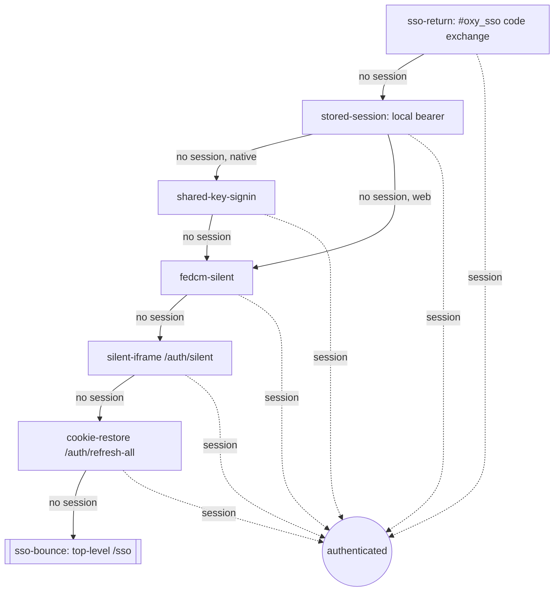

# Authentication & Session System

> How sign-in, cross-domain SSO, FedCM, service tokens, and backend request
> identity work across the Oxy ecosystem. The whole system is implemented **once**
> in the shared SDK (`@oxyhq/core`, `@oxyhq/auth`, `@oxyhq/services`) so every app
> gets it for free and stays zero-config.
>
> Related: [Architecture](../architecture/overview.md) · [Identity / Oxy ID](../identity/README.md) · [Changelog](../CHANGELOG.md)

---

## 1. The mental model: one IdP, many Relying Parties

There is exactly **one Identity Provider (IdP)** — `auth.oxy.so` (package
`packages/auth`, a standalone Vite + Hono app deployed as a Cloudflare Pages
`_worker.js`). Every other web app (Mention, accounts, console, inbox, Allo,
Homiio, …) is a **Relying Party (RP)** that consumes the IdP through the SDK.

| Role | Package / host | Session authority |
|---|---|---|
| **IdP** | `packages/auth` → `auth.oxy.so` (+ `auth.<rp-apex>` CNAMEs) | Owns `fedcm_session` + `oxy_rt_*` cookies (`Domain=oxy.so`) |
| **RP (web)** | `WebOxyProvider` from `@oxyhq/auth` | The SDK; restores via cold boot |
| **RP (Expo/RN)** | `OxyProvider` from `@oxyhq/services` | The SDK; restores via cold boot |
| **API** | `packages/api` → `api.oxy.so` | Validates bearer tokens, mints sessions, exchanges SSO codes |

**The IdP exception (critical — do not refactor away):** the auth app is the
IdP, *not* an RP. It MUST NOT use `WebOxyProvider` / `runColdBoot` / the RP
cold-boot + SSO-bounce chain — doing so would make the IdP bounce to *itself* for
session restore (a circular loop). Instead it uses a bespoke first-party path:
`useDeviceAccounts()` (`packages/auth/lib/use-device-accounts.ts`) reads the
shared refresh cookies via `POST api.oxy.so/auth/refresh-all` with
`credentials: include`. This is the *only* sanctioned exception to "all SSO logic
lives in the shared SDK"; that rule governs RPs.

---

## 2. FedCM (browser-native federated sign-in)

FedCM is the preferred interactive and silent path on Chromium browsers.

- **`mode` is W3C-spec `'active'` / `'passive'`** — NOT the legacy Chrome
  `'button'` / `'widget'`, which current Chrome rejects with a `TypeError`. The
  client (`OxyServices.fedcm.ts`) sends `'active'` first and transparently retries
  once with the Chrome 125–131 value for backward compatibility.
- **`mode` ≠ `mediation`.** `mode` (`active`/`passive`) selects the FedCM UI
  style; `mediation` (`silent`/`optional`/`required`) controls the
  credential-chooser flow. Silent SSO sends **no** `mode` field.
- **A server-minted, origin-bound nonce is required.** Before token exchange the
  client calls `POST /fedcm/nonce` (`mintServerNonce` / `getFedcmNonce`). A
  purely local UUID nonce is rejected with `invalid_nonce`.
- **Timeouts** (`OxyServices.fedcm.ts`): interactive `FEDCM_TIMEOUT = 15000`,
  silent `FEDCM_SILENT_TIMEOUT = 4000`, plus a `FEDCM_ABORT_SETTLE_GRACE_MS = 500`
  hard-settle grace. The grace exists because `navigator.credentials.get()` does
  **not** reliably reject on `AbortController` — in some Chrome states it hangs
  forever, so the silent step must race a settle-timer or it stalls the whole
  cold-boot chain.

**IdP server requirements** (in `packages/auth/server/index.ts`, require a
redeploy to take effect):

- `/.well-known/web-identity` served as `application/json` (not octet-stream).
- `id_assertion_endpoint` and `disconnect` send CORS headers
  (`Access-Control-Allow-Origin: <RP origin>` + `Access-Control-Allow-Credentials: true`)
  and enforce the `Sec-Fetch-Dest: webidentity` guard.
- `/fedcm.json` is a **dynamic handler**, not a static asset, because the issuer
  is computed per-request (see multi-domain FAPI below).

### Multi-domain FAPI

Any RP can `CNAME auth.<rp-domain>` → `oxy-auth.pages.dev`. `resolveConfig(c)`
(`packages/auth/server/index.ts:138`) derives `fedcmIssuer` from the incoming
request URL per-request (`${url.protocol}//${url.host}`), so on
`auth.mention.earth` the issuer is `https://auth.mention.earth` and the
`fedcm_session` cookie is first-party in Safari/Firefox. This is what makes
cross-domain restore survive Safari ITP / Firefox Total Cookie Protection.

> **NEVER set the `FEDCM_ISSUER` env var on the `oxy-auth` Pages project.** It
> pins *every* host to the same issuer and silently breaks multi-domain FAPI (all
> custom-domain hosts report the same `provider_urls`). The env override only
> exists for local dev/tests where the request URL is `http://localhost:<port>`.

---

## 3. The central-issuer invariant (read this before touching the IdP)

`resolveConfig()` sets `fedcmIssuer` *per-request* from the request URL — correct
for the browser-facing `/.well-known/web-identity` and `/fedcm.json` (they drive
the native FedCM UI). **But every API-bound assertion the IdP mints must use the
central issuer**, unconditionally:

```ts
// packages/auth/server/index.ts:794
const CENTRAL_FEDCM_ISSUER = `https://auth.${CENTRAL_IDP_APEX}`; // https://auth.oxy.so
```

`mintSessionForClient()` (`index.ts:614`) forces `iss = CENTRAL_FEDCM_ISSUER` for
**every** assertion it builds (used by `/sso/establish`, `/auth/silent`, etc.).

**Why:** the API's `POST /fedcm/exchange` validates the assertion's `iss` against
the central issuer *only*. If the IdP minted an assertion on
`auth.mention.earth` with `iss = https://auth.mention.earth`, the API would
reject it (`FedCM: Invalid issuer expected "https://auth.oxy.so"`),
`mintSessionForClient` would return `null`, and cross-domain sessions would never
survive a reload — even though the `fedcm_session` cookie was planted correctly.
The per-apex `fedcm_session` cookie (host-only) is independent of the assertion
issuer, so this fix does not affect cookie planting.

---

## 4. Cross-domain SSO — the "Option A" architecture

When a cross-apex RP has no local session and silent paths fail, the SDK does a
**top-level bounce** to the central IdP, which performs a second first-party hop
to plant a host-only cookie on `auth.<rp-apex>` (surviving Safari ITP / Firefox
TCP), mints a single-use code, and bounces back. The RP redeems the code at the
API. Subsequent reloads restore silently via the `/auth/silent` iframe — no bounce.

Key endpoints and storage keys (defined once in `@oxyhq/core`):

- `SSO_CALLBACK_PATH = '/__oxy/sso-callback'` (`ssoBounce.ts:53`)
- `SSO_GUARD_TTL_MS = 30_000` — self-healing once-guard TTL (`ssoBounce.ts:63`)
- `buildSsoBounceUrl(origin, state, authWebUrl?)` → `/sso?prompt=none&client_id=<origin>&return_to=<origin>/__oxy/sso-callback&state=<state>` (`ssoBounce.ts:195`)
- `isCentralIdPOrigin(origin)` — prevents bouncing `auth.oxy.so` to itself
- `guardActive(storage, origin)` — 30s reentrancy guard
- New API SSO endpoints: `POST /sso/code` (`X-Oxy-Internal`-gated; 404 if
  `SSO_INTERNAL_SECRET` unset) and `POST /sso/exchange` (CORS, origin-bound,
  atomic GETDEL burn in Valkey).
- IdP establish-token: HS256, signed with `FEDCM_TOKEN_SECRET`,
  `ESTABLISH_TOKEN_LIFETIME = 60s`, `purpose = 'sso-establish'`, bound to
  host + audience.

```mermaid
sequenceDiagram
    participant RP as RP page (SDK)
    participant Central as auth.oxy.so (/sso)
    participant Apex as auth.&lt;rp-apex&gt; (/sso/establish)
    participant API as api.oxy.so
    RP->>Central: top-level GET /sso?prompt=none&client_id=&state= (buildSsoBounceUrl)
    Note over Central: reads central fedcm_session cookie<br/>resolveApprovedClientOrigin(client_id)
    Central->>Apex: 2nd top-level hop /sso/establish?et=&lt;HS256 establish-token&gt;
    Note over Apex: verify et → re-validate session + approved client<br/>PLANT host-only fedcm_session on auth.&lt;rp-apex&gt;<br/>mintSessionForClient (iss = central!)
    Apex->>API: POST /sso/code (X-Oxy-Internal) → opaque single-use code
    Apex-->>RP: 303 → &lt;rp&gt;/__oxy/sso-callback#oxy_sso=ok&code=&lt;code&gt;&state=&lt;state&gt;
    Note over RP: SDK intercepts SSO_CALLBACK_PATH, validates state
    RP->>API: POST /sso/exchange { code } (origin-bound, atomic GETDEL)
    API-->>RP: session { accessToken, user } → token planted
```

The hash fragment (`#oxy_sso=…`) is used deliberately — fragments are never sent
to the server and never logged. The SDK intercepts `SSO_CALLBACK_PATH` on mount,
validates `state` against the stored `ssoStateKey(origin)`, exchanges the code,
clears the hash, and sets a once-guard so it can't re-fire.

---

## 5. Web cold-boot restore order

`runColdBoot` (`packages/core/src/utils/coldBoot.ts:141`) is a pure, ordered
short-circuit runner. It takes `steps: { id, enabled?, run }[]`, runs them in
order, and the **first** step that returns `{ kind: 'session' }` wins. A step may
return `{ kind: 'skip' }`, throw, or be disabled to fall through. There is **no
module-level state** — the silent-SSO once-guard lives in the consumers, because
a core module-level singleton re-evaluates in the Metro web bundle and the guard
wouldn't hold across navigations. A single shared deadline races all steps;
`onStepDeadline(id)` reports a step that fails to settle and the runner moves on.

**`WebOxyProvider` (`@oxyhq/auth`)** registers these steps in order
(`WebOxyProvider.tsx:698`):

| # | step `id` | enabled when | what it does |
|---|---|---|---|
| 0 | `sso-return` | web browser | parse `#oxy_sso` fragment, validate state, `exchangeSsoCode` |
| 1 | `fedcm-silent` | FedCM supported & not already attempted this page | central FedCM silent (one-shot guard keyed `origin|baseURL`) |
| 2 | `cookie-restore` | web browser | `authManager.initialize({ timeout: COOKIE_RESTORE_TIMEOUT })` (3000ms) |
| 3 | `sso-bounce` | smart gate passes (see below) | **terminal**: top-level navigation to central `/sso` |

**`OxyContext` (`@oxyhq/services`, web + native)** registers a longer chain
(`OxyContext.tsx:1268`), with a hard overall deadline
`COLD_BOOT_OVERALL_DEADLINE = 20000`:

| # | step `id` | enabled when | what it does |
|---|---|---|---|
| 0 | `sso-return` | web browser | `runSsoReturn()` → commit via `handleWebSSOSession` |
| 1 | `stored-session` | **always** | `restoreStoredSession()` — **the only native path** |
| 2 | `shared-key-signin` | native & no stored session | `signInWithSharedIdentity()` (shared-keychain SSO) |
| 3 | `fedcm-silent` | no stored session, FedCM supported, not attempted | central FedCM silent |
| 4 | `silent-iframe` | no stored session, web browser | per-apex `/auth/silent` iframe (`SILENT_IFRAME_TIMEOUT = 2500`) |
| 5 | `cookie-restore` | web browser | `restoreViaRefreshCookie()` (`COOKIE_RESTORE_TIMEOUT = 3000`) |
| 6 | `sso-bounce` | smart gate passes | **terminal**: central `/sso` bounce |



**Ordering rationale ("FIX A", `OxyContext.tsx:1201`):** `stored-session` runs
*before* the slow web probes. On a normal reload a local bearer validates in one
round-trip and short-circuits, so the common path is fast and never flashes.

**Native cold boot** runs only step 1 (`stored-session`) plus, if no stored
session, step 2 (`shared-key-signin`). There is no FedCM/iframe/cookie/bounce on
native.

### The "smart" SSO-bounce gate

The terminal `/sso` bounce is the only step that navigates the top frame, so it's
gated to avoid bouncing first-time visitors who have never had a session
(introduced in core 3.15.0 / auth 6.0.0 / services 12.0.0; replaced the old
`disableAutoSso` flag). The gate (`allowSsoBounce({ hasPriorSession, hasLocalSession })`)
allows the bounce only when there's evidence the user has signed in before
(`ssoPriorSessionKey`, a durable localStorage hint) or a local session exists,
AND the page is not an iframe, AND it's not the central IdP itself, AND no
`ssoNoSessionKey` / `ssoAttemptedKey` flag is set, AND no 30s `guardActive` is in
effect. After a successful restore the SDK writes the durable
`ssoPriorSessionKey` hint so future reloads can bounce silently.

### The `/auth/silent` iframe (Safari/Firefox restore without a bounce)

`silentSignIn()` (`OxyServices.silent.ts:83`) embeds a hidden iframe at
`https://auth.<rp-apex>/auth/silent?client_id=<origin>&nonce=<uuid>`. The IdP
reads the host-only `fedcm_session` cookie (first-party to the RP apex), mints an
assertion (central issuer!), exchanges it at the API, and `postMessage`s
`{ type: 'oxy_silent_auth', session, nonce }` back **to the validated
`client_id` origin only — never `targetOrigin: '*'`**. This restores
cross-domain sessions on Safari/Firefox without a top-level bounce.

---

## 6. Session token planting

`OxyServices.verifyChallenge()` (`OxyServices.auth.ts:524`) and
`claimSessionByToken()` both call `setTokens(accessToken, refreshToken ?? '')`
internally before returning. Consumers do not hand-plant tokens after sign-in —
they `await` and proceed. This also fixes token-less new-identity onboarding (no
call to the bearer-protected `getTokenBySession` for a brand-new identity that
has no session yet).

**401 = authoritative local sign-out.** On a 401, `HttpService` clears tokens and
emits `onTokensChanged(null)`. `OxyContext` treats that as authoritative: clears
session + managed accounts and disables private fetches until a new token is
restored. `isAuthenticated` must never stay `true` after
`getAccessToken()` becomes null. Consumer apps gate private work with SDK state
(`useAuth().canUsePrivateApi` / `useAuth().isPrivateApiPending`), never local
token helpers.

---

## 7. Service tokens (internal service-to-service auth)

Internal Oxy services authenticate with short-lived service JWTs (OAuth2
Client-Credentials). See [service tokens detail](../SERVICE_TOKENS.md) for the
DB model; the SDK surface (`OxyServices.auth.ts`):

```ts
const oxy = new OxyServices({ baseURL: 'https://api.oxy.so' });
oxy.configureServiceAuth('oxy_dk_...', 'secret...');   // line 248
const token = await oxy.getServiceToken();             // cached + auto-refreshed, line 272
const result = await oxy.makeServiceRequest('POST', '/endpoint', data, userId); // line 450
```

- `getServiceToken()` caches per `sha256(apiKey)` with a 60s clock-drift buffer,
  deduplicates concurrent calls via a shared `pending` promise, and compares the
  secret in constant time (`timingSafeEqual`). A secret mismatch throws
  `ServiceCredentialMismatchError`.
- `makeServiceRequest()` adds `Authorization: Bearer <token>` and, when `userId`
  is passed, an `X-Oxy-User-Id` delegation header.
- The service JWT embeds `appId` (= `applicationId`) and `credentialId`; the
  claim name `appId` is intentionally stable so `@oxyhq/core` service-token
  verification doesn't break.

The token endpoint is `POST /auth/service-token`, validating `publicKey` +
`secret` against an active `type:'service'` `ApplicationCredential` (sha256
`secretHash`, constant-time).

---

## 8. "Sign in with Oxy" — device sign-in (QR + shared keychain)

Two mechanisms, both surfaced under one user-facing label "Sign in with Oxy":

- **Same-device shared-keychain SSO (native):** `signInWithSharedIdentity()`
  signs a challenge with the shared identity key and redeems it. Runs as the
  `shared-key-signin` cold-boot step on native.
- **Cross-device QR handoff:** `startCommonsSignIn({ clientId })`
  (`OxyServices.auth.ts:768`) mints a secret `sessionToken` + a public
  `authorizeCode`, calls `POST /auth/session/create`, and returns a
  `qrPayload` (`oxycommons://approve?v=1&code=<authorizeCode>&...`) — the secret
  `sessionToken` is **never** in the QR. Commons scans, fetches
  `getCommonsApprovalInfo(authorizeCode)` (server-resolved `Application` identity
  + scopes, never trusting the raw QR), biometric-gates, and key-signs
  `approveCommonsSignIn(...)` → `POST /auth/session/authorize-signed/:code`. The
  RP polls (`pollCommonsSignIn`) and redeems via `claimSessionByToken`.

Full crypto + endpoint detail is in
[identity/README.md → Sign in with Oxy](../identity/README.md#6-sign-in-with-oxy).

---

## 9. Linked backend clients (RP → its own API)

RP apps that call their *own* backend (`api.mention.earth`, `api.syra.fm`, …)
MUST use `oxyServices.createLinkedClient({ baseURL })`. The linked client mirrors
the session owner's access token, delegates preflight/401 refresh to the owner,
and invalidates the owner when a linked 401 can't refresh. `createLinkedClient`
defaults to `enableCache: false` (core 3.9.0) so a GET cache never serves
stale-after-write data.

**Do NOT** add app-local token providers, Axios/fetch auth interceptors, manual
`Authorization` plumbing, refresh-cookie retries, or local session invalidation.
Those drift and re-implement what the SDK already owns.

---

## 10. Backend request identity — `@oxyhq/core/server`

Express/Node backends use the shared server middleware. **Do not** define
app-local `AuthRequest`, `requireAuth`, `getUserId`, bearer parsers, or
token-decoding middleware — missing behavior belongs upstream in
`@oxyhq/core/server`.

| Export | File | Purpose |
|---|---|---|
| `createOptionalOxyAuth(oxy, opts?)` | `server/auth.ts:113` | resolve identity if present (idempotent); never 401s |
| `createOxyAuthMiddleware(oxy, opts?)` | `server/auth.ts:135` | optional-auth + `requireOxyAuth` (401 if missing) |
| `requireOxyAuth(req,res,next)` | `server/auth.ts:97` | 401 when no resolved userId |
| `getRequiredOxyUserId(req)` | `server/auth.ts:89` | resolve userId or throw — use this for owner ids |
| `createOxyRateLimit(oxy, opts?)` | `server/rateLimit.ts:148` | per-user (5000/15min) / per-IP (600/15min) limiting; exempts uploads/media/health/OPTIONS; `express-rate-limit` is a required peer |
| `createOxyCors({ appOrigins, allowCredentials })` | `server/cors.ts` | deny-by-default allowlist; auto-allows `*.oxy.so`; HTTPS-only; **never** wildcard+credentials; always `Vary: Origin` |
| `safeFetch(url, opts?)` | `server/safeFetch.ts:502` | SSRF-safe fetch (see below) |
| `verifySecret(provided, expected)` | `server/verifySecret.ts:33` | constant-time `timingSafeEqual` + length guard; returns `false`, never throws |
| `authSocket` | `server/auth.ts` | Socket.IO/WebSocket auth |

**`safeFetch` SSRF protections** (use it for **any** fetch of a user/remote-supplied
URL): URL length ≤ 2048, protocol ∈ {http,https}, port ∈ {80,443}, a private/CGNAT/
link-local IPv4 denylist (`10/8`, `127/8`, `169.254/16`, `172.16/12`,
`192.168/16`, `100.64/10`, …), a **DNS-pinned** custom `lookup` that connects to
the exact validated IP (closes the DNS-rebind TOCTOU), bounded redirects
(`MAX_REDIRECTS = 5`, validate every hop, destroy redirect bodies), and an 8s
headers timeout. On Bun the custom `lookup` MUST return `[{address,family}]` when
called with `{all:true}` or Bun throws `results.sort is not a function`.

**Socket.IO rule:** always `io.use(oxy.authSocket())`, derive rooms from
`socket.user.id` (never client-supplied), and ownership-check before joining
session/conversation rooms — client-supplied room IDs are a critical IDOR gap.

**Mass-assignment rule:** never `new Model(req.body)` or spread `req.body` into
`findByIdAndUpdate`; resolve owner ids via `getRequiredOxyUserId` and whitelist
fields explicitly.
