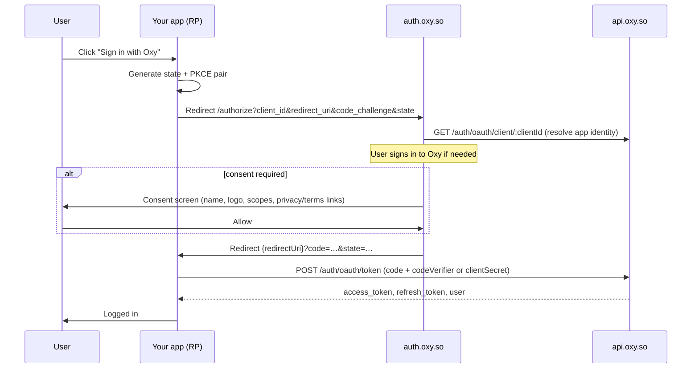

# Sign in with Oxy — Third-Party Integration Guide

> **Audience:** developers integrating "Sign in with Oxy" into an app that is **not** an official Oxy app — any web SPA, server-rendered site, or native app on any domain.
> **Model:** standard OAuth 2.0 Authorization Code, with PKCE (RFC 7636, S256) for public clients. No browser tricks, no Oxy session cookies on your domain, no hidden iframes — a plain top-level redirect to `auth.oxy.so` and back.
>
> Official Oxy apps integrate differently (in-app dialog + device-session sync) — see [`docs/auth/device-session.md`](./device-session.md). This guide is for everyone else.

The mental model is the same as Google Sign-In:

| Google | Oxy |
|--------|-----|
| Google Cloud Console → OAuth client | **Oxy Console** ([console.oxy.so](https://console.oxy.so)) → Application + Credential |
| `client_id` | `oxy_dk_…` (an `ApplicationCredential` public key) |
| Consent screen | `auth.oxy.so/authorize` + `OxyConsentScreen` |
| OAuth 2.0 Authorization Code + PKCE | `auth.oxy.so/authorize` → `POST api.oxy.so/auth/oauth/token` |
| "Sign in with Google" button | `OxySignInButton` from `@oxyhq/services`, or your own link |
| Connected apps in Google Account | Accounts → Connected apps (`GET /auth/grants`, revoke) |

---

## How it works



Key properties:

- The authorization code is **single-use** and expires after ~60 seconds. Replay, expiry, or a `redirect_uri` mismatch returns `401` with no detail.
- Tokens are **never in a URL** — only the short-lived `code` and your `state` cross the redirect.
- The user's Oxy session lives on Oxy's own origins. Your app only ever holds the OAuth tokens it was issued.
- Consent is recorded as an `AppGrant`. The user can revoke it at any time from their Oxy account, after which the next sign-in prompts for consent again.

---

## Step 1 — Register your application (Console)

1. Sign in to [console.oxy.so](https://console.oxy.so) and create (or pick) a **Workspace**.
2. **Applications → Create** with `type: third_party`.
3. Configure:
   - **Name, logo, description** — shown to the user on the consent screen.
   - **`redirectUris[]`** — matched **exactly** (RFC 6749 §3.1.2). e.g. `https://merchant.example/auth/callback` or `myapp://oauth/callback` for native. No wildcards, no prefix matching.
   - **`scopes`** — the permissions your app will request (default `openid profile`).
   - **`privacyPolicyUrl` / `termsUrl`** — rendered as legal links on the consent screen.
4. **Credentials → Create:**
   - **`public`** — for SPAs and native apps. No secret ships in the client; the code exchange is proven with PKCE.
   - **`confidential`** — for backends that can keep a `clientSecret`. The secret is shown **once** on create/rotate and only ever used server-side.

Your **`client_id`** is the credential's public key (`oxy_dk_…`).

---

## Step 2 — Web SPA (public client + PKCE)

Use the helpers from `@oxyhq/core` — `generatePkcePair()`, `generateOAuthState()`, and `buildOAuthAuthorizeUrl()` (see `packages/core/src/utils/oauthPkce.ts`). They run identically on web, Node, and React Native.

**Start the flow** (e.g. from your sign-in button's click handler):

```typescript
import { generatePkcePair, generateOAuthState, buildOAuthAuthorizeUrl } from '@oxyhq/core';

const OXY_CLIENT_ID = 'oxy_dk_your_client_id';
const REDIRECT_URI = 'https://merchant.example/auth/callback';

async function startSignInWithOxy(): Promise<void> {
  const [pkce, state] = await Promise.all([generatePkcePair(), generateOAuthState()]);

  // Persist the handshake so the callback page can validate `state` and
  // replay the verifier after the full-page redirect.
  sessionStorage.setItem('oxy_oauth_state', state);
  sessionStorage.setItem('oxy_oauth_code_verifier', pkce.codeVerifier);

  window.location.assign(
    buildOAuthAuthorizeUrl({
      clientId: OXY_CLIENT_ID,
      redirectUri: REDIRECT_URI,
      state,
      codeChallenge: pkce.codeChallenge,
      // scope defaults to 'openid profile'; authorizeBaseUrl defaults to
      // https://auth.oxy.so/authorize
    }),
  );
}
```

**Handle the callback** at your registered `redirectUri`:

```typescript
interface OxyTokenResponse {
  data: {
    access_token: string;
    refresh_token: string;
    token_type: 'Bearer';
    expires_in: number; // seconds (access token; currently 900)
    session_id: string;
    user: { id: string; username?: string; name?: { displayName?: string } };
  };
}

async function handleOAuthCallback(): Promise<OxyTokenResponse['data']> {
  const params = new URLSearchParams(window.location.search);
  const code = params.get('code');
  const returnedState = params.get('state');

  const expectedState = sessionStorage.getItem('oxy_oauth_state');
  const codeVerifier = sessionStorage.getItem('oxy_oauth_code_verifier');
  sessionStorage.removeItem('oxy_oauth_state');
  sessionStorage.removeItem('oxy_oauth_code_verifier');

  if (!code || !returnedState || !expectedState || returnedState !== expectedState || !codeVerifier) {
    throw new Error('Sign in with Oxy: state validation failed');
  }

  const response = await fetch('https://api.oxy.so/auth/oauth/token', {
    method: 'POST',
    headers: { 'Content-Type': 'application/json' },
    body: JSON.stringify({
      code,
      clientId: 'oxy_dk_your_client_id',
      redirectUri: 'https://merchant.example/auth/callback',
      codeVerifier,
    }),
  });
  if (!response.ok) {
    throw new Error(`Sign in with Oxy: token exchange failed (${response.status})`);
  }

  const { data } = (await response.json()) as OxyTokenResponse;
  // Store data.access_token / data.refresh_token in your app's own storage
  // (localStorage, memory, etc.) and call your APIs with
  // `Authorization: Bearer <access_token>`.
  return data;
}
```

Alternatively, render `<OxySignInButton />` from `@oxyhq/services` and let the SDK generate the PKCE pair and redirect for you — see [Step 5](#step-5--the-oxysigninbutton-sdk-ui). On web the button persists the handshake under the exported `OXY_OAUTH_STATE_STORAGE_KEY` / `OXY_OAUTH_CODE_VERIFIER_STORAGE_KEY` `sessionStorage` keys, which your callback reads back exactly as above.

---

## Step 3 — Server-side web app (confidential client)

Same authorize redirect as Step 2 (state is still required; PKCE is optional for confidential clients), but the **code→token exchange happens on your backend**, authenticated with the credential secret:

```http
POST https://api.oxy.so/auth/oauth/token
Content-Type: application/json

{
  "code": "…",
  "clientId": "oxy_dk_your_client_id",
  "redirectUri": "https://merchant.example/auth/callback",
  "clientSecret": "<secret — server-side only>"
}
```

The `clientSecret` **never** reaches the browser. What your backend does with the resulting tokens (its own app session, its own JWT, …) is your responsibility, not Oxy's.

---

## Step 4 — Native app (Expo / React Native)

Two supported options, mirroring Google Sign-In on mobile:

| Option | When | How |
|--------|------|-----|
| **A — OAuth + custom scheme** | Any native app | Register a `redirectUri` like `myapp://oauth/callback`; open `auth.oxy.so/authorize` in an in-app auth session (`WebBrowser.openAuthSessionAsync`); capture the `code` from the deep link; exchange with PKCE (or on your backend) |
| **B — SDK button** | App already using `@oxyhq/services` | `<OxySignInButton oauthRedirectUri onOAuthResult />` — the SDK builds the URL, opens the auth session, and hands you the handshake |

With Option B, the button opens the authorize URL via `expo-web-browser` (falling back to `Linking.openURL` when it isn't installed) and surfaces the OAuth handshake through `onOAuthResult` so **you** finish the token exchange:

```tsx
import { OxyProvider, OxySignInButton, type OxyOAuthResult } from '@oxyhq/services';

async function completeOAuth({ redirectUrl, state, codeVerifier }: OxyOAuthResult) {
  if (!redirectUrl) return; // auth session dismissed, or Linking fallback —
                            // finish from your own deep-link handler instead
  const url = new URL(redirectUrl);
  const code = url.searchParams.get('code');
  if (!code || url.searchParams.get('state') !== state) return;

  const response = await fetch('https://api.oxy.so/auth/oauth/token', {
    method: 'POST',
    headers: { 'Content-Type': 'application/json' },
    body: JSON.stringify({
      code,
      clientId: 'oxy_dk_your_client_id',
      redirectUri: 'myapp://oauth/callback',
      codeVerifier,
    }),
  });
  const { data } = await response.json();
  // Persist data.access_token / data.refresh_token in SecureStore.
}

export function App() {
  return (
    <OxyProvider clientId="oxy_dk_your_client_id" baseURL="https://api.oxy.so">
      <OxySignInButton
        oauthRedirectUri="myapp://oauth/callback"
        onOAuthResult={(result) => void completeOAuth(result)}
      />
    </OxyProvider>
  );
}
```

A native third-party sign-in **without** an `onOAuthResult` handler cannot complete — the `state` and `code_verifier` would be lost — and the SDK logs a warning.

Native third-party apps do **not** use the Commons QR flow; that is the first-party sign-in surface for official Oxy apps. Your flow is the standard OAuth redirect above.

---

## Step 5 — The OxySignInButton (SDK UI)

`OxySignInButton` (from `@oxyhq/services`) is the branded "Sign in with Oxy" button. On press it resolves your Application's public identity via `GET /auth/oauth/client/:clientId` (SDK: `oxyServices.getPublicApplication(clientId)`) and routes by type:

| Resolved `type` / flags | Action on press |
|-------------------------|-----------------|
| `first_party` / `internal` / `system` / `isOfficial` | Opens the in-app **OxyAccountDialog** (Commons-first sign-in) |
| `third_party` | **OAuth redirect** to `auth.oxy.so/authorize` with SDK-generated `state` + PKCE |

```tsx
import { OxyProvider, OxySignInButton, useAuth } from '@oxyhq/services';

export function App() {
  return (
    <OxyProvider clientId={process.env.OXY_CLIENT_ID} baseURL="https://api.oxy.so">
      <LoginPage />
    </OxyProvider>
  );
}

function LoginPage() {
  const { isAuthenticated } = useAuth();
  if (isAuthenticated) return <Dashboard />;
  return (
    <OxySignInButton
      variant="contained"
      oauthRedirectUri="https://merchant.example/auth/callback"
    />
  );
}
```

Notes:

- For a `third_party` app, `oauthRedirectUri` is **required**; without it the button logs an error and does nothing (it never invents a redirect URI).
- If the application lookup fails, the button falls back to the in-app dialog rather than breaking sign-in.
- Branding is always **"Sign in with Oxy"** — never "Sign in with Commons". The underlying mechanism (QR, keychain, password) is invisible plumbing.

---

## Step 6 — Protect your backend + connected apps

### Your backend validates Oxy bearer tokens

Use `@oxyhq/core/server` — do not hand-roll bearer parsing or token-decoding middleware:

```typescript
import express from 'express';
import { OxyServices } from '@oxyhq/core';
import { createOxyAuthMiddleware, getRequiredOxyUserId } from '@oxyhq/core/server';

const app = express();
const oxy = new OxyServices({ baseURL: 'https://api.oxy.so' });

// Rejects requests without a valid Oxy access token (Authorization: Bearer …)
app.use('/api', createOxyAuthMiddleware(oxy));

app.get('/api/me', (req, res) => {
  const userId = getRequiredOxyUserId(req);
  res.json({ userId });
});
```

### Connected apps (user-side revocation)

Every consent your app receives appears in the user's Oxy account under **Connected apps**:

- `GET /auth/grants` (Bearer) — lists the user's authorized third-party apps: `{ data: [{ applicationId, name, logoUrl?, scopes, firstGrantedAt, lastUsedAt }] }`
- `DELETE /auth/grants/:applicationId` (Bearer) — revokes the grant (idempotent). The next authorize for your app prompts for consent again.

SDK equivalents on `@oxyhq/core` (`packages/core/src/mixins/OxyServices.connectedApps.ts`): `listConnectedApps()`, `revokeAppGrant(applicationId)`, plus `getPublicApplication(clientId)` for the public identity lookup.

Design your app so a revoked grant simply means the user is signed out of it until they authorize again.

---

## What you do NOT get (and must not attempt)

Third-party integration is **standard OAuth only**. Do not expect — or try to rebuild — any of the following:

1. **No silent cross-domain session sharing.** A user signed in on `mention.earth` is not automatically signed in on `merchant.example`. Instant cross-app session sync (the device-session model — see [`device-session.md`](./device-session.md)) is exclusive to official Oxy apps on the same device; it is not part of the third-party contract.
2. **No Oxy session cookies on your domain.** Oxy's own session transport (a first-party device cookie on `oxy.so` origins plus a rotating refresh-token family) never extends to third-party domains. Never read, set, or depend on Oxy cookies; never send `credentials: 'include'` to Oxy APIs expecting a session to appear.
3. **No browser federated-identity or iframe tricks.** FedCM, hidden-iframe session probes, and top-level "bounce" flows were removed from the platform entirely. There is nothing to call; the only cross-origin hop is your top-level authorize redirect.
4. **No Oxy-internal callback routes.** Your callback is the plain OAuth `redirectUri` you registered in Console. Do not register Oxy-internal callback paths in your app or expect an injected bootstrap script to consume the redirect — those mechanisms no longer exist.
5. **No client secret in a browser or app bundle.** SPAs and native apps use `public` credentials + PKCE. Only a server may hold a `confidential` secret.
6. **No skipping `state` validation.** Always generate `state` with `generateOAuthState()` and reject any callback whose `state` doesn't match — this is your CSRF defense across the redirect.
7. **No tokens in URLs.** Only the single-use `code` and your `state` cross the redirect; the token exchange is always a POST body.
8. **No app-local bearer parsers or auth interceptors.** Backends use `@oxyhq/core/server`; clients that also talk to their own backend use `oxyServices.createLinkedClient({ baseURL })` from `@oxyhq/core`.
9. **No legacy web-only auth SDK.** The platform has exactly one UI SDK — `@oxyhq/services` (`OxyProvider`) — plus the headless client `@oxyhq/core`. The previous separate web auth SDK package was deleted from the monorepo; do not install or import it.
10. **No embedded first-party dialog for third-party apps.** A `third_party` application always goes through the consent-bearing OAuth redirect. Consent is what makes the grant revocable and auditable.

---

## API reference (third-party surface)

| Method | Endpoint | Auth | Purpose |
|--------|----------|------|---------|
| GET | `https://auth.oxy.so/authorize` | — (browser) | Authorization + consent UI. Query: `client_id`, `redirect_uri`, `response_type=code`, `state`, `scope`, `code_challenge`, `code_challenge_method=S256` |
| GET | `api.oxy.so/auth/oauth/client/:clientId` | none | Public, sanitized application metadata (name, icon, type, scopes, legal URLs). Generic 404 for unknown/revoked clients |
| POST | `api.oxy.so/auth/oauth/token` | none (code-bound) | Exchange `{ code, clientId, redirectUri, codeVerifier \| clientSecret }` → `{ data: { access_token, refresh_token, token_type, expires_in, session_id, user } }` |
| GET | `api.oxy.so/auth/grants` | Bearer | User's connected apps |
| DELETE | `api.oxy.so/auth/grants/:applicationId` | Bearer | Revoke a grant (idempotent) |

Related docs:

- [`docs/auth/device-session.md`](./device-session.md) — how **official** Oxy apps handle sessions (device session state, socket sync, multi-account)
- [`docs/architecture/oxy-auth-platform.md`](../architecture/oxy-auth-platform.md) — platform architecture and decisions
