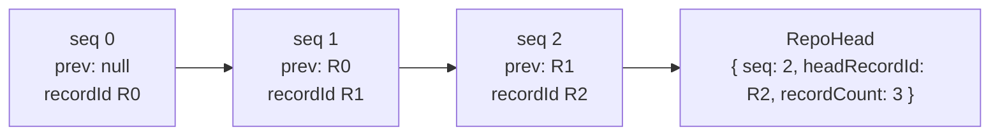

# Oxy ID — Self-Sovereign Identity

> The DID layer, cryptographically signed records (the per-user hash chain),
> signed data export, domain verification, and "Sign in with Oxy". The
> user-facing app is **Commons by Oxy** (`packages/commons`, native-only); the
> engine is in `@oxyhq/api`; the crypto + SDK surface is in `@oxyhq/core`; wire
> types are in `@oxyhq/contracts`.
>
> Related: [Reputation / civic engine](../reputation/README.md) · [Nodes](../nodes/README.md) ·
> [Auth & session](../auth/README.md) · [Changelog](../CHANGELOG.md)

---

## 1. DID: `did:web:api.oxy.so:u:<userId>`

Every user has a [W3C DID](https://www.w3.org/TR/did-core/) that is
**account-anchored on the stable Mongo `_id`**, *not* on a keypair. The keypair
(if any) is a *verification method* under the account's `authMethods[]`. This is
what makes the identity reversible: linking a key makes the DID self-sovereign;
unlinking reverts it to custodial — the DID string never changes.

- The anchor domain is configurable via `DID_WEB_DOMAIN` (default `api.oxy.so`,
  falling back to `FEDERATION_DOMAIN` = `oxy.so`). `:` is `%3A`-encoded.
  (`did.service.ts:47`)
- `buildUserDid(userId)` → `did:web:<domain>:u:<userId>` (`did.service.ts:86`).
- `OXY_DID` = `did:web:<domain>` is the Oxy organization's custodial controller.

### Custodial vs self-sovereign

`buildDidDocument(user)` (`did.service.ts:147`) derives the document **on demand**
(it is never stored):

| | Custodial (no on-device key) | Self-sovereign (≥1 `identity` auth method) |
|---|---|---|
| `controller` | `[OXY_DID]` | `[userDid, OXY_DID]` |
| `verificationMethod` | Oxy custodial key (if any) | the user's `publicKey` + each `authMethods[].type==='identity'` key |
| `authentication` / `assertionMethod` | — | references to the user's VMs |

Each verification method is
`{ id: "<did>#key-1", type: "EcdsaSecp256k1VerificationKey2019", controller, publicKeyHex }`.

`alsoKnownAs[]` carries `acct:<username>@oxy.so`, the profile URL, and
`https://<verifiedDomain>` for each verified domain.
`service[]` carries the Oxy API + profile endpoints and, when the user has an
active data node, an `OxyPersonalDataNode` entry (`#oxy-node`, derived from the
`UserNode` row — never by reaching the node; see [nodes](../nodes/README.md)).

### Resolving DIDs

| Route | Auth | Cache | Notes |
|---|---|---|---|
| `GET /u/:userId/did.json` (`did.ts`) | none | `public, max-age=300` | user DID document; CORS `*` |
| `GET /.well-known/did.json` | none | `public, max-age=300` | the Oxy org DID |

SDK (`OxyServices.identity.ts`): `resolveDid(userId)`, `getMyDid()` (derives the
caller's DID locally), `getMyDidDocument()`.

> **Infra note:** `did:web:api.oxy.so:u:<id>` works today. Routing
> `oxy.so/u/*/did.json` through the apex proxy (so the anchor can be `oxy.so`) is
> deferred — zero consumers today.

---

## 2. Signed records (envelope v2)

A signed record is the atomic unit of the Oxy ID data model: a self-authored,
cryptographically signed fact, appended to a **per-subject, per-collection hash
chain**. This is the substrate for reputation attestations, real-life
attestations, validation verdicts, personhood vouches, credentials, and node
registration.

### The envelope

`SignedRecordEnvelope` (`contracts/identity.ts`, schema `signedRecordEnvelopeSchema`):

```ts
{
  version: 1 | 2,
  type: 'identity' | 'profile' | 'reputation_attestation' | 'real_life_attestation'
      | 'validation_verdict' | 'personhood_vouch' | 'credential' | 'node',
  subject: string,        // DID the record is about
  issuer: string,         // DID that signed it (=== subject when self-issued)
  record: Record<string, unknown>,  // arbitrary payload
  issuedAt: number,       // epoch ms
  publicKey: string,      // signer's secp256k1 key (hex)
  alg: 'ES256K-DER-SHA256',
  signature: string,      // DER hex
  // v2 ONLY (all required when version===2; rejected when version===1):
  seq?: number,           // strictly-increasing per subject
  prev?: string | null,   // recordId of the previous record (null at genesis)
  collection?: string,    // AtProto-style NSID, e.g. "app.oxy.credential"
  rkey?: string,          // AtProto-style record key
}
```

The schema **rejects v1 envelopes that carry any v2 field** — this prevents
smuggling unsigned `seq`/`prev`/`collection`/`rkey` metadata onto a v1 record.

### Signing input and recordId

- `signedRecordSigningInput(fields)` (`signatureService.ts:52`) is the canonical
  byte string that gets signed. v1 signs
  `{version,type,subject,issuer,record,issuedAt}`; v2 additionally signs
  `{seq,prev,collection,rkey}`. `publicKey` and `signature` are **excluded**.
  `prev` is `null` (never omitted) at genesis, so it's always in the signed bytes.
- The signing input is produced by `canonicalize(...)` (`canonicalJson.ts:118`),
  an RFC 8785 / JCS-subset canonical JSON: recursive ascending key sort,
  `undefined`/function/symbol object members omitted, array order preserved,
  non-finite numbers and `bigint` rejected. Client and server use the **same**
  function, so re-canonicalizing on either side yields byte-identical input.
- `recordId = sha256(signedRecordSigningInput(fields))`
  (`computeRecordId`, `signatureService.ts:72`). The next record's `prev` points
  at this `recordId` — that's the chain link.
- Crypto: secp256k1 ECDSA (`elliptic`), SHA-256, DER-encoded signature, hex.
  Algorithm tag `ES256K-DER-SHA256`.

### The hash chain and RepoHead



`RepoHead` (collection `repoheads`) is one document per `(subject, collection)`
holding `{ seq, headRecordId, recordCount }` — an O(1) head pointer so the server
never scans the chain to find the tip. In MongoDB the `SignedRecord` column for
`collection` is named **`nsid`** (query by `nsid`; `collection` is the
schema/SDK alias).

### Server verification — `verifyEnvelope` branches

`signedRecord.service.ts:208` runs, in order:

1. **Shape** against `signedRecordEnvelopeSchema`.
2. **Subject binding**: `env.subject` must equal `buildUserDid(subjectUserId)`.
3. **Issuer branch** (the trust model):
   - `issuer === subject` → **self-issued**: `publicKey` must be a *current*
     verification method of the subject (primary `publicKey` or an `identity`
     auth-method key, `isCurrentVerificationMethod`).
   - `issuer === OXY_DID` → **Oxy custodial**: `publicKey` must equal the Oxy
     custodial key (`OXY_PUBLIC_KEY`, checked constant-time via `verifySecret`);
     the record is still stored on the **subject's** chain (provenance for
     custodial users who hold no key).
   - else → **`untrusted_issuer`**, reject.
4. **Signature** (`verifyEnvelopeSignature`, ES256K-DER-SHA256).
5. **Freshness**: `issuedAt ≤ now + 5min` (clock-skew window).
6. **Monotonicity**: v1 per `type`; v2 per `(nsid, rkey)`.
7. **v2 chain continuity**: no head → only genesis (`seq===0 && prev===null`);
   head exists → `prev === head.headRecordId && seq === head.seq + 1`. Otherwise
   `chain_gap` / `chain_fork` / `bad_seq`.

Rejection reasons are an explicit enum (`invalid_envelope`, `subject_mismatch`,
`public_key_not_a_current_verification_method`, `bad_signature`,
`issued_in_future`, `stale_issued_at`, `chain_gap`, `chain_fork`, `bad_seq`,
`chain_conflict`, `untrusted_issuer`). `verifyAndStoreRecord` appends + upserts
the head atomically, retrying on `chain_conflict` via a unique index backstop.

Because the verify code is in `@oxyhq/core`, a record signed in the Commons vault
verifies **identically** on Oxy and on a personal data node — no re-implementation.

### Publishing records (SDK)

`OxyServices.identity.ts`:
- `signRecord(type, record)` — sign on-device **without** publishing (native-only).
- `publishRecord(type, record)` → `POST /identity/records` (signs + publishes).
- `getRecord(userId, type)` → `GET /identity/records/:userId/:type` (latest).
- `verifyRecord(userId, type)` → `GET /identity/records/:userId/:type/verify`
  (server re-verifies signature + key authorization).
- `POST /identity/records` is the registration path for nodes too — a node is
  just a `type:'node'` signed record (see [nodes](../nodes/README.md)).

### Public log

The hash chain is publicly readable for the identity/profile/node collections
(`PUBLIC_LOG_COLLECTIONS = ['app.oxy.identity','app.oxy.profile', NODE_COLLECTION]`,
`repoLog.service.ts:19`):

| Route | Auth | Rate limit | Purpose |
|---|---|---|---|
| `GET /identity/log/:userId?since=<seq\|recordId>&limit=` | none | `rl:nodes:log:` (60/min) | ordered envelopes from a cursor (Oxy→node export) |
| `GET /identity/head/:userId` | none | `rl:nodes:head:` (240/min) | chain head `{ seq, headRecordId, recordCount }`; CORS `*` |
| `GET /identity/records/:userId/chain/head` | none | — | pre-sign head info (seq/prev for the next record) |

`getPublicLogSince` returns only *verified* records in the public collections,
capped at `MAX_LOG_LIMIT = 500`.

---

## 3. Auth methods and linking

`GET /auth/methods` (`listAuthMethods()`) returns
`{ did, methods: AuthMethodEntry[] }` where each entry is
`{ type: 'identity'|'password'|'google'|'apple'|'github', linkedAt, verificationMethodId? }`
(`verificationMethodId` is present only for `identity` and links to a DID VM
fragment).

- `linkIdentityKey()` — native-only; signs a JSON proof with the on-device key →
  `POST /auth/link`. Makes the DID self-sovereign.
- `linkPassword(email, password)` → `POST /auth/link`.
- `unlinkAuthMethod(type)` → `DELETE /auth/link/:type`; refuses to remove the last
  remaining method. Reverts the DID to custodial if the last `identity` key is
  removed.

Every link/unlink invalidates the identity caches (`_invalidateIdentityCaches`:
`GET:/users/me*`, `GET:/auth/methods`, `GET:/identity/domains`, the DID doc).

---

## 4. Signed data export ("credible exit")

`GET /users/me/export` (`exportMyData()`, auth + `rl:identity:export:` 5/hr) emits
a signed, open-format bundle (`exportBundleSchema`):

```ts
{
  $schema, exportedAt, did, didDocument,
  profile, verifiedDomains, authMethods,        // no secrets
  signedRecords,                                 // all published envelopes
  appData, social: { following, followers },
  attestation: ExportAttestation | null,         // Oxy custodial signature
  proof?: ExportAttestation,                      // the user's own signature, if they hold a key
}
```

`identityExport.service.ts:78` builds the bundle and signs it: the Oxy
`attestation` is `ES256K-DER-SHA256` over `canonicalize(bundleWithoutAttestation)`
with `issuer = OXY_DID`, signed with `OXY_PRIVATE_KEY`. `attestation` is `null`
only if `OXY_PRIVATE_KEY` is unset. No secrets leak — it mirrors
`formatUserResponse`.

---

## 5. Domain verification (a badge, not a handle)

A user can prove control of a domain to add it to `alsoKnownAs` (a verification
**badge** — it is *not* domain-as-handle).

| Route | Auth | Rate limit | Purpose |
|---|---|---|---|
| `POST /identity/domains` | bearer | `rl:identity:domainreq:` (10/hr) | issue a token; returns DNS-TXT + well-known instructions |
| `POST /identity/domains/:domain/verify` | bearer | `rl:identity:domainverify:` (20/hr) | prove via DNS-TXT `_oxy-identity.<domain>` or `/.well-known/oxy-domain` |
| `GET /identity/domains` | bearer | — | list verified + pending |
| `DELETE /identity/domains/:domain` | bearer | — | remove a verified domain |

Verification reads DNS via `dns.promises.resolveTxt` OR fetches the well-known
file via `safeFetch` (SSRF-safe — never a raw `fetch`), then pushes to
`verifiedDomains[]` (`{ domain, verifiedAt, method: 'dns-txt'|'well-known' }`) and
invalidates the user cache. SDK: `requestDomainVerification`, `verifyDomain`,
`listDomains`, `removeDomain`.

---

## 6. Sign in with Oxy

One user-facing entry ("Sign in with Oxy") presents three options: QR scan /
Commons handoff, username + password, and social/FedCM. Two cryptographic
mechanisms back the QR/handoff path. (FedCM and the web SSO flow are covered in
[auth/README.md](../auth/README.md).)

### Mechanism A — same-device shared-keychain SSO (native only)

Commons writes a shared identity to the platform keychain at creation. Any sibling
native app calls `OxyServices.signInWithSharedIdentity()`: request a challenge for
the shared public key → sign it with the shared key → `verifyChallenge` plants
tokens. This runs as the `shared-key-signin` cold-boot step on native; returns
`null` on web. Each native app must declare the iOS `keychain-access-groups`
(incl. `group.so.oxy.shared`, same Team ID) + Android shared-store config.

### Mechanism B — cross-device QR handoff

```mermaid
sequenceDiagram
    participant RP as RP app (startCommonsSignIn)
    participant API as api.oxy.so
    participant Commons as Commons (scanner)
    RP->>API: POST /auth/session/create { sessionToken(secret), expiresAt, clientId }
    API-->>RP: { authorizeCode(public), qrPayload, status }
    Note over RP: render QR oxycommons://approve?v=1&code=&lt;authorizeCode&gt;&...<br/>sessionToken is NEVER in the QR
    Commons->>API: GET /auth/session/approve-info/:authorizeCode (public)
    API-->>Commons: server-resolved Application identity + scopes + boundOrigin
    Note over Commons: biometric gate → KeyManager.getPublicKey() → sign challenge
    Commons->>API: POST /auth/session/authorize-signed/:authorizeCode { publicKey, challenge, signature, timestamp }
    Note over API: verifyChallengeResponse + atomic burn → resolve User by publicKey → createSession
    RP->>API: poll (pollCommonsSignIn) then claimSessionByToken(sessionToken)
    API-->>RP: session → tokens planted
```

- The QR carries the **public** `authorizeCode` (128-bit, single-use, 5-min,
  origin-bound) — the secret `sessionToken` stays with the RP and is never
  rendered.
- Commons renders the *server-resolved* `Application` identity from
  `getCommonsApprovalInfo`, never trusting the raw QR string.
- SDK methods (`OxyServices.auth.ts`): RP side `startCommonsSignIn`,
  `pollCommonsSignIn`, `claimSessionByToken`; Commons side
  `getCommonsApprovalInfo`, `approveCommonsSignIn`, `denyCommonsSignIn`.
- New rate-limit prefixes: `rl:auth:session-approve-info:`,
  `rl:auth:session-authorize-signed:`.

### QR scheme summary (all `oxycommons://`)

| Payload | Purpose | Key params |
|---|---|---|
| `oxycommons://card?did=<did>&v=1` | share Oxy ID card | `did` |
| `oxycommons://attest?subject=<A.did>&ctx=<context>&nonce=<n>&exp=<ms>` | real-life attestation (see [reputation](../reputation/README.md)) | `subject`, `ctx`, `nonce`, `exp` (10-min TTL) |
| `oxycommons://approve?v=1&code=<authorizeCode>&...` | sign-in handoff | `code` (= public `authorizeCode`) |

The legacy `oxydni://` scheme was removed entirely in the DNI→"Oxy ID" rename
(commit `6780ad55`).
