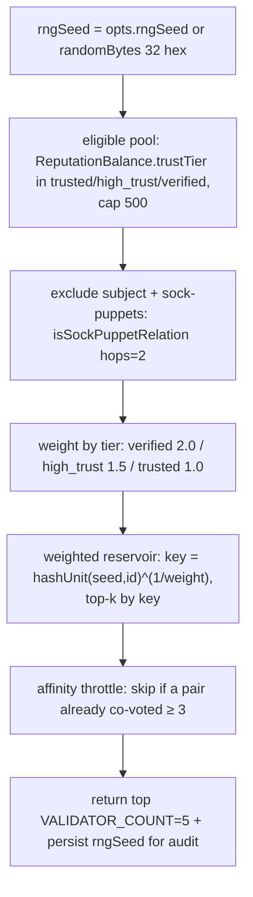

# Oxy Trust — Reputation & the Civic Engine

> The reputation ledger (transactions, balance, tiers, influence, reliability),
> crypto-owned reputation via Oxy-signed attestations, and the four civic phases:
> F2 real-life QR attestation + validator jury, F3 proof-of-personhood, F4
> verifiable credentials. The civic engine lives in
> `packages/api/src/services/civic/` + `routes/civic.ts`; the SDK surface is in
> `@oxyhq/core`; wire types in `@oxyhq/contracts/src/civic.ts`.
>
> Related: [Identity / Oxy ID](../identity/README.md) · [Nodes](../nodes/README.md) ·
> [Auth & session](../auth/README.md) · [Changelog](../CHANGELOG.md)

---

## 1. The core principle: users never self-award

Reputation is **earned through cryptographically signed attestations from
others**, never self-issued. The flow is always:

1. A user signs an attestation/vote/vouch **on-device** (a v2 signed record on
   *their own* chain).
2. A civic service evaluates rules / quorum and, if satisfied, calls
   `reputationService.award(...)` **in-process** with `emitAttestation: true`.
3. `attestation.service.ts` appends an **Oxy-signed `reputation_attestation`
   record onto the *subject's* chain** (`issuer = OXY_DID`, signed with
   `OXY_PRIVATE_KEY`, collection `app.oxy.reputation`, `rkey = txnId`).

So the *award authority* is the in-process `reputationService` (a single
chokepoint), the *provenance* is an Oxy signature anchored to the recipient's
hash chain, and the *trigger* is always a verified signature from a third party.

`reputationService` is also the single source of truth for the ledger itself.

---

## 2. The reputation ledger

Three MongoDB models back the ledger (`packages/api/src/models/`):

- **`ReputationTransaction`** (`reputationtransactions`) — the append-only ledger.
  `status` ∈ `active | disputed | reversed | voided` — **only `active` counts
  toward balance**. `category` ∈ `content | social | trust | moderation |
  physical | penalty | other`. `sourceActionId` gives idempotency.
- **`ReputationBalance`** (`reputationbalances`) — a cached per-user snapshot:
  `total`, `positive`, `negative`, `breakdown`, `reliability`, `trustTier`,
  `influence`; recalculated on demand.
- **`ReputationDispute`** (`reputationdisputes`) — dispute lifecycle.

Reversals never delete: `reverseTransaction` marks the original `reversed` and
inserts a compensating `-points active` transaction (nets to zero);
`voidTransaction` excludes a transaction from the balance with no compensating
entry.

### Trust tiers and influence

Trust tiers (top-down precedence): `restricted` (`total < 0` OR
`abuseScore ≥ 0.5`) → `verified` (`User.verified`, set by personhood) →
`high_trust` (`total ≥ 500`) → `trusted` (`total ≥ 100`) → `new`.

Influence is clamped to `[0.1, 3.0]` (base `= clamp(0.1 + total/500)`), with a
per-context moderation factor; `restricted` floors all weights to 0.1.

### SDK (`OxyServices.reputation.ts`)

Reads: `getReputationBalance(userId)`, `getReputationTransactions(userId, limit?, offset?)`,
`getReputationInfluence(userId, context?)`, `getReputationLeaderboard`,
`getReputationRules`, `getUserReputationDisputes`. Writes (service-token/staff
only, sweep the `GET:/reputation/` cache): `awardReputation`,
`reverseReputationTransaction`, `voidReputationTransaction`,
`recalculateReputation`, `upsertReputationRule`, `createReputationDispute`,
`resolveReputationDispute`, `getReputationDisputeQueue`. Exported unions:
`ReputationCategory`, `TrustTier`, `ReputationTransactionStatus`,
`ReputationTargetEntityType`, `ReputationDisputeStatus`,
`ReputationInfluenceContext`.

> **Pending:** the karma→reputation migration
> (`scripts/migrate-karma-to-reputation.ts`) must run as a one-shot ECS task —
> all balances read 0 until it does.

---

## 3. Civic award weights

`reputation.constants.ts` — the civic actions and their points:

| Action | Points | Category | Class | When |
|---|---:|---|---|---|
| `real_life_attested` | +25 | physical | HIGH | a counterparty physically met you and signed |
| `peer_validated` | +8 | trust | MEDIUM | a random jury validated you |
| `validation_correct` | +3 | trust | MEDIUM | a juror voted with the resolved majority |
| `validation_incorrect` | -10 | penalty | MEDIUM | a juror was on the losing side when reversed |
| `personhood_vouched` | +5 | trust | LOW | a staked web-of-trust vouch |
| `vouch_slashed` | -20 | penalty | LOW | a voucher was proven to have vouched for a fake |
| `endorsement_received` | +2 | social | LOW | cross-app endorsement signal |

`weightClassForAction(actionType)` maps an action to HIGH/MEDIUM/LOW (unknown →
LOW). The high-friction actions (real-life attestation) carry the most weight;
the low-friction ones (vouches) carry the least and are slashable.

---

## 4. F2 — Anti-gaming: real-life attestation + validator jury

### Real-life QR attestation (HIGH, +25)

Person B opens Commons and scans person A's
`oxycommons://attest?subject=<A.did>&ctx=<context>&nonce=<n>&exp=<ms>` QR. Commons
shows A's public card, biometric-gates B's approval, B signs a
`real_life_attestation` record **on B's own chain** (rkey = nonce), and POSTs it
to `POST /civic/attestations` (`rl:civic:attest:` 20/min).

`realLife.service.ts:126` validates, in order: type is
`real_life_attestation`; self-issued (subject = issuer = B's DID); `record.about`
= A's DID; the nonce is single-use (a `CivicNonce` index) and unexpired
(`REAL_LIFE_NONCE_MAX_AGE_MS` = 10 min); A ≠ B; the signature verifies; A and B
are **not graph-related** (`isSockPuppetRelation`, 1 hop); and there's no prior
attestation for the pair within `REAL_LIFE_PAIR_COOLDOWN_MS` (24h). On success it
stores B's record and awards A `real_life_attested` (+25, `emitAttestation: true`,
`sourceActionId = recordId`). A `biometricOk: true` in the record feeds the
personhood biometric signal.

### Validator jury (MEDIUM, +8)

Contested or fresh items queue for a randomly-selected jury.
`validator.service.ts:105` `selectValidators`:



- `VALIDATOR_COUNT = 5`, `VALIDATOR_QUORUM = 3`, `VALIDATOR_SUPERMAJORITY = 4`,
  `VALIDATION_EXCLUSION_HOPS = 2`, `VALIDATION_TTL_MS = 48h`,
  `AFFINITY_MAX_COVOTES = 3`. The `rngSeed` is stored on the
  `ValidationRequest` so selection is deterministic-yet-unpredictable and fully
  auditable.
- Jurors fetch `GET /civic/validations/inbox`, then sign a `validation_verdict`
  record (`verdict` ∈ `valid|invalid|abstain`, bound to `requestId` +
  `payloadHash`) → `POST /civic/validations/:id/vote`, or recuse via
  `/deny`.
- `tallyAndResolve` (`validator.service.ts:345`): once quorum is met (or on
  expiry/all-voted), a CAS-guarded single resolver awards the subject
  `peer_validated` (+8), awards winning jurors `validation_correct` (+3 each), and
  bumps pairwise `coVoteCount` affinity.

Routes (`civic.ts`): `POST /civic/validations` (service-auth — opens a request,
jury selected server-side, `rl:civic:validate:` 60/min), `GET .../inbox` (auth),
`POST .../:id/vote`, `POST .../:id/deny`.

### Sock-puppet exclusion (shared by F2 and F3)

`graphExclusion.ts:125` `isSockPuppetRelation(a, b, { hops })` returns excluded
when: `a === b` (`self`); `a` and `b` are graph-related within `hops`
(`areGraphRelated`: direct Follow/Block in either direction, or, at 2 hops, a
shared direct neighbor) (`graph_neighbor`); or they share a device fingerprint or
IP across active sessions (`shared_device` / `shared_ip`).

---

## 5. F3 — Proof of personhood

A multi-signal web-of-trust that decides whether an account is a real, unique
person and, if so, sets `User.verified = true` (which promotes the trust tier to
`verified`).

### Vouches + staking

`POST /civic/personhood/vouch` (`rl:civic:vouch:` 20/min). The voucher signs a
`personhood_vouch` record (rkey = subject DID, one vouch per subject, last-writer
wins) → `personhood.service.ts:261` validates: self-issued; `record.about` =
subject DID; subject ≠ voucher; signature valid; the voucher's own personhood
score ≥ `MIN_VOUCHER_PERSONHOOD` (0.6); no prior vouch for the pair; not
sock-puppet-related (1 hop). The voucher chooses a `stake` (clamped
`[1, 100]`, default 10), recorded on the `PersonhoodVouch` row for future
slashing. On success it awards the subject `personhood_vouched` (+5) and
recomputes personhood.

- **Withdraw** (`DELETE /civic/personhood/vouch/:subjectUserId`) flips the vouch
  to `withdrawn` (it does *not* claw back already-awarded points, but blocks
  re-vouching — closing the re-vouch farming hole fixed in #418) and recomputes.
- **Slash** (`slashVouchersForFakeSubject`): when an audit finds a subject fake,
  every active voucher is awarded `vouch_slashed` (-20), their vouch flips to
  `slashed`, and each voucher is recomputed.

### The personhood score

`personhoodDerive.ts:83` `personhoodScore(inputs)`:

```
if isSeedVerifier:  score = 1.0  (genesis; hand-picked bootstrap users)
else:
  vouchSignal     = clamp(weightedVouchScore / 3.0, 0, 1)   # ~3 verified vouches saturate
  realLifeSignal  = clamp(realLifeCount / 2, 0, 1)           # 2 real-life attestations saturate
  biometricSignal = biometricBound ? 1 : 0
  evidence        = 0.50·vouchSignal + 0.35·realLifeSignal + 0.15·biometricSignal
  score           = clamp(evidence · (1 − sybilPenalty), 0, 1)
isRealPerson = score >= 0.6   # θ = PERSONHOOD_THRESHOLD
```

The component weights sum to 1.0, and θ=0.6 means **no single signal class is
sufficient** — full vouches alone (0.50) fall short; full vouches + biometric
(0.65) or full vouches + full real-life (0.85) pass. `weightedVouchScore` sums
active vouchers' tier weights (`VOUCH_TIER_WEIGHT`: restricted 0, new 0.25,
trusted 0.45, high_trust 0.7, verified 1.0).

`recomputePersonhood` (`personhood.service.ts:170`) aggregates the signals,
derives the score, and — only when the flag changes — writes `User.verified`,
triggers a reputation balance recalc, and invalidates the user cache.

### Sybil penalty

`sybil.service.ts:157` `computeSybilPenalty(subjectUserId)` combines two signals
(each capped, voucher scan capped at 50):

- **Shared-fingerprint fraction**: fraction of vouchers that share a device
  fingerprint or IP with any other account in the {subject ∪ vouchers} set.
- **Vouch-ring density**: reciprocal (2-cycle) + triangle (3-cycle) vouch edges
  around the subject, normalized by incoming vouch count.

`penalty = clamp(0.6·sharedFingerprintFraction + 0.6·ringDensity, 0, 1.0)`. It
multiplicatively attenuates the evidence.

### Random audits

`personhoodAudit.service.ts:62` `sweepPersonhoodAudits()` samples ~5%
(`PERSONHOOD_AUDIT_SAMPLE_RATE`, batch ≤ 25, every 6h) of `isRealPerson` users and
opens a `personhood_audit` validation request — reusing the **F2 jury machinery**.
If the jury rules the subject fake, the slash cascade runs on all of that
subject's active vouchers.

Routes: `GET /civic/personhood/:userId` (public, `rl:civic:personhood:read:`
120/min), `POST /civic/personhood/:userId/recompute` (staff).

---

## 6. F4 — Verifiable credentials

Signed claims anchored on the holder's DID. NSID `app.oxy.credential`; one signed
record per credential; `rkey` = a fresh credential UUID.

- **Issuers:** user-issued (self-signed, `issuer === subject`) or org-issued (an
  Application's DID — requires the Application to be `type:'internal'` or
  `isOfficial`).
- `issueCredential(input)` → `POST /civic/credentials` (`rl:civic:credential:issue:`
  20/min): signs a `credential` record (`record.about` = holder DID; `types[]`
  must include `'VerifiableCredential'` + ≥1 specific type; arbitrary `claims`;
  optional `expiresAt` — part of the signed bytes so a holder cannot extend it).
- `verifyCredential(recordId)` →
  `GET /civic/credentials/by-record/:recordId/verify` (public) checks, **in order**:
  1. the outer envelope against the issuer DID's **current** active verification
     method (rejects a key rotated/unlinked since issuance);
  2. `status !== revoked`;
  3. not expired.
- `listCredentials(holderUserId, { status? })` →
  `GET /civic/credentials/:holderUserId` (public); `revokeCredential(id)` →
  `POST /civic/credentials/:id/revoke` (only the original issuer).

`VerifiableCredentialResponse` carries `recordId` (used for the by-record verify),
`holderDid`, `issuerDid`, `types`, `claims`, `status` (`active|revoked|expired`),
`issuedAt`, and optional `expiresAt`/`revokedAt`.

---

## 7. Slash cascade on reversal

When a triggering transaction is reversed, `slash.service.ts:62`
`slashForReversedTransaction(txn)` cascades the consequences:

- `peer_validated` reversed → every juror who voted `valid` is awarded
  `validation_incorrect` (-10).
- `real_life_attested` reversed → the attestor is awarded `validation_incorrect`
  (-10).
- `personhood_vouched` reversed → `slashVouchersForFakeSubject` (the full
  vouch-slash cascade).

All cascade awards are best-effort and non-fatal — an individual failure is logged
and skipped; the reversal itself never blocks.

---

## 8. Rate-limit prefixes (civic)

Each limiter owns a unique prefix (sharing a prefix across limiters causes
`ERR_ERL_DOUBLE_COUNT`):
`rl:civic:attest:`, `rl:civic:validate:`, `rl:civic:vouch:`,
`rl:civic:personhood:read:`, `rl:civic:personhood:admin:`,
`rl:civic:credential:issue:`, `rl:civic:credential:verify:`,
`rl:civic:credential:read:`, `rl:civic:credential:revoke:`, plus reputation's
`rl:reputation:read:` / `award:` / `admin:` / `dispute:`.
