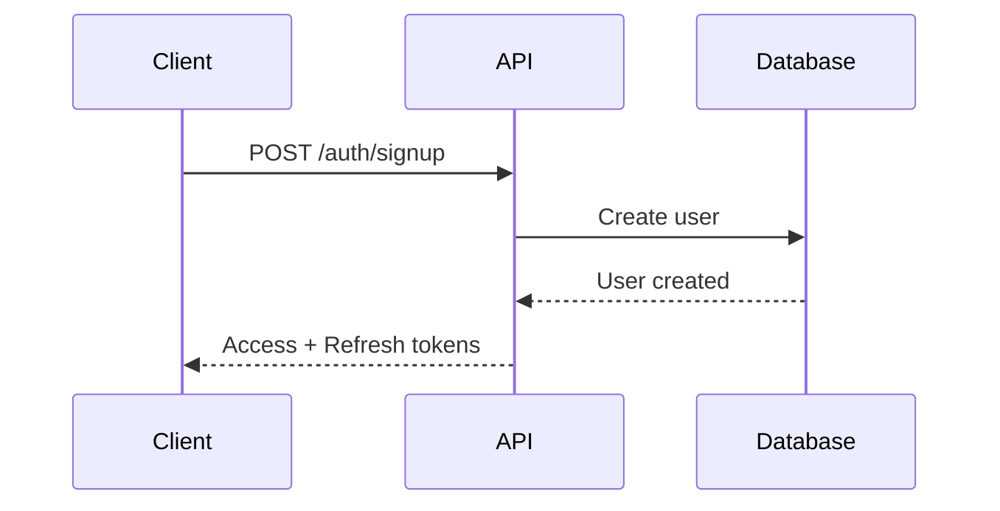
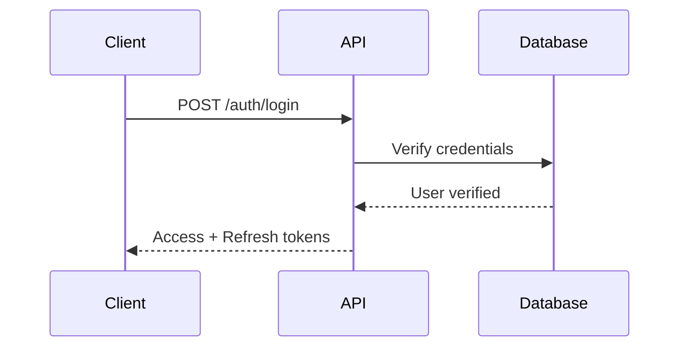
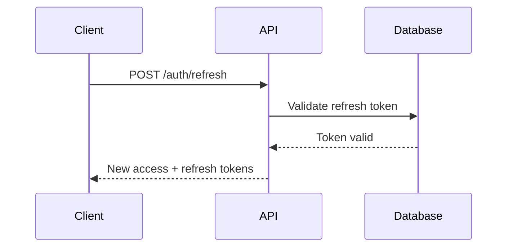

# Authentication Guide

Comprehensive guide to authentication and authorization in the OxyHQ API.

## Overview

The OxyHQ API uses JWT (JSON Web Tokens) for authentication with a dual-token system:
- **Access Token**: Short-lived token for API requests
- **Refresh Token**: Long-lived token for obtaining new access tokens

## Authentication Flow

### 1. User Registration



### 2. User Login



### 3. Token Refresh



## Token Structure

### Access Token

```json
{
  "header": {
    "alg": "HS256",
    "typ": "JWT"
  },
  "payload": {
    "userId": "507f1f77bcf86cd799439011",
    "sessionId": "507f1f77bcf86cd799439012",
    "iat": 1640995200,
    "exp": 1640998800,
    "type": "access"
  }
}
```

### Refresh Token

```json
{
  "header": {
    "alg": "HS256",
    "typ": "JWT"
  },
  "payload": {
    "userId": "507f1f77bcf86cd799439011",
    "sessionId": "507f1f77bcf86cd799439012",
    "iat": 1640995200,
    "exp": 1643673600,
    "type": "refresh"
  }
}
```

## Token Configuration

### Access Token
- **Lifetime**: 1 hour (3600 seconds)
- **Algorithm**: HS256
- **Secret**: Environment variable `ACCESS_TOKEN_SECRET`

### Refresh Token
- **Lifetime**: 30 days (2592000 seconds)
- **Algorithm**: HS256
- **Secret**: Environment variable `REFRESH_TOKEN_SECRET`

## Security Features

### 1. Token Rotation

Refresh tokens are rotated on each use to prevent token reuse attacks:

```typescript
// When refreshing tokens
const newRefreshToken = generateRefreshToken(userId, sessionId);
await invalidateRefreshToken(oldRefreshToken);
```

### 2. Session Management

Each token is tied to a session that can be:
- **Active**: Token is valid
- **Expired**: Token has expired
- **Revoked**: Token was manually invalidated

### 3. Rate Limiting

Authentication endpoints have stricter rate limits:
- **Login**: 5 attempts per 15 minutes
- **Signup**: 3 attempts per 15 minutes
- **Password Reset**: 3 attempts per hour

### 4. Brute Force Protection

Progressive delays for failed authentication attempts:
- 1st failure: No delay
- 2nd failure: 1 second delay
- 3rd failure: 2 second delay
- 4th+ failure: 5 second delay

## Implementation Examples

### Client-Side Token Management

```javascript
class AuthManager {
  constructor() {
    this.accessToken = localStorage.getItem('accessToken');
    this.refreshToken = localStorage.getItem('refreshToken');
  }

  async login(email, password) {
    const response = await fetch('/auth/login', {
      method: 'POST',
      headers: { 'Content-Type': 'application/json' },
      body: JSON.stringify({ email, password })
    });

    const data = await response.json();
    
    if (data.success) {
      this.setTokens(data.data.tokens);
      return data.data.user;
    }
    
    throw new Error(data.error.message);
  }

  async refreshTokens() {
    const response = await fetch('/auth/refresh', {
      method: 'POST',
      headers: { 'Content-Type': 'application/json' },
      body: JSON.stringify({ refreshToken: this.refreshToken })
    });

    const data = await response.json();
    
    if (data.success) {
      this.setTokens(data.data);
      return data.data.accessToken;
    }
    
    throw new Error(data.error.message);
  }

  setTokens(tokens) {
    this.accessToken = tokens.accessToken;
    this.refreshToken = tokens.refreshToken;
    
    localStorage.setItem('accessToken', tokens.accessToken);
    localStorage.setItem('refreshToken', tokens.refreshToken);
  }

  async makeAuthenticatedRequest(url, options = {}) {
    if (!this.accessToken) {
      throw new Error('No access token available');
    }

    const response = await fetch(url, {
      ...options,
      headers: {
        ...options.headers,
        'Authorization': `Bearer ${this.accessToken}`
      }
    });

    if (response.status === 401) {
      // Token expired, try to refresh
      try {
        await this.refreshTokens();
        
        // Retry request with new token
        return fetch(url, {
          ...options,
          headers: {
            ...options.headers,
            'Authorization': `Bearer ${this.accessToken}`
          }
        });
      } catch (error) {
        // Refresh failed, redirect to login
        this.logout();
        throw error;
      }
    }

    return response;
  }

  logout() {
    this.accessToken = null;
    this.refreshToken = null;
    localStorage.removeItem('accessToken');
    localStorage.removeItem('refreshToken');
  }
}
```

### Server-Side Authentication Middleware

```typescript
import jwt from 'jsonwebtoken';
import { Request, Response, NextFunction } from 'express';

interface AuthenticatedRequest extends Request {
  user?: {
    id: string;
    sessionId: string;
  };
}

export const authenticateToken = async (
  req: AuthenticatedRequest,
  res: Response,
  next: NextFunction
) => {
  const authHeader = req.headers.authorization;
  const token = authHeader && authHeader.split(' ')[1];

  if (!token) {
    return res.status(401).json({
      success: false,
      error: {
        code: 'UNAUTHORIZED',
        message: 'Access token required'
      }
    });
  }

  try {
    const decoded = jwt.verify(token, process.env.ACCESS_TOKEN_SECRET!) as any;
    
    // Verify session is still active
    const session = await Session.findById(decoded.sessionId);
    if (!session || !session.isActive) {
      return res.status(401).json({
        success: false,
        error: {
          code: 'INVALID_TOKEN',
          message: 'Session expired or invalid'
        }
      });
    }

    req.user = {
      id: decoded.userId,
      sessionId: decoded.sessionId
    };
    
    next();
  } catch (error) {
    return res.status(401).json({
      success: false,
      error: {
        code: 'INVALID_TOKEN',
        message: 'Invalid or expired token'
      }
    });
  }
};
```

## Password Security

### Password Requirements

- **Minimum length**: 8 characters
- **Maximum length**: 128 characters
- **Must contain**: At least one uppercase letter, one lowercase letter, one number
- **Recommended**: Include special characters

### Password Hashing

Passwords are hashed using bcrypt with:
- **Salt rounds**: 12
- **Algorithm**: bcrypt

```typescript
import bcrypt from 'bcrypt';

const hashPassword = async (password: string): Promise<string> => {
  return bcrypt.hash(password, 12);
};

const verifyPassword = async (password: string, hash: string): Promise<boolean> => {
  return bcrypt.compare(password, hash);
};
```

## Session Security

### Session Properties

Each session includes:
- **Device ID**: Unique identifier for the device
- **Device Info**: Browser, OS, IP address
- **Last Activity**: Timestamp of last activity
- **Expiration**: Automatic expiration after 30 days of inactivity

### Session Management

```typescript
// Create new session
const session = new Session({
  userId: user.id,
  deviceId: generateDeviceId(),
  deviceInfo: {
    browser: req.headers['user-agent'],
    os: detectOS(req.headers['user-agent']),
    ip: req.ip
  },
  isActive: true,
  expiresAt: new Date(Date.now() + 30 * 24 * 60 * 60 * 1000) // 30 days
});

// Update last activity
session.lastActivity = new Date();
await session.save();

// Invalidate session
session.isActive = false;
await session.save();
```

## Error Handling

### Common Authentication Errors

| Error Code | HTTP Status | Description |
|------------|-------------|-------------|
| `UNAUTHORIZED` | 401 | No token provided |
| `INVALID_TOKEN` | 401 | Token is invalid or expired |
| `INVALID_CREDENTIALS` | 401 | Wrong email/password |
| `ACCOUNT_LOCKED` | 423 | Account temporarily locked |
| `EMAIL_NOT_VERIFIED` | 403 | Email not verified |
| `RATE_LIMIT_EXCEEDED` | 429 | Too many authentication attempts |

### Error Response Format

```json
{
  "success": false,
  "error": {
    "code": "INVALID_CREDENTIALS",
    "message": "Invalid email or password",
    "details": {
      "attemptsRemaining": 4,
      "lockoutTime": null
    }
  }
}
```

## Best Practices

### 1. Token Storage

**Client-side:**
- Store tokens in memory when possible
- Use secure storage (localStorage/sessionStorage) as fallback
- Never store tokens in cookies (XSS vulnerability)

**Server-side:**
- Store refresh tokens in database
- Implement token blacklisting for logout
- Use secure session management

### 2. Token Transmission

- Always use HTTPS in production
- Include tokens in Authorization header
- Never include tokens in URL parameters
- Implement token rotation

### 3. Security Headers

```typescript
// Security headers middleware
app.use(helmet({
  contentSecurityPolicy: {
    directives: {
      defaultSrc: ["'self'"],
      styleSrc: ["'self'", "'unsafe-inline'"],
      scriptSrc: ["'self'"],
      imgSrc: ["'self'", "data:", "https:"],
    },
  },
  hsts: {
    maxAge: 31536000,
    includeSubDomains: true,
    preload: true
  }
}));
```

### 4. Rate Limiting

```typescript
// Rate limiting for authentication endpoints
const authRateLimit = rateLimit({
  windowMs: 15 * 60 * 1000, // 15 minutes
  max: 5, // 5 requests per window
  message: {
    success: false,
    error: {
      code: 'RATE_LIMIT_EXCEEDED',
      message: 'Too many authentication attempts'
    }
  },
  standardHeaders: true,
  legacyHeaders: false,
});
```

## Testing Authentication

### Unit Tests

```typescript
describe('Authentication', () => {
  test('should create valid JWT tokens', async () => {
    const user = await createTestUser();
    const tokens = await generateTokens(user.id, 'session123');
    
    expect(tokens.accessToken).toBeDefined();
    expect(tokens.refreshToken).toBeDefined();
    
    const decoded = jwt.verify(tokens.accessToken, process.env.ACCESS_TOKEN_SECRET!);
    expect(decoded.userId).toBe(user.id);
  });

  test('should validate password correctly', async () => {
    const password = 'SecurePassword123';
    const hash = await hashPassword(password);
    
    const isValid = await verifyPassword(password, hash);
    expect(isValid).toBe(true);
  });
});
```

### Integration Tests

```typescript
describe('Auth Endpoints', () => {
  test('POST /auth/login should return tokens', async () => {
    const user = await createTestUser();
    
    const response = await request(app)
      .post('/auth/login')
      .send({
        email: user.email,
        password: 'testPassword123'
      });
    
    expect(response.status).toBe(200);
    expect(response.body.success).toBe(true);
    expect(response.body.data.tokens).toBeDefined();
  });
});
```

## Troubleshooting

### Common Issues

1. **Token Expired**
   - Implement automatic token refresh
   - Check token expiration before requests
   - Handle 401 responses gracefully

2. **Session Invalid**
   - Verify session exists in database
   - Check session isActive status
   - Implement session cleanup

3. **Rate Limiting**
   - Implement exponential backoff
   - Show user-friendly error messages
   - Track remaining attempts

4. **CORS Issues**
   - Configure CORS properly
   - Include credentials in requests
   - Handle preflight requests

### Debug Mode

Enable debug logging for authentication:

```typescript
// Enable debug mode
process.env.AUTH_DEBUG = 'true';

// Debug middleware
const debugAuth = (req: Request, res: Response, next: NextFunction) => {
  if (process.env.AUTH_DEBUG === 'true') {
    console.log('Auth Debug:', {
      path: req.path,
      method: req.method,
      hasToken: !!req.headers.authorization,
      userAgent: req.headers['user-agent']
    });
  }
  next();
};
``` 